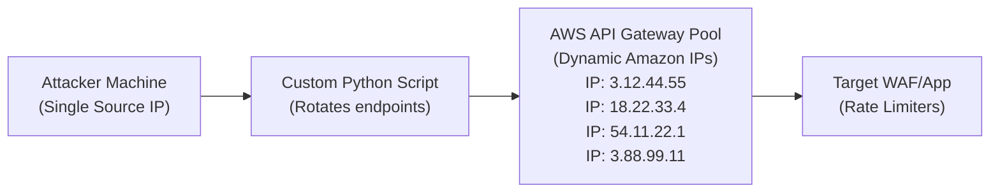

# IP Rotation and Distributed Evasion Techniques

IP Rotation is an essential, fundamental evasion technique used to bypass Web Application Firewalls (WAFs), bot management systems, and API rate-limiting mechanisms. In modern web architectures, defensive systems rely heavily on tracking the request frequency and the underlying reputation of the source IP address. By dynamically distributing malicious or automated requests across a vast pool of unique IP addresses, an attacker can blend their traffic with legitimate user behavior, effectively neutralizing localized rate-based blocking and IP blacklisting.

## The Mechanics of Rate Limiting and WAF Blacklisting

Before delving into advanced IP rotation, it is crucial to understand precisely how WAFs implement rate limiting and state tracking. WAFs generally maintain state using specific mathematical algorithms:

- **Token Bucket Algorithms:** The system allocates a specific number of tokens (requests) per time window to an IP. Each request consumes a token. If the bucket empties, requests are dropped until the bucket refills.
- **Leaky Bucket Algorithms:** This algorithm processes requests at a constant, fixed rate. If a burst of traffic arrives, the excess requests overflow the bucket and are discarded or queued.
- **Sliding Window Logs:** The WAF tracks the exact timestamp of every individual request to calculate the rate dynamically over a rolling window. This prevents the "boundary effect" seen in fixed-window counters.

When any of these thresholds are exceeded, the WAF may issue an HTTP `429 Too Many Requests` response, introduce a JS/CAPTCHA challenge, or drop the TCP connection entirely via a firewall rule.

### The IP Reputation Factor

In addition to rate tracking, modern WAFs (like Cloudflare, Akamai, and Fastly) consult massive Threat Intelligence feeds to evaluate the reputation of an incoming IP address in real-time. IPs associated with Tor exit nodes, known VPN providers, compromised botnets, or bulletproof hosting providers are assigned higher risk scores. A high risk score drastically lowers the threshold for blocking, meaning a data center IP might be blocked after 5 requests, whereas a residential IP might be allowed 500 requests.

## Advanced IP Rotation Strategies

To overcome these defenses, attackers employ several sophisticated IP rotation strategies, ranging from simple proxy chains to complex serverless cloud deployments.

### 1. Proxy Networks (Residential, Datacenter, and Mobile)

Proxy networks route traffic through intermediary servers. The type of proxy heavily influences the success rate:

- **Datacenter Proxies:** These are fast, cheap, and easily accessible. However, they are easily identifiable by WAFs because they belong to known cloud hosting Autonomous System Numbers (ASNs) like AWS, DigitalOcean, or Hetzner. WAFs often blanket-ban or heavily scrutinize traffic from these ASNs.
- **Residential Proxies:** These route traffic through actual consumer devices connected to ISPs like Comcast, AT&T, or BT. They are highly effective because their IPs carry a high reputation score. Blocking residential IPs risks massive false positives, blocking legitimate home users.
- **Mobile Proxies (4G/5G):** The holy grail of IP rotation. Mobile networks use Carrier-Grade NAT (CGNAT), meaning thousands of legitimate mobile users share a single external IP address. WAFs are terrified of blocking mobile IP gateways because blocking one IP could block 10,000 actual human users on Verizon or T-Mobile.

### 2. Cloud API Gateways (AWS API Gateway / Azure Functions)

A highly modern and effective technique involves leveraging serverless infrastructure to rotate IPs. This technique is often referred to as "Fireprox" routing. When an HTTP request is made through AWS API Gateway, AWS automatically handles the routing and assigns a dynamic IP from its vast pool of edge load balancers.

Attackers create hundreds or thousands of API Gateway endpoints and cycle their payloads through them. Since the traffic originates from AWS's trusted IP ranges, which many organizations whitelist or implicitly trust, it frequently bypasses reputation filters.

#### Architecture of API Gateway Rotation



### 3. Header-Based IP Spoofing

In some architectural setups, IP rotation can be simulated without changing the actual TCP source IP. This is achieved by manipulating HTTP headers that WAFs and downstream load balancers use to identify the original client IP.

Common headers targeted for manipulation include:
- `X-Forwarded-For`
- `X-Real-IP`
- `Client-IP`
- `True-Client-IP`
- `X-Originating-IP`
- `X-Wap-Profile`

If a WAF is misconfigured to blindly trust the `X-Forwarded-For` header provided by the client (rather than overwriting it or appending to it securely), an attacker can randomize this header for every single request. The backend system will read the spoofed header, believe it is seeing traffic from thousands of different users, and effectively reset the rate limit counters.

#### Example Payload Mutation:
```http
GET /api/v1/login HTTP/1.1
Host: target.com
X-Forwarded-For: 192.168.1.15
User-Agent: Mozilla/5.0
```
Next request in the brute-force sequence:
```http
GET /api/v1/login HTTP/1.1
Host: target.com
X-Forwarded-For: 203.0.113.88
User-Agent: Mozilla/5.0
```

### 4. IPv6 Rotation

As the world transitions to IPv6, attackers are presented with an unfathomably large address space. A standard `/64` IPv6 subnet contains 18 quintillion IP addresses. If an attacker's ISP or hosting provider assigns them a `/64` block, the attacker can configure their network stack to bind a completely new, unique IPv6 address for every single outgoing HTTP request.

Most legacy WAF rate limiters were designed for IPv4 and struggle to track state across /64 IPv6 subnets, often treating each unique IPv6 address as a distinct user, completely breaking the rate limiting logic.

## Implementing IP Rotation using Python

Below is an extensive technical implementation of an advanced IP rotator using Python, demonstrating how to interface with a proxy pool, manage sessions, and handle jitter to evade behavioral detection.

```python
import requests
import random
import time
import logging
from concurrent.futures import ThreadPoolExecutor

logging.basicConfig(level=logging.INFO, format='%(asctime)s - [%(levelname)s] - %(message)s')

class AdvancedProxyRotator:
    def __init__(self, proxy_list_file):
        self.proxies = self._load_proxies(proxy_list_file)
        self.current_index = 0
        self.user_agents = [
            "Mozilla/5.0 (Windows NT 10.0; Win64; x64) AppleWebKit/537.36 (KHTML, like Gecko) Chrome/115.0.0.0 Safari/537.36",
            "Mozilla/5.0 (Macintosh; Intel Mac OS X 10_15_7) AppleWebKit/605.1.15 (KHTML, like Gecko) Version/16.5 Safari/605.1.15",
            "Mozilla/5.0 (X11; Linux x86_64; rv:109.0) Gecko/20100101 Firefox/114.0"
        ]

    def _load_proxies(self, filepath):
        try:
            with open(filepath, 'r') as f:
                # Format expected: ip:port or user:pass@ip:port
                return [line.strip() for line in f if line.strip()]
        except Exception as e:
            logging.error(f"Failed to load proxies: {e}")
            return []

    def get_proxy(self):
        if not self.proxies:
            return None
        proxy = self.proxies[self.current_index]
        self.current_index = (self.current_index + 1) % len(self.proxies)
        return {
            "http": f"http://{proxy}", 
            "https": f"http://{proxy}"
        }

    def get_headers(self):
        return {
            "User-Agent": random.choice(self.user_agents),
            "Accept": "text/html,application/xhtml+xml,application/xml;q=0.9,image/webp,*/*;q=0.8",
            "Accept-Language": "en-US,en;q=0.5",
            "Accept-Encoding": "gzip, deflate, br",
            "Connection": "keep-alive",
            "Upgrade-Insecure-Requests": "1"
        }

    def attack_target(self, url, payload):
        proxy = self.get_proxy()
        headers = self.get_headers()
        
        # Injecting spoofed headers as a fallback evasion technique
        spoofed_ip = f"{random.randint(1,255)}.{random.randint(1,255)}.{random.randint(1,255)}.{random.randint(1,255)}"
        headers['X-Forwarded-For'] = spoofed_ip
        headers['X-Real-IP'] = spoofed_ip
        
        try:
            # Using timeout to prevent hanging on dead proxies
            response = requests.get(url, params=payload, proxies=proxy, headers=headers, timeout=8)
            if response.status_code == 200:
                logging.info(f"Success via {proxy['http']} | Spoofed IP: {spoofed_ip} | Status: 200")
            elif response.status_code == 429:
                logging.warning(f"Rate Limited via {proxy['http']} | Moving to next proxy.")
            else:
                logging.info(f"Response via {proxy['http']} | Status: {response.status_code}")
            return response
        except requests.exceptions.RequestException as e:
            logging.error(f"Connection Failed via {proxy['http']} | Error: {str(e)[:50]}...")
            return None

def launch_campaign():
    target_url = "https://api.target.local/v1/user/lookup"
    rotator = AdvancedProxyRotator("residential_proxies.txt")
    
    payloads = [{"id": str(i)} for i in range(1000, 1100)]
    
    # Threading to simulate distributed attack, but with intentional pacing
    with ThreadPoolExecutor(max_workers=5) as executor:
        for payload in payloads:
            executor.submit(rotator.attack_target, target_url, payload)
            # Critical Evasion: Introduce Jitter to break time-series analysis
            time.sleep(random.uniform(0.5, 2.5)) 

if __name__ == "__main__":
    launch_campaign()
```

## Evasion Considerations Beyond Network Layer (Layer 7 Challenges)

Simply rotating the TCP IP address is rarely enough against an enterprise-grade WAF system (e.g., Cloudflare Enterprise, Imperva, Fastly). These systems correlate multiple data points across the OSI model.

1. **TLS Fingerprinting (JA3/JA4):** Modern WAFs analyze the TLS Client Hello packet. If your Python script uses the default OpenSSL library, its JA3 hash will be immediately flagged as a known automated script, regardless of whether the IP address is a pristine residential IP. Bypassing this requires using specialized libraries (like `curl-impersonate`, `utls` in Golang, or customized TLS stacks) to mimic the exact cryptographic signature of legitimate browsers like Chrome or Firefox.
2. **HTTP/2 Fingerprinting:** Similar to TLS, the order of HTTP/2 pseudo-headers (e.g., `:method`, `:authority`, `:scheme`, `:path`) and the specific HTTP/2 frame settings (WINDOW_UPDATE, SETTINGS) are heavily fingerprinted. Browsers have very specific, hardcoded behaviors here that generic scripts do not replicate.
3. **Behavioral Analysis:** If 10,000 different IPs all navigate directly to `/api/v1/login` without fetching the HTML home page, executing the JavaScript, or requesting CSS/Image assets, the behavioral anomaly engine will flag the campaign. The traffic profile lacks the "noise" of human interaction.

## Designing a Stealthy Rotation Campaign

To achieve true stealth and sustained evasion, an attacker must design a campaign that mimics human behavior comprehensively:

- **Session Persistence:** When rotating IPs, maintain the IP for the duration of a logical user session. Changing IPs mid-session (e.g., between the login GET request that sets a CSRF token and the subsequent login POST request) is highly suspicious and often results in immediate session invalidation.
- **Geographical Consistency:** If the target is a regional municipal service in France, using residential proxies originating from Brazil or China will trigger geographical anomaly alerts. The proxy pool must be strictly filtered to match the expected user base's geographic distribution.
- **Full Page Rendering Simulation:** Instead of hitting API endpoints directly, attackers may use headless browsers (like Puppeteer or Playwright) routed through proxies. This ensures JavaScript challenges (like Cloudflare Turnstile or reCAPTCHA) are evaluated and solved, making the traffic appear entirely legitimate.

## Detection and Mitigation Strategies

Defending against distributed IP rotation attacks requires shifting the security posture away from pure network-layer (IP-based) rate limiting and moving towards application-layer identity and behavior verification.

- **Device Fingerprinting:** Implement robust client-side scripts to gather telemetry (canvas fingerprinting, WebGL characteristics, audio API context, font rendering) to generate a unique device identifier. Apply rate limits based on the computed Device ID, rather than the volatile IP address.
- **Behavioral Baselines:** Establish baseline metrics for normal user navigation paths (Markov Chains of user journeys). Block or challenge requests that deviate significantly (e.g., directly hitting an API endpoint without a valid referer or a prior session token indicating a visit to the landing page).
- **Invisible Challenges (Proof of Work):** Implement transparent computational challenges. Since residential proxies are often low-powered IoT devices or standard consumer PCs, cryptographic Proof-of-Work (PoW) challenges can rapidly exhaust their CPU resources, making the attack economically and computationally unviable.
- **Aggressive ASN Blocks:** Maintain aggressive blocks on non-residential ASNs (Datacenter IPs) specifically for sensitive endpoints that only expect human traffic (e.g., `/login`, `/register`, `/password-reset`).

## Summary

IP rotation is a continuous, evolving cat-and-mouse game. While attackers continually discover new pools of pristine IPs (residential networks, compromised IoT devices, 5G mobile proxies), defenders must continuously upgrade their correlation engines to rely on signals beyond the network layer, delving deep into the application execution context and behavioral layer to distinguish human from bot.

### Chaining Opportunities
- Often combined with [[17 - Slowloris and Rate Manipulation]] to exhaust server resources while avoiding single-IP connection limiters.
- Highly useful when probing for [[19 - CDN Origin Direct Access]] to prevent the origin firewall from blacklisting the primary scanning server.
- Essential when performing mass payload fuzzing to discover bypasses discussed in [[20 - ML-Based WAF Evasion Concepts]].

### Related Notes
- [[02 - WAF Identification and Fingerprinting]]
- [[05 - Rate Limiting Bypasses]]
- [[12 - Advanced Bot Evasion Techniques]]
- [[24 - Cloud Architecture Vulnerabilities]]
