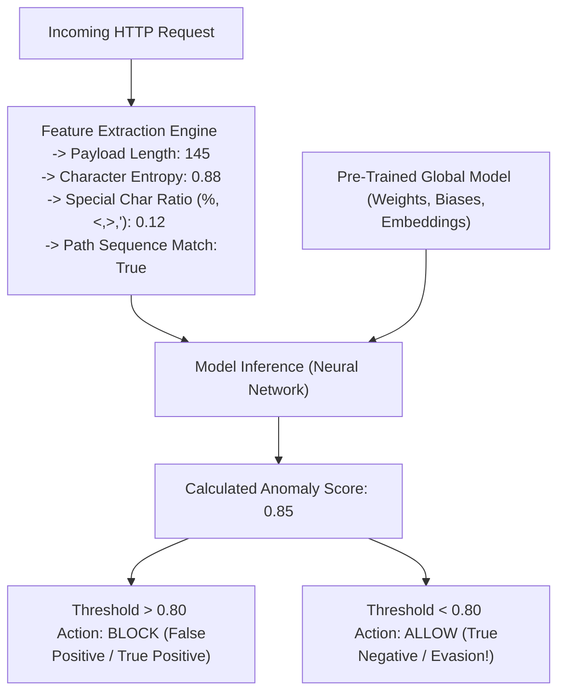

# ML-Based WAF Evasion Concepts

Traditional Web Application Firewalls (WAFs) rely heavily on static regular expressions (regex) and signature matching. While highly effective against known, documented threats, they are rigid and easily bypassed using simple encoding or syntax obfuscation. To combat this, Next-Generation WAFs (NGWAFs) and modern cloud defense platforms (like Cloudflare's Machine Learning engines, Signal Sciences, and AWS WAF Fraud Control) incorporate Machine Learning (ML) and Artificial Intelligence (AI) to perform deep **Anomaly Detection** and **Behavioral Analysis**.

Evading ML-based WAFs requires a complete paradigm shift. Attackers must move away from simple payload syntax manipulation (like tweaking SQLi characters) and embrace **Adversarial Machine Learning**—the practice of mathematically manipulating the request feature space to deceive the neural networks underlying the firewall.

## Understanding ML WAF Architectures

ML WAFs typically employ two primary models, often used in tandem:

1. **Supervised Learning (Classification Models):** These models (e.g., Random Forests, Support Vector Machines, or Deep Neural Networks) are trained on millions of labeled examples of known malicious payloads (SQLi, XSS) and benign payloads. The WAF calculates a probability score for incoming requests. If the mathematical features of the request look 95% similar to the known SQLi cluster, it is blocked.
2. **Unsupervised Learning (Anomaly Detection Models):** These models analyze baseline traffic over time to understand what "normal" looks like for a specific, unique application. They monitor sequence paths, request frequencies, geographic distributions, structural payload depths, and length variations. Any deviation from the established baseline cluster is flagged as an anomaly.

### ASCII Architecture of an ML WAF Evaluation



## Adversarial Attacks against ML Models

To bypass an ML WAF, the attacker's goal is to craft a malicious payload that the model misclassifies as benign (creating a **False Negative**). This is achieved through calculated adversarial perturbation.

### 1. Feature Squeezing and Padding (Payload Mutation)

ML models often rely heavily on statistical features, such as the ratio of special characters to alphanumeric characters. A raw SQLi payload like `UNION SELECT null, version()--` has a very high density of SQL keywords and punctuation.

To evade detection, attackers pad the payload with massive amounts of benign, expected data, diluting the malicious signature.

**Original Blocked Payload:**
```json
{"username": "admin' OR 1=1--"}
```

**Adversarial Mutated Payload (Padding):**
```json
{
  "username": "admin' OR 1=1--", 
  "bio": "This is a completely normal string that adds a massive amount of benign character entropy to the request. It discusses everyday topics, diluting the mathematical weight of the SQL injection characters so the model classifies the overall payload block as natural human language rather than an exploit attempt."
}
```
By increasing the denominator (total payload length) while keeping the numerator (malicious chars) constant, the statistical signature is pushed back into the "benign" cluster.

### 2. Gradient-Based Evasion (Whitebox/Graybox)

If an attacker has an understanding of the ML model's architecture (or can train a surrogate proxy model locally), they can use mathematical optimization to find the minimum changes needed to flip the model's classification.

Techniques like the **Fast Gradient Sign Method (FGSM)** involve calculating the gradient of the loss function with respect to the input characters. This allows the attacker to intelligently select exactly which characters to alter (e.g., swapping a space for a tab, injecting a specific null byte, or changing casing) to maximally confuse the neural network with the fewest possible modifications.

### 3. Mimicry Attacks (Structural Cloning)

Mimicry attacks focus specifically on unsupervised anomaly detection models. The attacker carefully profiles the application's expected traffic over a long period. 

If the application normally expects a JSON payload containing exactly three keys, in a specific order, with integer values, the attacker ensures their exploit payload perfectly matches this rigid structural expectation.

**Normal Baseline Request:**
```json
{"id": 123, "role": "user", "action": "view"}
```

**Mimicry Exploit Payload (Blind SQLi):**
```json
{"id": "123 AND SLEEP(5)", "role": "user", "action": "view"}
```
Here, the attacker maintains the exact JSON structure, depth, and key names, only subtly mutating the value of the `id` field. If the model relies heavily on structural features rather than deep character-level payload inspection, it perceives the request as structurally normal and allows it.

## The Concept of "Data Poisoning" (Online Learning Exploitation)

If an attacker knows that the WAF continuously learns from live traffic to update its baseline (Online Learning), they can execute a **Data Poisoning** attack.

Over weeks or months, the attacker slowly introduces increasingly anomalous requests. On day one, they send a slightly weird payload (e.g., adding an extra benign parameter). The model flags it as an edge case but accepts it, subtly expanding its definition of "normal." On day two, they push the boundary slightly further. Over time, the attacker shifts the mathematical decision boundary entirely, until a full-blown SQL injection payload is considered completely normal baseline traffic by the corrupted model.

## ML Blindspots: The Semantic Gap

The biggest weakness of ML WAFs is the "Semantic Gap." The ML model sees the request as a string of bytes, vectors, or abstract features. It does not actually *understand* SQL, JavaScript execution context, or the underlying backend compiler logic.

If an attacker uses profound, layered obfuscation—such as complex multi-stage decoding, esoteric encoding formats (like IBM EBCDIC, or multiple layers of base64 mixed with hex), or deeply nested serialization objects—the ML model will likely misclassify it as benign binary data or random noise, because the payload does not syntactically resemble any known threat cluster in its training data.

## Defending against Adversarial Evasion

Improving ML WAF robustness requires sophisticated data science engineering.

1. **Adversarial Training:** Defenders must proactively generate adversarial examples (mutated payloads, padded payloads, GAN-generated exploits) and explicitly include them in the training dataset, labeling them as malicious to harden the model.
2. **Ensemble Models:** Relying on a single model is incredibly dangerous. Combining multiple heterogeneous models (e.g., a random forest, a deep neural network, and a structural anomaly detector) makes it exponentially harder for an attacker to craft a single payload that evades all of them simultaneously.
3. **Hybrid Defense Architecture:** ML should never completely replace deterministic rules. A hybrid approach uses strict Regex signatures to catch obvious, lazy threats instantly, reserving ML compute for complex, nuanced, or zero-day anomaly attacks.

## Summary

Evading ML-based WAFs represents the absolute cutting edge of application security and VAPT. As WAFs become more mathematically complex, attackers must adopt algorithmic, statistical, and AI-driven approaches to obfuscation, treating the WAF not as a wall of rules, but as a complex mathematical equation that can be systematically solved and subverted.

### Chaining Opportunities
- Leverage [[16 - IP Rotation]] and [[17 - Slowloris and Rate Manipulation]] to conduct long-term Data Poisoning attacks without triggering aggressive rate-based blocks during the poisoning phase.
- Combine Adversarial Padding with [[10 - XSS Obfuscation and Encoding]] to dilute the statistical density of JavaScript payloads, rendering them invisible to heuristic engines.

### Related Notes
- [[30 - Advanced Fuzzing Strategies]]
- [[28 - Bypassing Heuristic Analysis]]
- [[12 - Advanced Bot Evasion Techniques]]
- [[02 - WAF Identification and Fingerprinting]]
