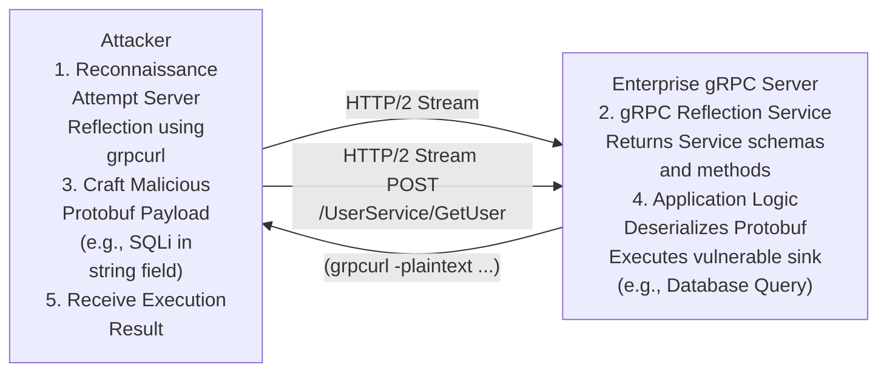

# 14 - Exploiting gRPC Endpoints

## 1. Introduction to gRPC and Protobuf

gRPC (gRPC Remote Procedure Calls) is a high-performance, open-source universal RPC framework developed by Google. In enterprise environments, it has become the backbone of microservices architectures, facilitating rapid, low-latency communication between internal services. increasingly, it is also being exposed externally to mobile clients and web applications (via gRPC-Web).

Unlike traditional REST APIs that rely on human-readable JSON or XML over HTTP/1.1, gRPC uses **Protocol Buffers (Protobuf)** as its interface definition language and its underlying message interchange format. It heavily relies on HTTP/2 for transport, utilizing features like multiplexing, server push, and persistent streaming.

From a security testing perspective, gRPC presents a unique challenge: the traffic is highly compressed, binary, and unreadable without the corresponding schema definition (`.proto` files).

## 2. Protocol Buffers and the Wire Format

Protobuf defines data structures in `.proto` files. These files define the services, RPC methods, and the exact structure of the requests and responses.

```protobuf
syntax = "proto3";

service UserService {
  rpc GetUser (UserRequest) returns (UserResponse);
}

message UserRequest {
  int32 user_id = 1;
}

message UserResponse {
  string username = 1;
  string email = 2;
}
```

When compiled, the gRPC client and server use these definitions to serialize and deserialize data. The serialized binary format does not contain field names (like "username"), only tag numbers (like `1` and `2`) and the data types. This makes reverse engineering the binary stream without the schema incredibly difficult.

## 3. Architecture of gRPC Attacks

Below is an ASCII representation of interacting with and attacking a gRPC service:



## 4. Overcoming the Binary Barrier: Tooling

To test gRPC endpoints, you cannot simply use a standard HTTP proxy and modify JSON. You need specialized tooling.

### Server Reflection
Just as GraphQL has introspection, gRPC has **Server Reflection**. If enabled, the server exposes a standard reflection service that clients can query to download the `.proto` definitions on the fly. This is a goldmine for attackers.

### Tooling
- **grpcurl**: The `curl` of the gRPC world. It can interact with reflection-enabled servers seamlessly.
  ```bash
  # List all services via reflection
  grpcurl -plaintext target.com:443 list

  # Describe a specific service
  grpcurl -plaintext target.com:443 describe UserService

  # Call a method with JSON data (grpcurl handles the conversion to protobuf)
  grpcurl -plaintext -d '{"user_id": 1}' target.com:443 UserService/GetUser
  ```
- **grpcui**: A web-based UI wrapper around `grpcurl`, providing a Postman-like experience for gRPC.
- **Burp Suite Extensions**: Extensions like `gRPC` or `Protobuf` intercept the binary HTTP/2 traffic and attempt to decode it. If you have the `.proto` files (or acquired them via reflection), you can load them into Burp Suite to transparently edit requests as JSON.

## 5. Exploitation Vectors in gRPC

Once you can read and modify the requests, gRPC applications are susceptible to the same logical and injection vulnerabilities as REST APIs, but with some specific nuances.

### A. Injection Vulnerabilities (SQLi, Command Injection)
Data inside the Protobuf messages eventually reaches a database or system shell. Since Protobuf only ensures type safety (e.g., ensuring an integer field contains an integer), it does not sanitize the content. If a `string` field is passed directly to a database query, SQL Injection is possible.
*Testing strategy*: Inject standard SQLi payloads (`' OR 1=1--`) into string fields using `grpcurl` or Burp.

### B. Broken Object Level Authorization (BOLA/IDOR)
If the gRPC method `UpdateUserProfile` takes a `user_id` parameter, an attacker can modify the Protobuf message to point to a different `user_id`. The binary nature of the transport does not inherently secure the authorization logic.

### C. Metadata Manipulation (Authentication Bypass)
gRPC uses HTTP/2 headers to pass metadata, which is the equivalent of HTTP headers in REST. Authentication tokens (like JWTs) are typically passed in the `authorization` metadata field.
Attackers can attempt to:
- Manipulate JWT tokens.
- Inject custom metadata fields that the server-side interceptors might trust implicitly.
- Perform HTTP/2 header smuggling if there is an API gateway down-converting HTTP/2 to HTTP/1.1 before reaching the gRPC backend.

### D. Denial of Service (DoS)
- **Large Message Sizes**: By default, gRPC has a maximum message size limit (usually 4MB). However, developers sometimes increase this limit arbitrarily. Sending massive Protobuf payloads can exhaust memory.
- **Stream Abuse**: gRPC supports client-side, server-side, and bidirectional streaming. Opening thousands of persistent HTTP/2 streams without closing them can quickly exhaust server resources (similar to Slowloris).

## 6. Penetration Testing Methodology without Reflection

If Server Reflection is disabled and you do not have the `.proto` files, testing becomes a black-box binary analysis task.
1. **Endpoint Brute-forcing**: gRPC URLs follow a predictable pattern: `/<ServiceName>/<MethodName>`. You can use wordlists to guess services and methods. A successful guess usually returns an `UNIMPLEMENTED` or `PERMISSION_DENIED` status code rather than a 404.
2. **Protobuf Reverse Engineering**: Use tools like `protoc --decode_raw` to parse intercepted binary payloads. This will not reveal field names, but it will show the data types, tag numbers, and the raw string values, allowing you to deduce the structure and modify values by flipping bytes.

## 7. Mitigation and Remediation

- **Disable Server Reflection in Production**: This prevents attackers from easily mapping the entire attack surface.
- **Strict Input Validation**: Protobuf guarantees data types, but not data safety. All input must be validated (length, format, content) before being processed.
- **Robust Interceptors**: Implement authentication and authorization logic in central gRPC interceptors (middleware) rather than inside individual service methods to ensure consistent enforcement.
- **Implement Rate Limiting and Connection Limits**: Protect against streaming-based DoS attacks by restricting the number of concurrent streams and enforcing strict timeouts.
- **Use mTLS**: For service-to-service gRPC communication, strictly enforce mutual TLS to prevent lateral movement and man-in-the-middle attacks within the microservices cluster.

## 8. Chaining Opportunities

- **[[09 - Insecure Direct Object References IDOR]]**: Manipulating IDs within the Protobuf message to access unauthorized data.
- **[[11 - .NET Deserialization ysoserial.net]]**: If a gRPC service accepts a raw byte array field and deserializes it using a vulnerable formatter.
- **[[04 - SSRF Server-Side Request Forgery]]**: Passing URLs in string fields to backend microservices that fetch external resources.

## 9. Related Notes

- [[12 - Attacking Node.js Prototype Pollution]]
- [[13 - GraphQL Introspection and Exploitation]]
- [[15 - Server-Side Template Injection SSTI in Enterprise Apps]]
- [[21 - Advanced WAF Bypassing Techniques]]
