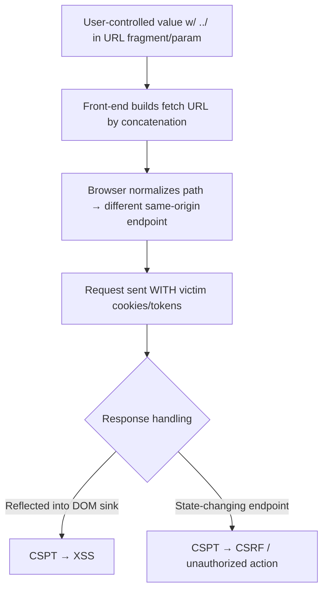

# Client-Side Path Traversal (CSPT)

## Introduction

Client-Side Path Traversal (CSPT), also called **On-site Request Forgery**, happens when **front-end JavaScript builds a request URL from user-controllable input** and the input can contain `../` sequences. After the browser normalizes the path, the `fetch`/XHR is redirected to a **different same-origin endpoint than the developer intended** — and because the browser auto-attaches cookies/tokens, the attacker rides the victim's session. CSPT is rarely impactful alone; its power is as a **delivery primitive**: CSPT→CSRF (reach state-changing endpoints bypassing anti-CSRF that only protects the "intended" path) and CSPT→XSS (steer a fetch to an endpoint whose JSON is reflected into a sink).

## Core Mechanics

Vulnerable pattern:
```js
// id comes from URL hash/query/path param
fetch(`/api/users/${id}/profile`).then(r => r.json()).then(render);
```
If `id = ../../admin/deleteUser/123`, the browser normalizes `/api/users/../../admin/deleteUser/123/profile` → `/admin/deleteUser/123/profile`. The request hits an unintended endpoint **with the victim's credentials**. The response may then flow into a DOM sink (→XSS) or the request itself performs an action (→CSRF).

## Mermaid: CSPT Flow



## Vulnerability 1: CSPT → CSRF
Anti-CSRF often guards only the documented API. By traversing from a "safe" GET-built fetch to a sensitive same-origin endpoint, the attacker reuses the page's own auth headers/tokens to trigger actions the victim didn't intend (e.g. role change, delete). Especially potent when the front-end attaches a bearer token to **all** same-origin fetches.

## Vulnerability 2: CSPT → XSS
Steer the fetch to an endpoint returning attacker-influenced JSON (e.g. a notes/search endpoint the attacker pre-seeded). The component renders the response with `innerHTML`/`dangerouslySetInnerHTML` → stored-style XSS via the traversed response.

## Methodology
1. Map front-end code where URL segments are built from `location.hash`, query params, `postMessage`, or path params (`grep` JS for template literals in `fetch(`/`axios(`/`XMLHttpRequest`).
2. Inject `../` (URL-encoded `%2e%2e%2f` too) and observe whether the outgoing request path changes in devtools Network.
3. Enumerate reachable same-origin endpoints; find a sensitive sink (state-change for CSRF) or a reflective JSON endpoint (for XSS).
4. Build a PoC URL (hash/param) that, when a victim opens it, performs the traversal.

## Remediation
1. **Don't build request paths by string concatenation** of user input; use allowlists/IDs validated against a known set; reject `../`, encoded variants, and absolute paths.
2. Use path-segment encoding (`encodeURIComponent` on each segment) so `/` and `.` can't break out; construct URLs with the URL API and fixed templates.
3. Scope tokens narrowly (don't blanket-attach bearer tokens to arbitrary same-origin fetches); treat all fetched responses as untrusted before DOM insertion (kills the XSS leg).

## Chaining Opportunities
- The bridge that revives **CSRF** (CSRF (folder B-11) even with tokens, and an alternative **XSS** delivery (XSS (folder B-07).
- Combine with [[28 - DOM Clobbering]] / open redirect for richer client-side chains.

## Related Notes
- [[28 - DOM Clobbering]], [[20 - Postmessage Vulnerabilities]] (this folder); server-side analogue: Path Traversal (folder I-23).

## Tools
BurpSuite DOM Invader (CSPT support), browser devtools Network, `gau`/JS analysis for endpoint mapping.
