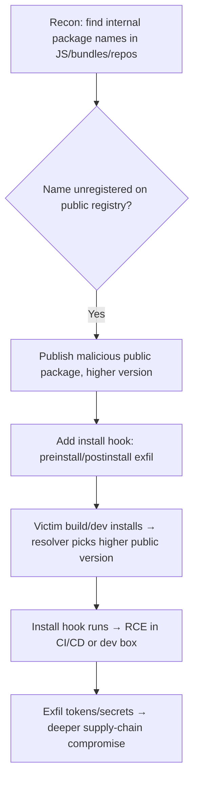

# Dependency Confusion

## Introduction

Dependency confusion (a.k.a. **substitution attack**) is a software **supply-chain** attack: many package managers, when asked to install a dependency, will pull the **highest version available across all configured registries** — including the **public** registry. If a company uses an **internal** package name (e.g. `acme-internal-utils`) that isn't registered publicly, an attacker can publish a **malicious public package of the same name with a higher version**. Build pipelines and developer machines then fetch the attacker's package instead of the internal one → **RCE in CI/CD and on developer/prod systems**. It famously hit dozens of major orgs with zero social engineering.

## Core Mechanics

The flaw is **name + version resolution across mixed registries**:
- Internal package `acme-utils@1.2.3` lives only on a private registry.
- Attacker publishes `acme-utils@99.0.0` to the public registry (npm/PyPI/RubyGems/Maven, etc.).
- A misconfigured client (no scoping, no registry pinning) sees `99.0.0 > 1.2.3` and installs the public one.
- The package's install hooks (`preinstall`/`postinstall`, `setup.py`) execute attacker code.

Leak sources for internal names: exposed `package.json`/`requirements.txt`/lockfiles in JS bundles, public repos, `.npmrc`, error messages, source maps.

## Mermaid: Attack Flow



## Vulnerability 1: NPM example
```jsonc
// attacker package.json published publicly as the internal name
{ "name": "acme-internal-utils", "version": "99.9.9",
  "scripts": { "preinstall": "node exfil.js" } }   // beacons hostname/env to attacker
```
When `npm install` runs in a repo that lists `acme-internal-utils` without a private scope/registry pin, the public version wins.

## Vulnerability 2: PyPI / others
Same idea with `setup.py` executing on install, or Maven/Gradle resolving from public Maven Central when an internal coordinate isn't pinned. RubyGems/NuGet are similarly affected.

## Methodology
1. Harvest internal dependency names (JS source maps, leaked lockfiles, public GitHub, `.npmrc`, build logs).
2. Check each name's availability on the relevant **public** registry.
3. (Authorized only) register a benign PoC package with a higher version and a **callback** (DNS/HTTP beacon — no destructive payload) to prove resolution; document which clients fetched it.
4. Report impacted packages + pipelines.

> Publishing packages to public registries is an outward, hard-to-reverse action. On engagements use a **harmless beacon** PoC, never a real payload, and only for names in authorized scope; coordinate before publishing.

## Remediation
1. **Scope/namespace** internal packages (npm scopes `@acme/...`, claimed org); **register the internal names defensively** on public registries.
2. **Pin registries per scope** (`.npmrc` with scoped registry), use lockfiles + integrity hashes, and configure the private proxy to **not** fall through to public for internal names.
3. Disable install scripts in CI (`npm ci --ignore-scripts` where feasible); use an internal mirror/allowlist; monitor public registries for your names.

## Chaining Opportunities
- Leads to **CI/CD compromise** → cloud creds (links to AWS [[18 - CodeBuild and CodePipeline Exploitation]] / ECR [[08 - ECR Exploitation]] in Cloud category) and broader supply-chain.
- Internal-name recon overlaps [[17 - JavaScript File Analysis]] (folder B-05 Recon).

## Related Notes
- [[31 - Web LLM and Prompt Injection]] (this folder); supply-chain cousin of [[21 - Supply Chain — Malicious Container Images]] (I-38 Containers).

## Tools
`confused`, `DepFuzzer`, `snyk`, registry search, `gau`/source-map extractors.
