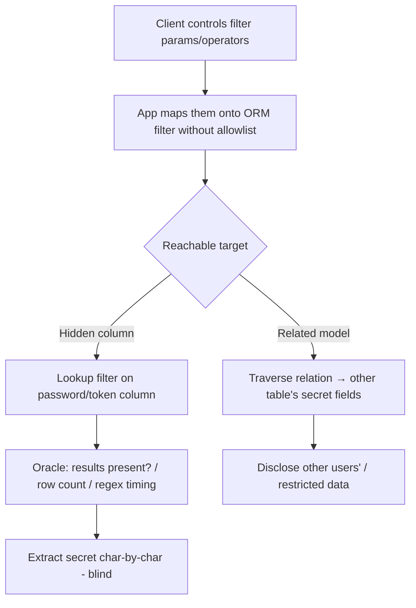

# ORM Leak

## Introduction

An **ORM Leak** exposes sensitive data by abusing how an application maps **user-controllable query parameters onto ORM filters**. Modern frameworks (Django, Prisma, SQLAlchemy, Ruby on Rails, Laravel Eloquent) let clients pass filter operators and **traverse relationships**; if the app forwards untrusted input into `filter()`/`where` without restricting **which fields and relations** are queryable, an attacker can **filter on secret columns** (password hashes, tokens, other users' data) and infer their values **character-by-character** — even when those columns are never returned in the response. It's like blind SQL injection, but through the legitimate ORM filtering API (no SQL syntax needed).

## Core Mechanics

Two abuse classes:
- **Relational filtering**: traverse a relationship to a related table and filter/return its fields (e.g. `?user__profile__ssn__startswith=123`) — reaching data the endpoint never meant to expose.
- **Field/operator lookup leaking**: filter a hidden column with lookups (`__startswith`, `__contains`, `__regex`, `__gt`) and use the **presence/absence of results** (or row count / timing) as an oracle to extract the value one piece at a time.
  - Error-/ReDoS-based: a `__regex` filter with a catastrophic pattern causes a measurable delay when it matches → boolean oracle even without visible output.

Root cause: passing `request.GET`/JSON straight into `Model.objects.filter(**params)` or Prisma `where: req.body`.

## Mermaid: Leak Flow



## Vulnerability 1: Django relational filtering
```python
# view: Article.objects.filter(**request.GET.dict())
# attacker:
GET /articles?author__user__password__startswith=pbkdf2_sha256$  # boolean oracle on hash
GET /articles?author__user__email__contains=ceo                  # cross-relation disclosure
```
Iterate `__startswith` over the charset to recover the hash/token; a returned vs empty list is the oracle.

## Vulnerability 2: Prisma (Node.js)
```js
// prisma.user.findMany({ where: req.body.where })
{ "where": { "resetToken": { "startsWith": "a" }, "role": "admin" } }
```
Brute the token char-by-char via match/no-match.

## Vulnerability 3: Error/ReDoS oracle
`...__regex=^(secret-guess)(.*a){50}$` — when the prefix matches, the catastrophic regex makes the DB/app hang → **time-based** boolean even with no visible data or count.

## Methodology
1. Identify endpoints that accept flexible filters/sorts (search, list, GraphQL filter args, `?field__op=`); fingerprint the ORM.
2. Test relationship traversal (`__`/nested `where`) and lookup operators (`startswith`, `contains`, `regex`, `gt/lt`).
3. Establish an oracle (result presence, count, or timing/ReDoS) and script extraction of hidden fields (hashes, tokens, PII) char-by-char.
4. Confirm cross-user/cross-tenant reach.

## Remediation
1. **Allowlist** filterable fields and operators; never splat raw request params into `filter()`/`where`. Use explicit serializers/DTOs (Django `FilterSet` with declared fields, Prisma input validation).
2. Block relationship traversal to sensitive models; exclude secret columns at the model layer (`deferred`/`Meta` restrictions); separate read models.
3. Rate-limit + monitor high-cardinality filter probing; guard against ReDoS (timeouts, safe regex); least-privilege DB views.

## Chaining Opportunities
- Yields password hashes/reset tokens → **account takeover** (Authentication (folder B-16); cross-tenant reads → IDOR-class impact (folder I-22).
- Common in **GraphQL** filter args → see GraphQL Security (folder I-30).

## Related Notes
- Blind-extraction cousin of SQL Injection (folder B-06, esp. NoSQL/blind); mass-data exposure relative of [[02 - Mass Assignment]] (this folder).

## Tools
BurpSuite Intruder (oracle automation), custom extraction scripts, GraphQL introspection tools, `sqlmap` (conceptually analogous).
