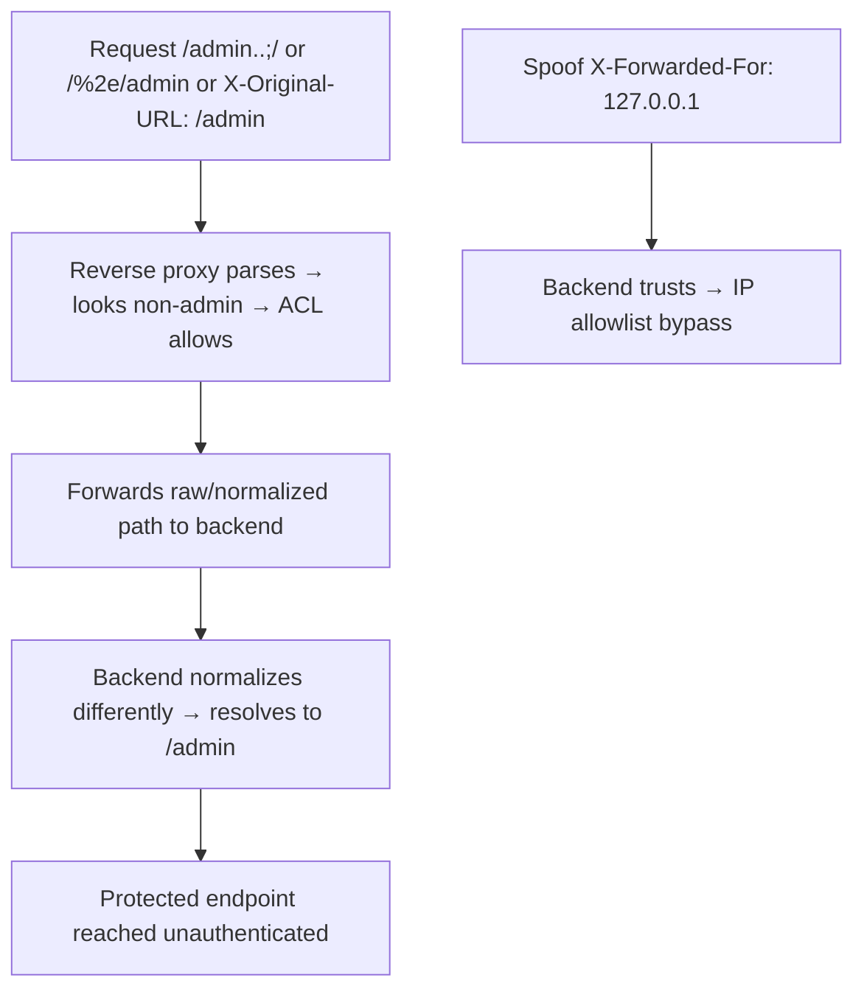

# Reverse Proxy Misconfigurations

## Introduction

Almost every modern app sits behind a **reverse proxy / load balancer / CDN** (Nginx, Apache, HAProxy, Envoy, Cloudflare, AWS ALB). When the proxy and the backend **disagree about how a request is parsed** — path normalization, trailing slashes, encoding, header trust — attackers exploit the gap to **bypass access controls, reach internal-only endpoints, poison caches, and SSRF the backend**. This is the umbrella for **path confusion**, **header trust issues** (`X-Forwarded-*`, `X-Original-URL`), and proxy-level **ACL bypass** — subtle, high-impact, and easy to miss.

## Core Mechanics

- **Path/ACL bypass via normalization differences**: the proxy enforces "deny `/admin`" but normalizes differently than the backend, so `/admin/`, `/admin/.`, `/%61dmin`, `/admin/..;/`, `/admin%2f`, or `/./admin` slips past the rule yet still routes to admin on the backend.
- **Header trust**: backend trusts proxy-set headers it shouldn't. Spoofing `X-Forwarded-For` (IP allowlist bypass), `X-Forwarded-Host` (password-reset poisoning / cache), `X-Original-URL`/`X-Rewrite-URL` (route to a path the proxy ACL didn't see), `X-Forwarded-Proto`.
- **Backend SSRF / internal exposure**: misrouted `proxy_pass`, dynamic upstream from user input, or off-by-one location blocks expose internal services; `merge_slashes off` / alias traversal in Nginx.
- **Request smuggling** is the extreme case (separate note: HTTP Request Smuggling (folder A-26) folder).

## Mermaid: Path-Confusion ACL Bypass



## Vulnerability 1: ACL bypass by path confusion
```http
GET /admin HTTP/1.1            → 403 (proxy blocks)
GET /admin/ HTTP/1.1           → 200
GET /%2e/admin HTTP/1.1        → 200
GET /admin..;/ HTTP/1.1        → 200   (Tomcat/Java path param ;)
GET / HTTP/1.1
X-Original-URL: /admin         → 200   (backend honors header, proxy didn't see it)
```

## Vulnerability 2: Trusted-header abuse
```http
X-Forwarded-For: 127.0.0.1     # bypass "internal only"/IP allowlist
X-Forwarded-Host: evil.com     # → reset-link/cache poisoning (see Web Cache)
X-Rewrite-URL: /admin/delete   # reroute past proxy ACL
```

## Vulnerability 3: Nginx alias traversal / misrouting
```nginx
location /static { alias /var/www/app/static/; }   # missing trailing slash
# GET /static../config.py → /var/www/app/config.py  (LFI-style)
```

## Methodology
1. Identify the proxy (Server header, behavior, error pages); map endpoints that return 401/403 at the edge.
2. Fuzz **path normalization** variants (`/`, `//`, `/./`, `/../`, `;`, encoded `%2e`/`%2f`, `..;/`, unicode) against blocked paths; compare proxy vs backend handling.
3. Test **trusted headers** (`X-Forwarded-*`, `X-Original-URL`, `X-Rewrite-URL`) on blocked routes and on IP-restricted features.
4. Probe for internal upstream exposure / alias traversal; check trailing-slash and `merge_slashes` behavior.

## Remediation
1. **Normalize once, consistently** — ensure proxy and backend agree on path parsing; enforce ACLs on the **normalized** path at the backend, not only the edge.
2. **Strip/override** client-supplied `X-Forwarded-*`, `X-Original-URL`, `X-Rewrite-URL` at the proxy; only set them server-side; don't make security decisions on spoofable headers.
3. Careful `location`/`alias` config (trailing slashes, `merge_slashes on`), explicit upstreams (no user-controlled `proxy_pass`), deny internal paths at the backend; test with the actual proxy+backend pair.

## Chaining Opportunities
- ACL bypass → reach admin/internal functionality (Access Control, folder B-21); `X-Forwarded-Host` → Web Cache Poisoning and Deception (folder A-27) and password-reset poisoning (Authentication (folder B-16) B-16).
- Extreme variant: HTTP Request Smuggling (folder A-26); backend exposure → SSRF (folder I-13).

## Related Notes
- [[29 - Client-Side Path Traversal]] (this folder, path-confusion cousin); server path traversal: folder I-23; WAF edge bypass: A-39.

## Tools
BurpSuite (Intruder, `bypass-403`/`4-ZERO-3`), `nuclei`, `ffuf` path fuzzing, `httpx`, normalization wordlists.
