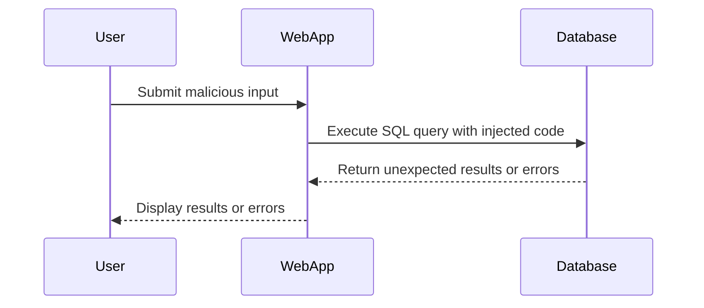

## SQL Injection: A Comprehensive Guide

### Introduction to SQL Injection

SQL injection is a type of attack where an attacker manipulates a SQL query by inserting malicious input into a web application's form fields, URL parameters, or cookies. This manipulation can lead to unauthorized access to sensitive data, data corruption, or even complete system compromise. Understanding SQL injection is crucial for both developers and security professionals to ensure the integrity and confidentiality of web applications.

### Background Theory

#### What is SQL?

Structured Query Language (SQL) is a programming language used to manage and manipulate relational databases. It allows users to perform operations such as querying, updating, and managing data stored in a database. SQL is widely used in various applications, including web applications, where it interacts with backend databases to retrieve and store user data.

#### How Does SQL Injection Work?

SQL injection occurs when an attacker injects malicious SQL code into a query that is executed by the database. This can happen due to poor input validation and sanitization practices in the application. For instance, consider a simple login form where a user enters their username and password. The application might construct a SQL query like this:

```sql
SELECT * FROM users WHERE username = 'user_input' AND password = 'password_input';
```

If the `user_input` and `password_input` are not properly sanitized, an attacker can inject malicious SQL code. For example, an attacker might enter the following input:

- Username: `admin' --`
- Password: `anything`

This would result in the following SQL query:

```sql
SELECT * FROM users WHERE username = 'admin' --' AND password = 'anything';
```

The `--` symbol comments out the rest of the query, effectively bypassing the password check and logging in as the admin user.

### Finding the Number of Columns

One of the first steps in exploiting SQL injection vulnerabilities is to determine the number of columns in the query. This information is crucial for crafting further attacks, such as extracting data or manipulating the query structure.

#### Example Scenario

Consider a web application that displays a list of products based on a search query. The application constructs a SQL query like this:

```sql
SELECT * FROM products WHERE name LIKE '%search_term%';
```

An attacker might attempt to inject a `UNION SELECT` payload to determine the number of columns. The initial payload might look like this:

```sql
' UNION SELECT NULL -- 
```

This payload attempts to append a `UNION SELECT` clause to the original query, with `NULL` as the value. If the number of columns in the original query does not match the number of columns in the injected query, the database will return an error.

#### Error Analysis

When the attacker submits the payload, the resulting query might look like this:

```sql
SELECT * FROM products WHERE name LIKE '%' UNION SELECT NULL -- ';
```

If the original query has more than one column, the database will return an error similar to:

```
All queries combined using a UNION, INTERSECT or EXCEPT operator must have an equal number of expressions in their target lists.
```

This error indicates that the number of columns in the original query does not match the number of columns in the injected query.

#### Incrementing Null Values

To determine the exact number of columns, the attacker can increment the number of `NULL` values in the `UNION SELECT` payload until the error disappears. For example, if the original query has two columns, the attacker might try the following payloads:

1. `' UNION SELECT NULL --`
2. `' UNION SELECT NULL, NULL --`
3. `' UNION SELECT NULL, NULL, NULL --`

The second payload (`' UNION SELECT NULL, NULL --`) will not produce an error, indicating that the original query has two columns.

### Probing Each Column for Data Types

Once the number of columns is determined, the next step is to probe each column to identify the data types it can hold. This is important because different data types can be exploited in different ways.

#### Testing for String Data Types

One common approach is to test whether each column can hold string data. This can be done by injecting a `UNION SELECT` payload that places a string value into each column in turn.

For example, if the original query has two columns, the attacker might try the following payloads:

1. `' UNION SELECT 'test', NULL --`
2. `' UNION SELECT NULL, 'test' --`

Each payload tests whether the corresponding column can hold string data. If the payload returns a valid result, it indicates that the column can hold string data.

### Real-World Examples

#### Recent CVEs and Breaches

SQL injection vulnerabilities continue to be a significant threat to web applications. Here are some recent examples:

- **CVE-2021-3129**: This vulnerability affected the WordPress REST API plugin, allowing attackers to inject malicious SQL code through the API endpoints. The vulnerability was exploited to gain unauthorized access to sensitive data.
- **Capital One Breach (2019)**: In this breach, an attacker exploited a misconfigured web application firewall to inject SQL code and gain access to sensitive customer data. The breach resulted in the exposure of personal information of over 100 million customers.

### Code Examples

#### Vulnerable Code

Here is an example of a vulnerable PHP script that constructs a SQL query based on user input:

```php
<?php
$username = $_GET['username'];
$password = $_GET['password'];

$query = "SELECT * FROM users WHERE username = '$username' AND password = '$password'";
$result = mysqli_query($connection, $query);

if ($result && mysqli_num_rows($result) > 0) {
    echo "Login successful!";
} else {
    echo "Invalid credentials.";
}
?>
```

#### Secure Code

To prevent SQL injection, the script should use prepared statements with parameterized queries. Here is the corrected version:

```php
<?php
$username = $_GET['username'];
$password = $_GET['password'];

$stmt = $connection->prepare("SELECT * FROM users WHERE username = ? AND password = ?");
$stmt->bind_param("ss", $username, $password);
$stmt->execute();
$result = $stmt->get_result();

if ($result && $result->num_rows > 0) {
    echo "Login successful!";
} else {
    echo "Invalid credentials.";
}
?>
```

### Mermaid Diagrams

#### SQL Injection Attack Chain



### Pitfalls and Common Mistakes

#### Poor Input Validation

One of the most common mistakes is failing to validate and sanitize user input. Developers often assume that user input is safe and do not take necessary precautions to prevent SQL injection.

#### Lack of Prepared Statements

Using prepared statements with parameterized queries is a fundamental practice to prevent SQL injection. However, many developers still use dynamic SQL queries, which are highly susceptible to injection attacks.

### How to Prevent / Defend

#### Detection

Detecting SQL injection vulnerabilities requires a combination of static and dynamic analysis techniques. Static analysis tools can scan the codebase for potential vulnerabilities, while dynamic analysis tools can simulate attacks to identify exploitable weaknesses.

#### Prevention

Preventing SQL injection involves several best practices:

1. **Use Prepared Statements**: Always use prepared statements with parameterized queries to separate the SQL logic from the user input.
2. **Input Validation**: Validate and sanitize all user input to ensure it conforms to expected formats and patterns.
3. **Least Privilege Principle**: Ensure that the database user account used by the application has the minimum privileges required to perform its tasks.
4. **Error Handling**: Implement proper error handling to avoid leaking sensitive information through error messages.

#### Secure Coding Fixes

Here is a comparison of vulnerable and secure code:

**Vulnerable Code**

```php
<?php
$username = $_GET['username'];
$password = $_GET['password'];

$query = "SELECT * FROM users WHERE username = '$username' AND password = '$password'";
$result = mysqli_query($connection, $query);

if ($result && mysqli_num_rows($result) > 0) {
    echo "Login successful!";
} else {
    echo "Invalid credentials.";
}
?>
```

**Secure Code**

```php
<?php
$username = $_GET['username'];
$password = $_GET['password'];

$stmt = $connection->prepare("SELECT * FROM users WHERE username = ? AND password = ?");
$stmt->bind_param("ss", $username, $password);
$stmt->execute();
$result = $stmt->get_result();

if ($result && $result->num_rows > 0) {
    echo "Login successful!";
} else {
    echo "Invalid credentials.";
}
?>
```

### Configuration Hardening

#### Database Configuration

Ensure that the database is configured securely to minimize the risk of SQL injection:

1. **Disable Unnecessary Features**: Disable unnecessary features and extensions that are not required by the application.
2. **Limit User Privileges**: Limit the privileges of the database user account used by the application to the minimum required.
3. **Enable Logging**: Enable detailed logging to monitor and detect suspicious activities.

#### Web Application Configuration

Configure the web application to enforce strict input validation and error handling:

1. **Input Validation**: Implement server-side input validation to ensure that user input conforms to expected formats and patterns.
2. **Error Handling**: Configure the application to handle errors gracefully and avoid leaking sensitive information through error messages.

### Practice Labs

To gain hands-on experience with SQL injection, consider the following well-known labs:

- **PortSwigger Web Security Academy**: Offers interactive labs to practice and learn about various web security vulnerabilities, including SQL injection.
- **OWASP Juice Shop**: A deliberately insecure web application designed for security training and research.
- **DVWA (Damn Vulnerable Web Application)**: A PHP/MySQL web application that demonstrates insecure coding practices.
- **WebGoat**: An interactive, open-source Java web application designed to teach web application security lessons.

By practicing in these environments, you can gain a deeper understanding of SQL injection and develop the skills needed to prevent and defend against such attacks.

### Conclusion

SQL injection remains a significant threat to web applications, but with proper understanding and implementation of best practices, it can be effectively prevented. By validating and sanitizing user input, using prepared statements, and configuring the application and database securely, developers can significantly reduce the risk of SQL injection attacks. Regularly testing and monitoring the application can help detect and mitigate vulnerabilities before they can be exploited.

---
<!-- nav -->
[[Web Security (PortSwigger)/02-SQL Injection/01-SQL Injection Complete Guide/01-Introduction to SQL Injection|Introduction to SQL Injection]] | [[Web Security (PortSwigger)/02-SQL Injection/01-SQL Injection Complete Guide/00-Overview|Overview]] | [[03-SQL Injection Overview|SQL Injection Overview]]
