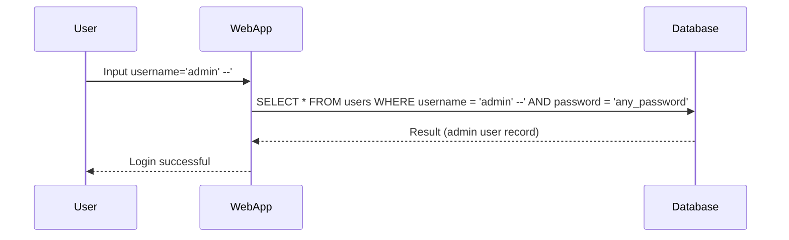
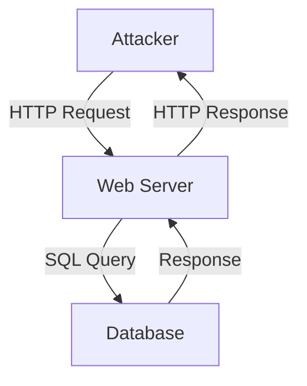

## What is SQL Injection?

SQL Injection (SQLi) is a type of security vulnerability that occurs when an attacker manipulates the SQL queries executed by an application to access or modify data in the backend database. This manipulation is typically achieved by injecting malicious SQL code into input fields that are not properly validated or sanitized. SQL Injection attacks can lead to unauthorized access to sensitive data, data corruption, and even complete compromise of the database.

### How SQL Injection Works

To understand SQL Injection, let's break down the process:

1. **Input Vector**: An input vector is any point where user input is accepted by the application, such as form fields, URL parameters, or API endpoints.
2. **SQL Query Construction**: The application constructs SQL queries using the input provided by the user.
3. **Execution**: The constructed SQL query is executed against the database.
4. **Manipulation**: If the input is not properly validated or sanitized, an attacker can inject additional SQL code that alters the intended behavior of the query.

#### Example Scenario

Consider an application with an authentication functionality where users enter their username and password. The application constructs a SQL query to check if the provided credentials exist in the database. Here’s a simplified example:

```sql
SELECT * FROM users WHERE username = 'input_username' AND password = 'input_password';
```

If the input fields are not properly validated, an attacker could inject malicious SQL code. For instance, if the attacker inputs `admin' --` as the username, the resulting SQL query might look like this:

```sql
SELECT * FROM users WHERE username = 'admin' --' AND password = 'any_password';
```

The `--` is a comment marker in SQL, which causes the rest of the query to be ignored. As a result, the attacker bypasses the password requirement and logs in as the `admin` user.

### Real-World Examples

SQL Injection vulnerabilities have been exploited in numerous high-profile breaches. One notable example is the 2017 Equifax breach, where attackers exploited a vulnerability in Apache Struts, leading to the exposure of sensitive personal information of millions of individuals. Another example is the 2018 British Airways breach, where attackers used SQL Injection to steal payment card details.

### Detection and Prevention

#### Detection

Detecting SQL Injection vulnerabilities requires a combination of static and dynamic analysis tools, as well as manual testing. Some common methods include:

1. **Static Analysis Tools**: Tools like SonarQube, Fortify, and Veracode can analyze source code for potential SQL Injection vulnerabilities.
2. **Dynamic Analysis Tools**: Tools like Burp Suite, OWASP ZAP, and SQLMap can simulate attacks to identify exploitable vulnerabilities.
3. **Manual Testing**: Penetration testing and code reviews can help identify vulnerabilities that automated tools might miss.

#### Prevention

Preventing SQL Injection involves several strategies:

1. **Parameterized Queries**: Use parameterized queries or prepared statements to ensure that user input is treated as data rather than executable code.
2. **Input Validation**: Validate and sanitize all user input to ensure it conforms to expected formats and lengths.
3. **Least Privilege Principle**: Ensure that database accounts used by applications have the minimum necessary privileges.
4. **Web Application Firewalls (WAF)**: Deploy WAFs to filter out malicious traffic and protect against SQL Injection attacks.

### Secure Coding Practices

Here’s an example of how to implement parameterized queries in Python using the `sqlite3` library:

#### Vulnerable Code

```python
import sqlite3

def authenticate(username, password):
    conn = sqlite3.connect('database.db')
    cursor = conn.cursor()
    query = f"SELECT * FROM users WHERE username = '{username}' AND password = '{password}'"
    cursor.execute(query)
    result = cursor.fetchone()
    conn.close()
    return result
```

#### Secure Code

```python
import sqlite3

def authenticate(username, password):
    conn = sqlite3.connect('database.db')
    cursor = conn.cursor()
    query = "SELECT * FROM users WHERE username = ? AND password = ?"
    cursor.execute(query, (username, password))
    result = cursor.fetchone()
    conn.close()
    return result
```

In the secure version, the `?` placeholders are used to represent user input, and the `execute` method takes a tuple of values to replace the placeholders. This ensures that user input is treated as data rather than executable code.

### Mermaid Diagrams

#### Attack Chain Diagram



#### Network Topology Diagram



### Common Pitfalls

1. **Assuming Input is Safe**: Relying solely on client-side validation can lead to vulnerabilities, as attackers can bypass client-side checks.
2. **Using String Concatenation**: Constructing SQL queries using string concatenation is a common mistake that leads to SQL Injection vulnerabilities.
3. **Ignoring Error Messages**: Displaying detailed error messages to users can provide attackers with valuable information about the database schema.

### Hands-On Labs

For hands-on practice with SQL Injection, consider the following resources:

- **PortSwigger Web Security Academy**: Offers interactive labs that cover various aspects of SQL Injection.
- **OWASP Juice Shop**: A deliberately insecure web application for practicing web security skills.
- **DVWA (Damn Vulnerable Web Application)**: A PHP/MySQL web application that demonstrates common web application vulnerabilities.

By thoroughly understanding SQL Injection and implementing robust security measures, developers can significantly reduce the risk of such vulnerabilities in their applications.

---
<!-- nav -->
[[03-SQL Injection Overview|SQL Injection Overview]] | [[Web Security (PortSwigger)/02-SQL Injection/01-SQL Injection Complete Guide/00-Overview|Overview]] | [[05-Black Box Testing vs White Box Testing vs Gray Box Testing|Black Box Testing vs White Box Testing vs Gray Box Testing]]
