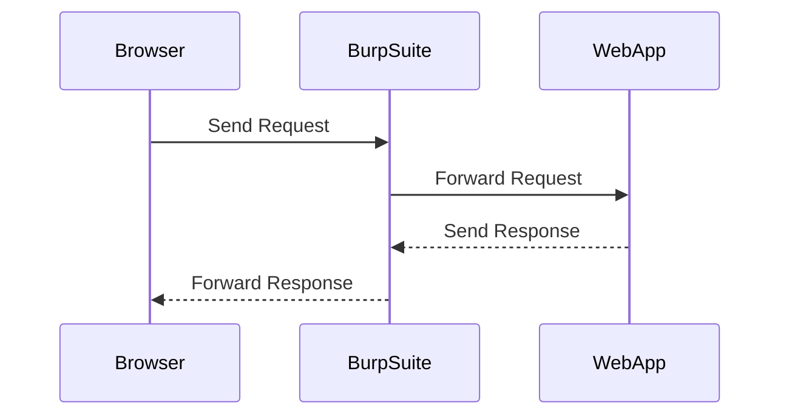
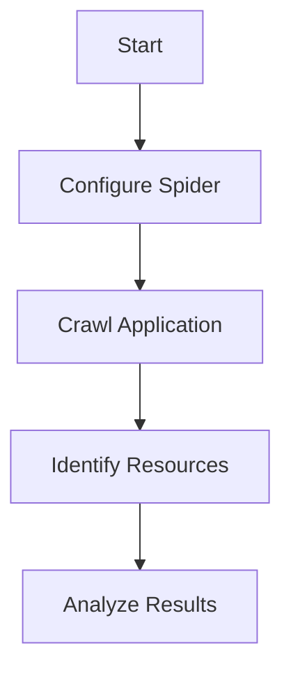

## Mapping the Application: An Underrated but Critical Step

When conducting penetration testing on web applications, one of the most crucial steps often overlooked by beginners is the thorough mapping of the application. This process involves identifying and enumerating directories, pages, and other resources that may not be immediately visible or accessible through the user interface. By doing so, you gain a comprehensive understanding of the application's structure and functionality, which is essential for effective penetration testing.

### Why Mapping Matters

Mapping the application is critical because it allows you to:

- **Identify Hidden Resources**: Discover directories, files, and pages that are not directly linked from the main application interface. These hidden resources could contain sensitive information or provide additional attack surfaces.
- **Understand Application Flow**: Gain insight into how the application processes inputs and interacts with the backend systems. This knowledge is invaluable when crafting targeted attacks.
- **Locate Input Vectors**: Identify all possible points where user input can be injected into the application. This includes form fields, URL parameters, cookies, and other input mechanisms.

### Tools for Mapping

Several tools can assist in mapping web applications:

- **Burp Suite**: A comprehensive toolkit for web application security testing. Burp Suite includes features like the Spider, which automatically crawls the application and identifies resources.
- **OWASP ZAP**: Another popular open-source tool for web application security testing. ZAP includes a spider that can crawl the application and identify resources.
- **DirBuster**: A tool specifically designed for directory and file enumeration. DirBuster can help you discover hidden directories and files by attempting to access them using predefined or custom wordlists.

### Example: Using Burp Suite to Map an Application

Let's walk through an example of using Burp Suite to map a web application.

#### Step 1: Set Up Burp Suite

1. Install Burp Suite and start the application.
2. Configure your browser to use Burp Suite as a proxy. This ensures that all traffic from your browser is routed through Burp Suite.



#### Step 2: Start Crawling the Application

1. In Burp Suite, navigate to the "Target" tab and select "Site map."
2. Click on the "Spider" button to start crawling the application. You can specify the starting URL and configure the spider settings as needed.



#### Step 3: Analyze the Results

Once the spider has completed its crawl, review the identified resources in the site map. Look for any unexpected directories or files that may be worth further investigation.

### Common Pitfalls

- **Overlooking Hidden Resources**: Beginners often focus solely on the visible parts of the application and miss hidden directories or files.
- **Relying Solely on Automated Tools**: While tools like Burp Suite and OWASP ZAP are powerful, they should be supplemented with manual analysis to ensure thorough coverage.

### How to Prevent / Defend

To defend against unauthorized discovery of hidden resources, implement the following measures:

- **Directory Browsing Prevention**: Disable directory browsing on the server to prevent users from listing the contents of directories.
- **Robust Access Controls**: Ensure that access controls are properly implemented to restrict access to sensitive directories and files.
- **Regular Audits**: Conduct regular audits to identify and remediate any hidden resources that could be exploited.

### Secure Coding Practices

Here’s an example of how to securely configure directory browsing prevention in an Apache server:

#### Vulnerable Configuration

```apache
<Directory "/var/www/html">
    Options Indexes FollowSymLinks
</Directory>
```

#### Secure Configuration

```apache
<Directory "/var/www/html">
    Options FollowSymLinks
</Directory>
```

In the secure configuration, the `Indexes` option is removed, preventing directory listings.

### Real-World Examples

- **CVE-2021-21972**: This vulnerability in the WordPress REST API allowed attackers to discover hidden resources and exploit them. Proper mapping and access control could have prevented this issue.
- **CVE-2022-22965**: This vulnerability in the Drupal CMS allowed attackers to discover and exploit hidden modules. Regular audits and robust access controls would have mitigated this risk.

### Practice Labs

For hands-on practice in mapping web applications, consider the following labs:

- **PortSwigger Web Security Academy**: Offers interactive labs that cover various aspects of web application security, including mapping and enumeration.
- **OWASP Juice Shop**: A deliberately insecure web application that includes hidden resources and vulnerabilities for testing.

By thoroughly mapping the application, you set a solid foundation for effective penetration testing and uncover potential vulnerabilities that automated tools might miss.

---
<!-- nav -->
[[11-Input Validation|Input Validation]] | [[Web Security (PortSwigger)/02-SQL Injection/01-SQL Injection Complete Guide/00-Overview|Overview]] | [[13-Out-of-Band SQL Injection|Out-of-Band SQL Injection]]
