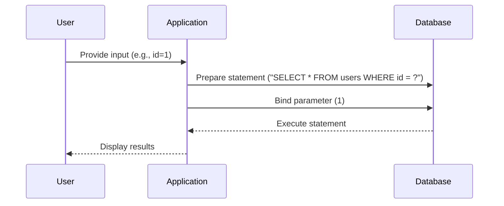

## Parameterized Queries and Prepared Statements

Parameterized queries and prepared statements are powerful techniques to prevent SQL Injection. They ensure that user-supplied input is treated as data rather than executable SQL code.

### Explanation of Prepared Statements

A prepared statement is a precompiled SQL statement that can be executed multiple times with different parameters. This separation of SQL logic and data prevents attackers from injecting malicious SQL code.

#### Example of Prepared Statement in PHP

Consider the following PHP code snippet using prepared statements:

```php
<?php
$servername = "localhost";
$username = "username";
$password = "password";
$dbname = "myDB";

// Create connection
$conn = new mysqli($servername, $username, $password, $dbname);

// Check connection
if ($conn->connect_error) {
    die("Connection failed: " . $conn->connect_error);
}

$user_input = $_GET['id']; // User-supplied input

// Prepare and bind
$stmt = $conn->prepare("SELECT * FROM users WHERE id = ?");
$stmt->bind_param("i", $user_input);

// Execute the statement
$stmt->execute();

// Get result
$result = $stmt->get_result();

if ($result->num_rows > 0) {
    // Output data of each row
    while($row = $result->fetch_assoc()) {
        echo "id: " . $row["id"]. " - Name: ". $row["name"]. "<br>";
    }
} else {
    echo "0 results";
}

// Close the statement and connection
$stmt->close();
$conn->close();
?>
```

In this example, the `?` placeholder in the SQL query is replaced by the `$user_input` value, ensuring that the input is treated as data.

### Mermaid Diagram of Prepared Statement Execution



### Pitfalls of Prepared Statements

Prepared statements are generally effective against SQL Injection, but they can still be vulnerable if not used correctly. For example, concatenating user input with SQL strings can still introduce vulnerabilities.

### Secure Coding Practices

To ensure secure coding practices, developers should:

1. Always use parameterized queries or prepared statements.
2. Validate and sanitize all user inputs.
3. Use least privilege principles when connecting to the database.
4. Regularly update and patch database systems.

### Detection and Prevention

#### Detection

Detection of SQL Injection vulnerabilities can be done through various methods:

- **Static Analysis Tools**: Tools like SonarQube, Fortify, and Veracode can analyze code for potential SQL Injection vulnerabilities.
- **Dynamic Analysis Tools**: Tools like Burp Suite, OWASP ZAP, and SQLMap can test applications for SQL Injection vulnerabilities.

#### Prevention

Prevention of SQL Injection involves a combination of coding practices and security tools:

- **Code Reviews**: Regular code reviews can identify and fix SQL Injection vulnerabilities.
- **Security Training**: Educating developers about SQL Injection and secure coding practices can reduce the likelihood of introducing vulnerabilities.
- **Automated Testing**: Automated testing tools can help identify and mitigate SQL Injection vulnerabilities.

### Real-World Example: Secure vs. Insecure Code

#### Insecure Code

```php
<?php
$servername = "localhost";
$username = "username";
$password = "password";
$dbname = "myDB";

// Create connection
$conn = new mysqli($servername, $username, $password, $dbname);

// Check connection
if ($conn->connect_error) {
    die("Connection failed: " . $conn->connect_error);
}

$user_input = $_GET['id']; // User-supplied input
$sql = "SELECT * FROM users WHERE id = '$user_input'";
$result = $conn->query($sql);

if ($result->num_rows > 0) {
    // Output data of each row
    while($row = $result->fetch_assoc()) {
        echo "id: " . $row["id"]. " - Name: ". $row["name"]. "<br>";
    }
} else {
    echo "0 results";
}
$conn->close();
?>
```

#### Secure Code

```php
<?php
$servername = "localhost";
$username = "username";
$password = "password";
$dbname = "myDB";

// Create connection
$conn = new mysqli($servername, $username, $password, $dbname);

// Check connection
if ($conn->connect_error) {
    die("Connection failed: " . $conn->connect_error);
}

$user_input = $_GET['id']; // User-supplied input

// Prepare and bind
$stmt = $conn->prepare("SELECT * FROM users WHERE id = ?");
$stmt->bind_param("i", $user_input);

// Execute the statement
$stmt->execute();

// Get result
$result = $stmt->get_result();

if ($result->num_rows > 0) {
    // Output data of each row
    while($row = $result->fetch_assoc()) {
        echo "id: " . $row["id"]. " - Name: ". $row["name"]. "<br>";
    }
} else {
    echo "0 results";
}

// Close the statement and connection
$stmt->close();
$conn->close();
?>
```

### Conclusion

SQL Injection is a serious threat to web applications, but it can be effectively prevented through proper coding practices and security measures. By using parameterized queries, validating user inputs, and regularly testing applications, developers can significantly reduce the risk of SQL Injection attacks.

### Hands-On Practice

For hands-on practice with SQL Injection, consider the following labs:

- **PortSwigger Web Security Academy**: Offers interactive labs to learn and practice SQL Injection.
- **OWASP Juice Shop**: A deliberately insecure web application for practicing web security skills.
- **DVWA (Damn Vulnerable Web Application)**: A PHP/MySQL web application that demonstrates web application vulnerabilities.

These labs provide practical experience in identifying and mitigating SQL Injection vulnerabilities.

---

This expanded chapter covers the essential concepts, real-world examples, and detailed explanations necessary for a comprehensive understanding of SQL Injection. The inclusion of code snippets, diagrams, and practical labs ensures that readers gain both theoretical knowledge and practical skills to defend against SQL Injection attacks.

---
<!-- nav -->
[[13-Out-of-Band SQL Injection|Out-of-Band SQL Injection]] | [[Web Security (PortSwigger)/02-SQL Injection/01-SQL Injection Complete Guide/00-Overview|Overview]] | [[15-Stored Procedures and SQL Injection|Stored Procedures and SQL Injection]]
