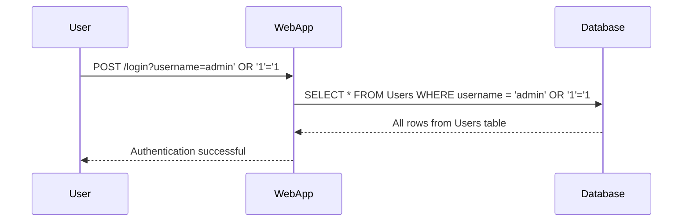
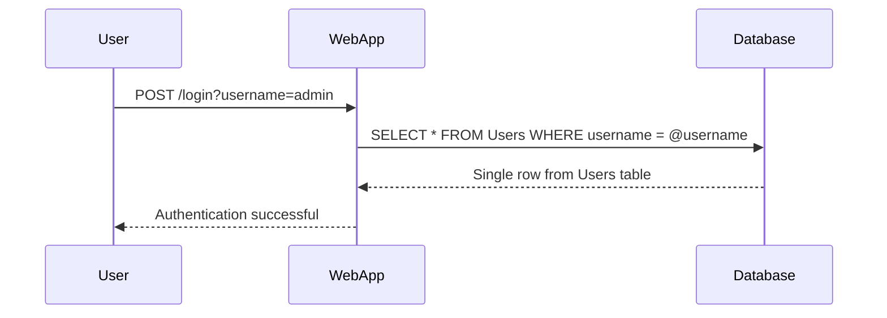

## Stored Procedures and SQL Injection

### What Are Stored Procedures?

Stored procedures are precompiled collections of SQL statements that are stored in a database. They can be invoked by simply calling their name, passing in parameters if necessary. These procedures are often used to encapsulate complex logic and improve performance by reducing the overhead of parsing and compiling SQL statements at runtime.

#### Why Use Stored Procedures?

Stored procedures offer several advantages:
- **Performance**: Since they are precompiled, they can execute faster than ad-hoc SQL statements.
- **Security**: They can enforce access control and limit direct access to data.
- **Maintainability**: They centralize business logic, making it easier to manage and update.

### SQL Injection Vulnerabilities in Stored Procedures

Despite these benefits, stored procedures are not inherently immune to SQL injection attacks. If they are not implemented correctly, they can still be vulnerable.

#### Example of a Vulnerable Stored Procedure

Consider the following stored procedure:

```sql
CREATE PROCEDURE GetUserInfo
    @username NVARCHAR(50)
AS
BEGIN
    DECLARE @sql NVARCHAR(MAX);
    SET @sql = 'SELECT * FROM Users WHERE username = ''' + @username + '''';
    EXEC sp_executesql @sql;
END;
```

This procedure constructs a dynamic SQL statement using the `@username` parameter. If an attacker provides a malicious input such as `admin' OR '1'='1`, the resulting SQL statement becomes:

```sql
SELECT * FROM Users WHERE username = 'admin' OR '1'='1'
```

This query will return all rows from the `Users` table, effectively bypassing authentication.

### How to Safely Use Stored Procedures

To prevent SQL injection, stored procedures should be called in a parameterized manner. This means that the SQL statements within the procedure should use parameterized queries instead of concatenating strings.

#### Correct Implementation

Here’s a safer implementation of the same stored procedure:

```sql
CREATE PROCEDURE GetUserInfo
    @username NVARCHAR(50)
AS
BEGIN
    SELECT * FROM Users WHERE username = @username;
END;
```

In this version, the `@username` parameter is directly used in the SQL statement, ensuring that it is treated as a parameter rather than part of the SQL string.

### Handling Dynamic Elements in Queries

Sometimes, parts of the query such as table names or column names need to be dynamically determined based on user input. This scenario is particularly risky because these elements cannot be parameterized in the same way as values.

#### Example of Dynamic Table Names

Consider a scenario where a user can select a table name from a dropdown menu:

```sql
CREATE PROCEDURE GetDataFromTable
    @tableName NVARCHAR(50)
AS
BEGIN
    DECLARE @sql NVARCHAR(MAX);
    SET @sql = 'SELECT * FROM ' + @tableName;
    EXEC sp_executesql @sql;
END;
```

If an attacker provides a malicious input such as `users; DROP TABLE users`, the resulting SQL statement becomes:

```sql
SELECT * FROM users; DROP TABLE users
```

This can lead to severe data loss.

### Whitelist Input Validation

To mitigate this risk, you can implement whitelist input validation. This involves defining a set of valid inputs and rejecting any input that does not match this set.

#### Example of Whitelist Validation

Here’s how you can implement whitelist validation for table names:

```sql
CREATE PROCEDURE GetDataFromTable
    @tableName NVARCHAR(50)
AS
BEGIN
    IF @tableName NOT IN ('users', 'orders', 'products')
    BEGIN
        RAISERROR('Invalid table name', 16, 1);
        RETURN;
    END;

    DECLARE @sql NVARCHAR(MAX);
    SET @sql = 'SELECT * FROM ' + @tableName;
    EXEC sp_executesql @sql;
END;
```

In this version, the procedure checks if the provided table name is in a predefined list of valid tables. If not, it raises an error and exits.

### Real-World Examples and Recent CVEs

#### CVE-2021-21972: WordPress REST API SQL Injection

In 2021, a vulnerability was discovered in the WordPress REST API that allowed attackers to inject SQL commands through the `orderby` parameter. This vulnerability was exploited to retrieve sensitive information from the database.

#### CVE-2022-22965: Drupal SQL Injection

Another notable example is the SQL injection vulnerability found in Drupal, where attackers could inject malicious SQL commands through the `destination` parameter in the URL. This allowed them to manipulate database queries and potentially gain unauthorized access.

### How to Prevent / Defend Against SQL Injection

#### Detection

- **Logging and Monitoring**: Implement logging and monitoring tools to detect unusual SQL activity.
- **Intrusion Detection Systems (IDS)**: Use IDS to identify and alert on suspicious patterns that may indicate SQL injection attempts.

#### Prevention

- **Parameterized Queries**: Always use parameterized queries to ensure that user input is treated as data rather than executable code.
- **Whitelist Input Validation**: Validate user input against a predefined list of acceptable values.
- **Least Privilege Principle**: Ensure that database accounts have the minimum privileges necessary to perform their tasks.

#### Secure Coding Fixes

##### Vulnerable Code

```sql
CREATE PROCEDURE GetUserInfo
    @username NVARCHAR(50)
AS
BEGIN
    DECLARE @sql NVARCHAR(MAX);
    SET @sql = 'SELECT * FROM Users WHERE username = ''' + @username + '''';
    EXEC sp_executesql @sql;
END;
```

##### Fixed Code

```sql
CREATE PROCEDURE GetUserInfo
    @username NVARCHAR(50)
AS
BEGIN
    SELECT * FROM Users WHERE username = @username;
END;
```

### Mermaid Diagrams

#### Sequence Diagram for SQL Injection Attack



#### Sequence Diagram for Secure Implementation



### Hands-On Labs

For practical experience with SQL injection and mitigation techniques, consider the following labs:
- **PortSwigger Web Security Academy**: Offers interactive labs on SQL injection and other web security topics.
- **OWASP Juice Shop**: A deliberately insecure web application for practicing web security skills.
- **DVWA (Damn Vulnerable Web Application)**: Provides various levels of difficulty for learning and testing web application vulnerabilities.

By thoroughly understanding and implementing these practices, you can significantly reduce the risk of SQL injection attacks in your applications.

---
<!-- nav -->
[[14-Parameterized Queries and Prepared Statements|Parameterized Queries and Prepared Statements]] | [[Web Security (PortSwigger)/02-SQL Injection/01-SQL Injection Complete Guide/00-Overview|Overview]] | [[16-Time-Based SQL Injection|Time-Based SQL Injection]]
