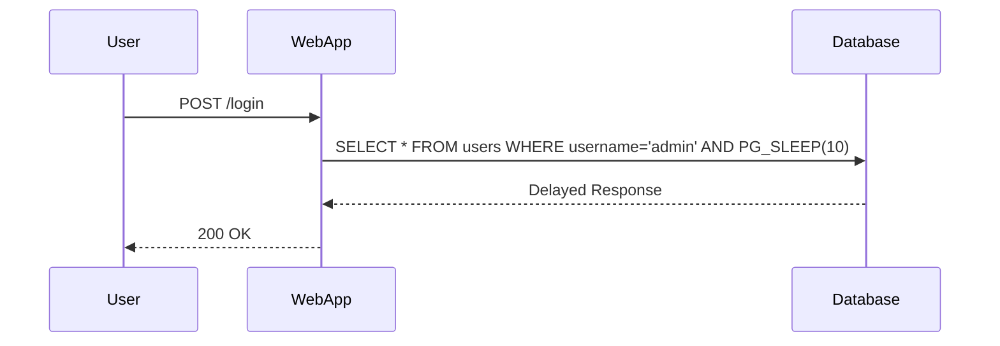

## Time-Based SQL Injection

### Introduction

Time-based SQL injection is a type of blind SQL injection technique that exploits vulnerabilities in web applications by injecting malicious SQL code into input fields. Unlike traditional SQL injection attacks, which can return data directly, time-based SQL injection infers the success of the injected SQL code by measuring the time taken for the server to respond. This method is particularly useful when the attacker cannot see the output of the SQL query directly, making it a powerful tool for extracting sensitive information from databases.

### How Time-Based SQL Injection Works

The core idea behind time-based SQL injection is to inject a payload that causes the database to pause for a specified amount of time. By observing the response time, the attacker can determine whether the injected SQL code was executed successfully. This technique is often used in conjunction with other SQL injection methods to extract data from the database.

#### Example Payloads

In PostgreSQL, the `PG-SLEEP` function is commonly used to introduce a delay. Here’s an example of how this works:

```sql
SELECT * FROM users WHERE username = 'admin' AND PG_SLEEP(10);
```

If the server takes approximately 10 seconds to respond, it indicates that the SQL injection was successful and the `PG-SLEEP` function was executed. Conversely, if the response time is normal, the injection attempt failed.

### Detailed Explanation of the Process

To understand time-based SQL injection in more detail, let's break down the process step-by-step:

1. **Identify Vulnerable Parameters**: First, identify parameters in the web application that are susceptible to SQL injection. These could be form fields, URL parameters, or any other input that is directly used in SQL queries.

2. **Inject Payload**: Inject a payload that includes a time delay function. For PostgreSQL, this would be `PG-SLEEP`.

3. **Measure Response Time**: Measure the time taken for the server to respond. If the response time is significantly longer than usual, it indicates that the payload was executed.

4. **Extract Information**: Use the time delay to infer the correctness of boolean conditions. For example, if the first character of the administrator's hashed password is 'A', the server will delay for 10 seconds.

### Real-World Examples

Recent real-world examples of time-based SQL injection include:

- **CVE-2021-21972**: This vulnerability affected several versions of Oracle MySQL. Attackers could exploit this vulnerability to execute arbitrary SQL commands, including time-based SQL injection payloads.

- **CVE-2022-22965**: This vulnerability in Microsoft SQL Server allowed attackers to bypass authentication mechanisms using time-based SQL injection techniques.

These examples highlight the importance of securing web applications against such vulnerabilities.

### Full HTTP Request and Response Example

Let's consider a scenario where an attacker is trying to exploit a time-based SQL injection vulnerability in a login form. The following is a complete HTTP request and response example:

#### HTTP Request

```http
POST /login HTTP/1.1
Host: vulnerableapp.com
Content-Type: application/x-www-form-urlencoded
Content-Length: 55

username=admin' AND PG_SLEEP(10)--&password=guessme
```

#### HTTP Response

```http
HTTP/1.1 200 OK
Date: Tue, 01 Aug 2023 12:00:00 GMT
Server: Apache/2.4.41 (Ubuntu)
Content-Length: 1024
Content-Type: text/html; charset=UTF-8

<!DOCTYPE html>
<html>
<head>
    <title>Login</title>
</head>
<body>
    <h1>Login Failed</h1>
    <p>Please check your credentials and try again.</p>
</body>
</html>
```

### Mermaid Diagrams

#### Sequence Diagram



### Common Pitfalls and Detection

#### Common Pitfalls

- **Incorrect Timing Measurement**: Measuring the response time accurately is crucial. Network latency and server load can affect timing measurements.
- **Insufficient Delay**: Using too short a delay might not provide enough time to distinguish between a successful and unsuccessful injection.

#### Detection

Detection of time-based SQL injection involves monitoring for unusual response times. Tools like Burp Suite, OWASP ZAP, and SQLMap can help automate the detection process.

### How to Prevent / Defend

#### Secure Coding Practices

- **Parameterized Queries**: Use parameterized queries to ensure that user inputs are treated as data rather than executable code.
- **Input Validation**: Validate all user inputs to ensure they meet expected formats and lengths.

#### Example: Secure Code vs. Vulnerable Code

##### Vulnerable Code

```python
# Vulnerable code
import psycopg2

def login(username, password):
    conn = psycopg2.connect("dbname=test user=postgres password=secret")
    cur = conn.cursor()
    cur.execute(f"SELECT * FROM users WHERE username='{username}' AND password='{password}'")
    result = cur.fetchone()
    cur.close()
    conn.close()
    return result
```

##### Secure Code

```python
# Secure code
import psycopg2

def login(username, password):
    conn = psycopg2.connect("dbname=test user=postgres password=secret")
    cur = conn.cursor()
    cur.execute("SELECT * FROM users WHERE username=%s AND password=%s", (username, password))
    result = cur.fetchone()
    cur.close()
    conn.close()
    return result
```

#### Configuration Hardening

- **Disable Unnecessary Functions**: Disable functions like `PG-SLEEP` that are not required for the application to function.
- **Least Privilege Principle**: Ensure that the database user has the minimum privileges necessary to perform its tasks.

### Conclusion

Time-based SQL injection is a sophisticated technique that allows attackers to infer the success of their SQL injection attempts by measuring response times. Understanding how this technique works, along with practical examples and secure coding practices, is essential for defending against such attacks. By implementing robust security measures and staying vigilant, organizations can significantly reduce the risk of SQL injection vulnerabilities.

### Practice Labs

For hands-on practice with time-based SQL injection, consider the following labs:

- **PortSwigger Web Security Academy**: Offers comprehensive modules on various types of SQL injection, including time-based SQL injection.
- **OWASP Juice Shop**: Provides a vulnerable web application for practicing different types of SQL injection attacks.
- **DVWA (Damn Vulnerable Web Application)**: Includes scenarios for testing and learning about SQL injection vulnerabilities.

By engaging with these labs, you can gain practical experience in identifying and mitigating time-based SQL injection vulnerabilities.

---
<!-- nav -->
[[15-Stored Procedures and SQL Injection|Stored Procedures and SQL Injection]] | [[Web Security (PortSwigger)/02-SQL Injection/01-SQL Injection Complete Guide/00-Overview|Overview]] | [[17-Understanding SQL Injection|Understanding SQL Injection]]
