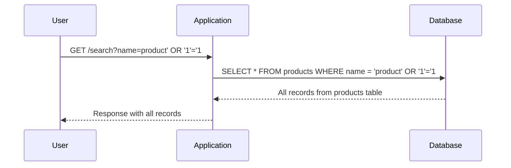

## Introduction to SQL Injection

SQL Injection (SQLi) is a type of security vulnerability that occurs when an attacker manipulates input data to execute arbitrary SQL commands on a database. This can lead to unauthorized access to sensitive information, data manipulation, or even complete compromise of the database. SQL Injection attacks are particularly dangerous because they can be executed through seemingly benign inputs, such as search queries or form submissions.

### What is SQL Injection?

At its core, SQL Injection involves inserting or "injecting" malicious SQL code into user input fields. This code is then executed by the database, leading to unintended behavior. For example, an attacker might inject a command to retrieve all records from a table instead of just the intended ones.

#### Why Does SQL Injection Matter?

SQL Injection is significant because it can expose sensitive data, such as usernames, passwords, and financial information. It can also allow attackers to manipulate or delete data, potentially causing significant damage to the application and its users. Furthermore, SQL Injection can be used as a stepping stone to gain further access to the system, leading to more severe consequences.

#### How Does SQL Injection Work?

To understand how SQL Injection works, let's consider a simple example. Suppose we have a login form that takes a username and password. The backend code constructs an SQL query like this:

```sql
SELECT * FROM users WHERE username = 'input_username' AND password = 'input_password';
```

If the input fields are not properly sanitized, an attacker could inject malicious SQL code. For instance, if the attacker enters `admin' --` as the username, the resulting SQL query would look like this:

```sql
SELECT * FROM users WHERE username = 'admin' --' AND password = 'anything';
```

The `--` is a comment marker in SQL, which causes the rest of the query to be ignored. As a result, the query becomes:

```sql
SELECT * FROM users WHERE username = 'admin';
```

This allows the attacker to log in as the admin user without knowing the password.

### Types of SQL Injection

There are several types of SQL Injection attacks, including:

- **In-band SQLi**: This is the most straightforward type, where the attacker receives the results of the injected SQL query directly. This can be done through error messages or direct output.
- **Blind SQLi**: In this type, the attacker does not receive direct feedback from the database. Instead, they must infer the success of their injection based on changes in the application's behavior.
- **Out-of-band SQLi**: This type involves the attacker receiving the results of the injection through a different channel, such as DNS requests or HTTP requests to a server controlled by the attacker.

### Detecting SQL Injection

Detecting SQL Injection vulnerabilities can be challenging, but there are several methods to identify potential issues:

- **Static Analysis**: Tools like SonarQube, Fortify, and Veracode can analyze the source code for patterns that indicate SQL Injection vulnerabilities.
- **Dynamic Analysis**: Tools like Burp Suite, OWASP ZAP, and SQLMap can test the application in real-time to identify SQL Injection points.
- **Manual Testing**: Manual testing involves simulating SQL Injection attacks to see if the application is vulnerable. This can be done using tools like SQLMap or manually crafting payloads.

### Real-World Examples

SQL Injection has been responsible for numerous high-profile breaches. Here are a few recent examples:

- **CVE-2021-31166**: A SQL Injection vulnerability was found in the Joomla! CMS, allowing attackers to execute arbitrary SQL commands. This could lead to unauthorized access to sensitive data.
- **CVE-2020-14882**: A SQL Injection vulnerability was discovered in the WordPress plugin WP Travel Engine, allowing attackers to retrieve sensitive information from the database.

### Lab Setup

For this lab, we will be using the PortSwigger Web Security Academy. To access the lab, follow these steps:

1. Visit the URL `https://portswigger.net/web-security`.
2. Click on the "Sign Up" button to create an account or log in if you already have one.
3. Once logged in, navigate to the "Academy" section.
4. Scroll down and select the "Learning Path".
5. Choose the "SQL Injection" module.
6. Select the first lab titled "SQL Injection Vulnerability in the WHERE Clause, allowing retrieval of hidden data".

### Lab Description

The lab describes an exercise where you need to exploit a SQL Injection vulnerability in the `WHERE` clause of a SQL query. The goal is to retrieve hidden data that should not be accessible through normal means.

### Exploiting the Vulnerability

Let's dive into the details of how to exploit the SQL Injection vulnerability in the `WHERE` clause.

#### Understanding the Query

Suppose the application has a search feature that allows users to search for products by name. The backend code constructs an SQL query like this:

```sql
SELECT * FROM products WHERE name = 'input_name';
```

If the input field is not properly sanitized, an attacker can inject malicious SQL code. For example, if the attacker enters `product' OR '1'='1` as the input, the resulting SQL query would look like this:

```sql
SELECT * FROM products WHERE name = 'product' OR '1'='1';
```

Since `'1'='1` is always true, the query becomes:

```sql
SELECT * FROM products WHERE name = 'product' OR TRUE;
```

This effectively returns all records from the `products` table, revealing hidden data.

#### Crafting the Payload

To craft the payload, we need to ensure that the injected SQL code is syntactically correct and achieves the desired effect. Here’s a step-by-step guide:

1. Identify the input field where the SQL Injection can be performed.
2. Craft the payload to inject additional SQL code.
3. Test the payload to ensure it works as expected.

For example, if the input field is a search box, we can enter the following payload:

```
product' OR '1'='1
```

This will cause the SQL query to return all records from the `products` table.

### Full Example

Let's walk through a complete example of exploiting the SQL Injection vulnerability.

#### Initial Request

Suppose the initial request looks like this:

```http
GET /search?name=product HTTP/1.1
Host: vulnerable-app.com
```

The corresponding SQL query would be:

```sql
SELECT * FROM products WHERE name = 'product';
```

#### Injected Request

Now, let's inject the payload:

```http
GET /search?name=product' OR '1'='1 HTTP/1.1
Host: vulnerable-app.com
```

The corresponding SQL query would be:

```sql
SELECT * FROM products WHERE name = 'product' OR '1'='1';
```

#### Response

The response would include all records from the `products` table, revealing hidden data.

### Mermaid Diagram

Here is a mermaid diagram illustrating the flow of the SQL Injection attack:



### Common Pitfalls

When exploiting SQL Injection vulnerabilities, there are several common pitfalls to avoid:

- **Syntax Errors**: Ensure that the injected SQL code is syntactically correct. Any syntax errors will cause the query to fail.
- **Character Encoding**: Be aware of character encoding issues that may affect the injection. For example, some characters may need to be URL-encoded.
- **Error Messages**: Pay attention to error messages returned by the application. These can provide valuable information about the structure of the SQL query and the database schema.

### How to Prevent / Defend

Preventing SQL Injection attacks requires a combination of secure coding practices, proper input validation, and the use of parameterized queries.

#### Secure Coding Practices

1. **Use Parameterized Queries**: Parameterized queries separate the SQL code from the input data, preventing SQL Injection. For example, in Python using the `sqlite3` library:

    ```python
    import sqlite3

    conn = sqlite3.connect('example.db')
    cursor = conn.cursor()

    name = 'product'
    cursor.execute("SELECT * FROM products WHERE name = ?", (name,))
    ```

2. **Input Validation**: Validate all user input to ensure it meets expected criteria. For example, if the input should be a product name, validate that it contains only alphanumeric characters and spaces.

#### Detection

Detection of SQL Injection vulnerabilities can be done using various tools and techniques:

- **Static Analysis Tools**: Tools like SonarQube and Fortify can analyze the source code for patterns that indicate SQL Injection vulnerabilities.
- **Dynamic Analysis Tools**: Tools like Burp Suite and OWASP ZAP can test the application in real-time to identify SQL Injection points.
- **Manual Testing**: Manual testing involves simulating SQL Injection attacks to see if the application is vulnerable.

#### Prevention

Prevention of SQL Injection attacks involves several best practices:

- **Use Prepared Statements**: Prepared statements separate the SQL code from the input data, preventing SQL Injection.
- **Input Validation**: Validate all user input to ensure it meets expected criteria.
- **Least Privilege Principle**: Ensure that the database user has the least privileges necessary to perform its tasks.
- **Error Handling**: Implement proper error handling to prevent sensitive information from being exposed in error messages.

#### Secure Code Fix

Here is an example of a vulnerable code and its secure counterpart:

**Vulnerable Code:**

```python
import sqlite3

conn = sqlite3.connect('example.db')
cursor = conn.cursor()

name = 'product'  # User input
query = f"SELECT * FROM products WHERE name = '{name}'"
cursor.execute(query)
```

**Secure Code:**

```python
import sqlite3

conn = sqlite3.connect('example.db')
cursor = conn.cursor()

name = 'product'  # User input
cursor.execute("SELECT * FROM products WHERE name = ?", (name,))
```

### Conclusion

SQL Injection is a serious security vulnerability that can lead to unauthorized access to sensitive data. By understanding how SQL Injection works, identifying potential vulnerabilities, and implementing secure coding practices, you can protect your applications from these attacks.

### Practice Labs

For hands-on practice with SQL Injection, consider the following labs:

- **PortSwigger Web Security Academy**: Offers a variety of labs that cover different aspects of SQL Injection.
- **OWASP Juice Shop**: A deliberately insecure web application that includes several SQL Injection vulnerabilities.
- **Damn Vulnerable Web Application (DVWA)**: A PHP/MySQL web application that is intentionally vulnerable to common web application attacks, including SQL Injection.

By completing these labs, you can gain practical experience in identifying and exploiting SQL Injection vulnerabilities, as well as implementing effective defenses.

---
<!-- nav -->
[[Web Security (PortSwigger)/02-SQL Injection/02-Lab 1 SQL injection vulnerability in WHERE clause allowing retrieval of hidden data/00-Overview|Overview]] | [[Web Security (PortSwigger)/02-SQL Injection/02-Lab 1 SQL injection vulnerability in WHERE clause allowing retrieval of hidden data/02-Common Pitfalls and Mistakes|Common Pitfalls and Mistakes]]
