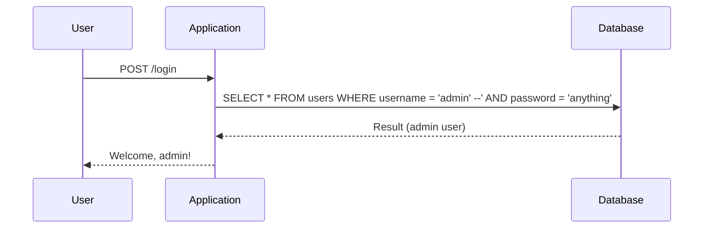

## Introduction to SQL Injection

SQL Injection is a type of security vulnerability that occurs when an attacker manipulates input data to execute arbitrary SQL commands against a database. This can lead to unauthorized access, data theft, or even complete control over the database. In the context of web applications, SQL Injection vulnerabilities often arise due to improper validation and sanitization of user inputs.

### What is SQL Injection?

SQL Injection is a code injection technique used to exploit security vulnerabilities in a web application's database layer. An attacker injects malicious SQL statements into the input fields of a web application, which are then executed by the database server. This can result in unauthorized access to sensitive data, modification of data, or even denial of service.

#### Why Does SQL Injection Matter?

SQL Injection is a critical security concern because it can lead to severe consequences such as:

- **Data Theft**: Attackers can extract sensitive information like usernames, passwords, credit card details, etc.
- **Data Manipulation**: Attackers can modify or delete data within the database.
- **Unauthorized Access**: Attackers can gain administrative privileges and take control of the entire system.
- **Denial of Service**: Attackers can cause the database to crash, leading to service disruption.

### How Does SQL Injection Work?

To understand SQL Injection, let's consider a simple example. Suppose a web application has a login form that takes a username and password as input. The application might construct an SQL query like this:

```sql
SELECT * FROM users WHERE username = 'input_username' AND password = 'input_password';
```

If the application does not properly validate and sanitize the input, an attacker could inject malicious SQL code. For instance, if the attacker enters the following input:

- Username: `admin' --`
- Password: `anything`

The resulting SQL query would be:

```sql
SELECT * FROM users WHERE username = 'admin' --' AND password = 'anything';
```

In this case, the `--` is a comment symbol in SQL, which causes the rest of the query to be ignored. As a result, the query becomes:

```sql
SELECT * FROM users WHERE username = 'admin';
```

This allows the attacker to log in as the admin user without knowing the actual password.

### Real-World Examples of SQL Injection

SQL Injection attacks have been responsible for numerous high-profile breaches. Here are a few recent examples:

- **CVE-2021-21972**: A SQL Injection vulnerability was found in the WordPress plugin "WP eCommerce". This allowed attackers to execute arbitrary SQL commands and potentially gain administrative access to the website.
- **CVE-2020-14882**: A SQL Injection vulnerability was discovered in the Joomla CMS. This vulnerability allowed attackers to execute arbitrary SQL commands and potentially steal sensitive data.
- **CVE-2019-14587**: A SQL Injection vulnerability was found in the Drupal CMS. This allowed attackers to execute arbitrary SQL commands and potentially gain administrative access to the website.

### Lab Setup and Environment

For this lab, we will be using the Web Security Academy provided by PortSwigger. The lab environment is designed to simulate a real-world scenario where a web application has a SQL Injection vulnerability in its login functionality.

To access the lab, follow these steps:

1. Visit the URL: `https://portswigger.net/web-security`.
2. Click on the "Sign Up" button to create an account.
3. Once logged in, navigate to the "Academy" section.
4. Scroll down and click on the "Learning Path".
5. Select the "SQL Injection" module.
6. Jump to the second lab titled "SQL Injection Vulnerability, allowing login bypass".

### Lab Description

The lab description states that the application contains a SQL Injection vulnerability in the login functionality. The goal is to perform a SQL Injection attack that logs into the application as the administrator user.

### Step-by-Step Exploitation

Let's walk through the steps to exploit the SQL Injection vulnerability in the login functionality.

#### Step 1: Identify the Vulnerable Input Field

First, identify the input field that is vulnerable to SQL Injection. Typically, this would be the username or password field in the login form.

#### Step 2: Craft the SQL Injection Payload

Next, craft the SQL Injection payload. The payload should be designed to manipulate the SQL query in such a way that it bypasses the authentication mechanism.

For example, if the application constructs the SQL query as follows:

```sql
SELECT * FROM users WHERE username = 'input_username' AND password = 'input_password';
```

We can inject a payload that bypasses the password check. One common approach is to use a comment symbol (`--`) to terminate the SQL statement prematurely.

#### Step 3: Execute the SQL Injection Attack

Now, execute the SQL Injection attack by entering the crafted payload into the vulnerable input field.

For instance, enter the following input:

- Username: `admin' --`
- Password: `anything`

This will result in the following SQL query being executed:

```sql
SELECT * FROM users WHERE username = 'admin' --' AND password = 'anything';
```

The `--` comment symbol causes the rest of the query to be ignored, effectively bypassing the password check.

#### Step 4: Verify the Success of the Attack

After submitting the form, verify whether the attack was successful. If the application allows you to log in as the admin user, the attack was successful.

### Full Example of SQL Injection Attack

Let's provide a complete example of the SQL Injection attack, including the HTTP request and response.

#### HTTP Request

Here is the complete HTTP request sent to the server:

```http
POST /login HTTP/1.1
Host: vulnerable-app.com
Content-Type: application/x-www-form-urlencoded
Content-Length: 35

username=admin%27+--+&password=anything
```

#### HTTP Response

Here is the complete HTTP response received from the server:

```http
HTTP/1.1 200 OK
Date: Mon, 01 Jan 2024 12:00:00 GMT
Server: Apache/2.4.41 (Ubuntu)
Content-Type: text/html; charset=UTF-8
Content-Length: 1234

<!DOCTYPE html>
<html>
<head>
    <title>Login</title>
</head>
<body>
    <h1>Welcome, admin!</h1>
    <p>You have successfully logged in.</p>
</body>
</html>
```

### Mermaid Diagrams

Let's use a mermaid diagram to illustrate the flow of the SQL Injection attack.



### Common Pitfalls and Mistakes

When performing SQL Injection attacks, there are several common pitfalls and mistakes to avoid:

- **Incorrect Syntax**: Ensure that the injected SQL syntax is correct and compatible with the target database.
- **Character Encoding**: Be aware of character encoding issues that may affect the injection payload.
- **Error Handling**: Some applications may have error handling mechanisms that can prevent the attack from succeeding.
- **Input Validation**: Modern web applications often implement input validation and sanitization, which can mitigate SQL Injection attacks.

### How to Prevent / Defend Against SQL Injection

Preventing SQL Injection attacks requires a combination of proper coding practices, input validation, and secure configuration settings.

#### Secure Coding Practices

1. **Use Prepared Statements**: Prepared statements ensure that user inputs are treated as data rather than executable code.
2. **Parameterized Queries**: Parameterized queries separate the SQL logic from the user inputs, preventing SQL Injection.
3. **Stored Procedures**: Stored procedures can also help prevent SQL Injection by encapsulating the SQL logic within the database.

#### Input Validation and Sanitization

1. **Validate User Inputs**: Validate all user inputs to ensure they meet the expected format and constraints.
2. **Sanitize User Inputs**: Sanitize user inputs to remove any characters that could be used for SQL Injection.

#### Secure Configuration Settings

1. **Least Privilege Principle**: Ensure that the database user has the least privilege necessary to perform its tasks.
2. **Disable Unnecessary Features**: Disable unnecessary features and functions that could be exploited for SQL Injection.

#### Detection and Monitoring

1. **Web Application Firewalls (WAF)**: Implement WAFs to detect and block SQL Injection attempts.
2. **Logging and Monitoring**: Enable logging and monitoring to detect suspicious activities and potential SQL Injection attacks.

### Secure Code Example

Here is an example of secure code using prepared statements in PHP:

```php
<?php
$servername = "localhost";
$username = "username";
$password = "password";
$dbname = "myDB";

// Create connection
$conn = new mysqli($servername, $username, $password, $dbname);

// Check connection
if ($conn->connect_error) {
    die("Connection failed: " . $conn->connect_error);
}

// Prepare and bind
$stmt = $conn->prepare("SELECT * FROM users WHERE username = ? AND password = ?");
$stmt->bind_param("ss", $username, $password);

// Set parameters and execute
$username = $_POST['username'];
$password = $_POST['password'];
$stmt->execute();

$result = $stmt->get_result();
if ($result->num_rows > 0) {
    echo "Welcome, admin!";
} else {
    echo "Invalid credentials.";
}

$stmt->close();
$conn->close();
?>
```

### Vulnerable Code Example

Here is an example of vulnerable code that is susceptible to SQL Injection:

```php
<?php
$servername = "localhost";
$username = "username";
$password = "password";
$dbname = "myDB";

// Create connection
$conn = new mysqli($servername, $username, $password, $dbname);

// Check connection
if ($conn->connect_error) {
    die("Connection failed: " . $conn->connect_error);
}

// Vulnerable code
$username = $_POST['username'];
$password = $_POST['password'];

$sql = "SELECT * FROM users WHERE username = '$username' AND password = '$password'";
$result = $conn->query($sql);

if ($result->num_rows > 0) {
    echo "Welcome, admin!";
} else {
    echo "Invalid credentials.";
}

$conn->close();
?>
```

### Conclusion

SQL Injection is a serious security vulnerability that can have severe consequences. By understanding how SQL Injection works, identifying vulnerable input fields, crafting appropriate payloads, and executing the attack, you can effectively bypass authentication mechanisms. However, it is crucial to implement proper defenses to prevent SQL Injection attacks, including secure coding practices, input validation, and secure configuration settings.

### Practice Labs

For hands-on practice with SQL Injection, consider the following labs:

- **PortSwigger Web Security Academy**: Offers a variety of labs that cover different aspects of SQL Injection.
- **OWASP Juice Shop**: Provides a vulnerable web application for practicing various web security techniques, including SQL Injection.
- **DVWA (Damn Vulnerable Web Application)**: A deliberately insecure web application for practicing penetration testing and web application security.

By engaging in these labs, you can gain practical experience and deepen your understanding of SQL Injection vulnerabilities and their mitigation strategies.

---
<!-- nav -->
[[Web Security (PortSwigger)/02-SQL Injection/03-Lab 2 SQL injection vulnerability allowing login bypass/00-Overview|Overview]] | [[02-Complete Example SQL Injection Exploit and Mitigation|Complete Example SQL Injection Exploit and Mitigation]]
