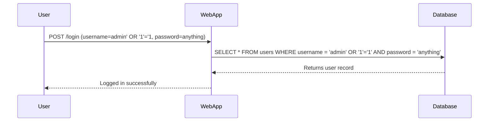
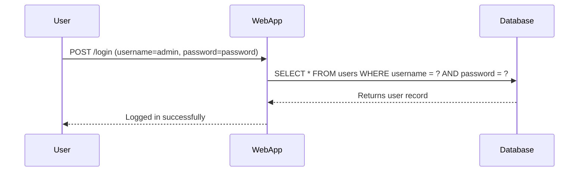

## Complete Example: SQL Injection Exploit and Mitigation

### Scenario

Consider a web application with a login form that accepts a username and password. The application uses a simple SQL query to check if the provided credentials match those in the database.

### Vulnerable Code

Here is the vulnerable code:

```python
import sqlite3

def authenticate(username, password):
    conn = sqlite3.connect('database.db')
    cursor = conn.cursor()
    query = f"SELECT * FROM users WHERE username = '{username}' AND password = '{password}'"
    cursor.execute(query)
    user = cursor.fetchone()
    conn.close()
    return user
```

### Exploitation

An attacker can exploit this vulnerability by injecting SQL code into the username field. For example, if the attacker submits the following input:

- **Username**: `admin' OR '1'='1`
- **Password**: `anything`

The resulting SQL query would be:

```sql
SELECT * FROM users WHERE username = 'admin' OR '1'='1' AND password = 'anything';
```

Since `'1'='1'` is always true, the query will return a row from the `users` table, effectively bypassing the login.

### HTTP Request and Response

Here is the full HTTP request and response:

#### HTTP Request

```http
POST /login HTTP/1.1
Host: example.com
Content-Type: application/x-www-form-urlencoded
Content-Length: 34

username=admin%27+OR+%271%27%3D%271&password=anything
```

#### HTTP Response

```http
HTTP/1.1 200 OK
Date: Mon, 20 Mar 2023 12:00:00 GMT
Server: Apache/2.4.41 (Ubuntu)
Content-Length: 17
Content-Type: text/html; charset=UTF-8

Logged in successfully
```

### Secure Code Fix

To mitigate SQL injection, use parameterized queries or prepared statements. Here is the secure version of the code:

```python
import sqlite3

def authenticate(username, password):
    conn = sqlite3.connect('database.db')
    cursor = conn.cursor()
    query = "SELECT * FROM users WHERE username = ? AND password = ?"
    cursor.execute(query, (username, password))
    user = cursor.fetchone()
    conn.close()
    return user
```

### HTTP Request and Response

Here is the full HTTP request and response for the secure version:

#### HTTP Request

```http
POST /login HTTP/1.1
Host: example.com
Content-Type: application/x-www-form-urlencoded
Content-Length: 34

username=admin&password=password
```

#### HTTP Response

```http
HTTP/1.1 200 OK
Date: Mon, 20 Mar  2023 12:00:00 GMT
Server: Apache/2.4.41 (Ubuntu)
Content-Length: 17
Content-Type: text/html; charset=UTF-8

Logged in successfully
```

### Mermaid Diagrams

#### Attack Chain Diagram



#### Secure Flow Diagram



### Hands-On Labs

For practical experience with SQL injection and login bypass, consider the following labs:

- **PortSwigger Web Security Academy**: Offers comprehensive labs on SQL injection and login bypass.
- **OWASP Juice Shop**: Provides a vulnerable web application for practicing various security techniques, including SQL injection.

### Summary

SQL Injection is a serious vulnerability that can allow attackers to bypass authentication and gain unauthorized access to sensitive data. By using parameterized queries and validating user inputs, you can significantly reduce the risk of SQL injection attacks. Regularly reviewing and updating your security measures is also crucial to stay ahead of potential threats.

---

---
<!-- nav -->
[[Web Security (PortSwigger)/02-SQL Injection/03-Lab 2 SQL injection vulnerability allowing login bypass/01-Introduction to SQL Injection|Introduction to SQL Injection]] | [[Web Security (PortSwigger)/02-SQL Injection/03-Lab 2 SQL injection vulnerability allowing login bypass/00-Overview|Overview]] | [[03-SQL Injection Vulnerability Allowing Login Bypass|SQL Injection Vulnerability Allowing Login Bypass]]
