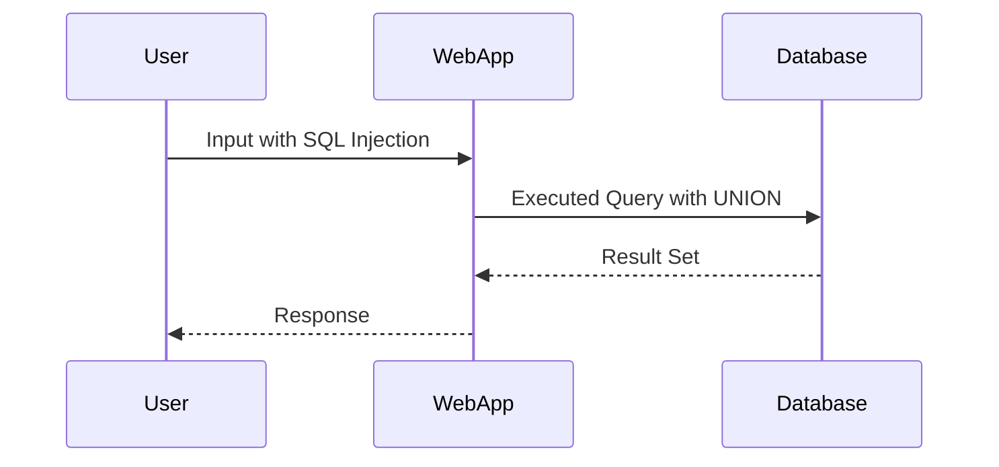

## Background Knowledge on SQL Injection and Union Operator

### What is SQL Injection?

SQL Injection (SQLi) is a type of injection attack where an attacker manipulates a web application's input fields to execute arbitrary SQL commands on the backend database. This can lead to unauthorized access to sensitive data, data manipulation, or even complete control of the database.

#### Why Does SQL Injection Matter?

SQL Injection attacks are significant because they can compromise the integrity and confidentiality of a database. Attackers can extract sensitive information such as user credentials, financial data, and personal identifiable information (PII). They can also modify or delete data, leading to potential financial losses and reputational damage.

#### How Does SQL Injection Work?

SQL Injection occurs when user input is not properly sanitized or validated before being used in a SQL query. For example, consider a login form where the username and password are used in a SQL query:

```sql
SELECT * FROM users WHERE username = '$username' AND password = '$password';
```

If an attacker inputs `'$username' OR '1'='1'` as the username, the query becomes:

```sql
SELECT * FROM users WHERE username = '' OR '1'='1' AND password = '';
```

This query will return all rows from the `users` table, effectively bypassing authentication.

### Understanding the Union Operator

The `UNION` operator in SQL is used to combine the results of two or more `SELECT` statements into a single result set. Each `SELECT` statement within the `UNION` must have the same number of columns, and corresponding columns must have compatible data types.

#### Example of Union Operator

Consider two tables, `Table1` and `Table2`, with the following structure:

- **Table1**: Columns `A` and `B`
- **Table2**: Columns `C` and `D`

Let's assume the tables contain the following data:

**Table1**
| A | B |
|---|---|
| 1 | 2 |
| 3 | 4 |

**Table2**
| C | D |
|---|---|
| 2 | 3 |
| 4 | 5 |

Now, let's perform a `SELECT` query on `Table1`:

```sql
SELECT A, B FROM Table1;
```

The result would be:

| A | B |
|---|---|
| 1 | 2 |
| 3 | 4 |

Next, let's use the `UNION` operator to combine the results of `Table1` and `Table2`:

```sql
SELECT A, B FROM Table1
UNION
SELECT C, D FROM Table2;
```

The result would be:

| A | B |
|---|---|
| 1 | 2 |
| 3 | 4 |
| 2 | 3 |
| 4 | 5 |

### SQL Injection Using the Union Operator

In the context of SQL Injection, the `UNION` operator can be used to inject additional rows into the result set. This can help an attacker determine the number of columns returned by the original query and potentially extract data from other tables.

#### Example of SQL Injection with Union

Suppose we have a vulnerable query like:

```sql
SELECT column1, column2 FROM some_table WHERE id = '$input';
```

An attacker can inject a `UNION` clause to add additional rows:

```sql
SELECT column1, column2 FROM some_table WHERE id = '1' UNION SELECT NULL, NULL;
```

This will return the original rows plus an additional row with `NULL` values.

### Determining the Number of Columns Returned by the Query

To determine the number of columns returned by the query, an attacker can inject a `UNION` clause with different numbers of `NULL` values until the query succeeds.

#### Step-by-Step Process

1. **Identify the Vulnerable Parameter**: Find a parameter in the URL or form that is used in a SQL query.
2. **Inject the UNION Clause**: Start with a simple `UNION` clause with one `NULL` value and incrementally increase the number of `NULL` values until the query succeeds.

For example, suppose the original query is:

```sql
SELECT column1, column2 FROM some_table WHERE id = '$input';
```

The attacker can start with:

```sql
SELECT column1, column2 FROM some_table WHERE id = '1' UNION SELECT NULL;
```

If this fails, try:

```sql
SELECT column1, column2 FROM some_table WHERE id = '1' UNION SELECT NULL, NULL;
```

If this succeeds, the query has two columns.

### Real-World Examples of SQL Injection Attacks

#### Recent CVEs and Breaches

- **CVE-2021-22205**: This vulnerability affected the WordPress plugin "WP GDPR Compliance." An attacker could exploit this vulnerability to execute arbitrary SQL queries, including SQL Injection attacks using the `UNION` operator.
- **Equifax Data Breach (2017)**: One of the vulnerabilities exploited was an SQL Injection flaw in the Apache Struts framework. Although not specifically involving the `UNION` operator, this breach highlights the severe consequences of SQL Injection vulnerabilities.

### Complete Code Example

Let's walk through a complete example of determining the number of columns returned by a query using SQL Injection with the `UNION` operator.

#### Original Query

Assume the original query is:

```sql
SELECT column1, column2 FROM some_table WHERE id = '$input';
```

#### Injected Query with UNION

Start with one `NULL` value:

```sql
SELECT column1, column2 FROM some_table WHERE id = '1' UNION SELECT NULL;
```

If this fails, try two `NULL` values:

```sql
SELECT column1, column2 FROM some_table WHERE id = '1' UNION SELECT NULL, NULL;
```

If this succeeds, the query has two columns.

### Mermaid Diagrams

#### SQL Injection Attack Flow



### Pitfalls and Common Mistakes

- **Incorrect Number of NULL Values**: If the number of `NULL` values does not match the number of columns in the original query, the SQL Injection attempt will fail.
- **Improper Error Handling**: If the web application does not handle errors properly, it may reveal information about the database schema, making it easier for attackers to craft successful SQL Injection attacks.

### How to Prevent / Defend Against SQL Injection

#### Detection

- **Logging and Monitoring**: Implement logging and monitoring to detect unusual SQL queries or patterns indicative of SQL Injection attempts.
- **Security Tools**: Use security tools like SQLMap to test for SQL Injection vulnerabilities.

#### Prevention

- **Parameterized Queries**: Use parameterized queries or prepared statements to ensure user input is treated as data rather than executable code.
- **Input Validation**: Validate and sanitize user input to prevent malicious SQL commands from being executed.

#### Secure Coding Fixes

##### Vulnerable Code

```php
$input = $_GET['id'];
$query = "SELECT column1, column2 FROM some_table WHERE id = '$input'";
$result = mysqli_query($conn, $query);
```

##### Secure Code

```php
$input = $_GET['id'];
$stmt = $conn->prepare("SELECT column1, column2 FROM some_table WHERE id = ?");
$stmt->bind_param("i", $input);
$stmt->execute();
$result = $stmt->get_result();
```

### Configuration Hardening

- **Database Permissions**: Ensure database permissions are restricted to the minimum necessary for the application to function.
- **Error Reporting**: Disable error reporting in production environments to prevent attackers from gaining insights into the database schema.

### Hands-On Labs

For hands-on practice with SQL Injection and the `UNION` operator, consider the following labs:

- **PortSwigger Web Security Academy**: Offers interactive labs on SQL Injection, including the `UNION` operator.
- **OWASP Juice Shop**: Provides a vulnerable web application for practicing various web security techniques, including SQL Injection.
- **DVWA (Damn Vulnerable Web Application)**: A deliberately insecure web application for practicing penetration testing and web application security.

By thoroughly understanding the concepts, practicing with real-world examples, and implementing secure coding practices, you can effectively defend against SQL Injection attacks.

---
<!-- nav -->
[[Web Security (PortSwigger)/02-SQL Injection/04-Lab 3 SQLi UNION attack determining the number of columns returned by the query/03-Introduction to SQL Injection|Introduction to SQL Injection]] | [[Web Security (PortSwigger)/02-SQL Injection/04-Lab 3 SQLi UNION attack determining the number of columns returned by the query/00-Overview|Overview]] | [[05-Determining the Number of Columns in a Query|Determining the Number of Columns in a Query]]
