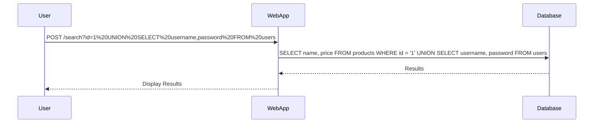

## Understanding SQL Injection and UNION Attacks

### Background Theory

SQL Injection (SQLi) is a type of attack where an attacker manipulates a database query by injecting malicious SQL code into input fields. This can lead to unauthorized access to sensitive data, data manipulation, or even complete control of the database. One common technique used in SQLi attacks is the `UNION` operator, which allows an attacker to combine the results of two or more SELECT statements into a single result set.

### How UNION Works

The `UNION` operator is used to combine the results of two or more SELECT statements. Each SELECT statement within the UNION must have the same number of columns and compatible data types. Here’s a basic example:

```sql
SELECT a, b FROM table_one
UNION
SELECT c, d FROM table_two;
```

In this example, `table_one` has columns `a` and `b`, and `table_two` has columns `c` and `d`. The `UNION` operator combines these results into a single result set.

#### Example Breakdown

Let's break down the example provided in the lecture:

```sql
SELECT a, b FROM table_one
UNION
SELECT c, d FROM table_two;
```

- **First Query**: `SELECT a, b FROM table_one`
  - Result: `1, 2`, `3, 4`
- **Second Query**: `SELECT c, d FROM table_two`
  - Result: `2, 3`, `4, 5`

Combining these results using `UNION`:

```plaintext
1, 2
3, 4
2, 3
4, 5
```

### SQL Injection with UNION

In the context of SQL Injection, an attacker can inject a `UNION` query to manipulate the output of a database query. For instance, consider a web application that displays products from a product table:

```sql
SELECT * FROM products WHERE id = '1';
```

An attacker might inject a `UNION` query to retrieve data from other tables, such as a user table containing usernames and hashed passwords:

```sql
SELECT * FROM products WHERE id = '1' UNION SELECT username, password FROM users;
```

This query will return both the product data and the user data in a single result set.

### Determining the Number of Columns

To successfully perform a `UNION` attack, the attacker must know the number of columns returned by the original query. This is crucial because the injected query must match the number of columns in the original query.

#### Example Scenario

Consider the following original query:

```sql
SELECT name, price FROM products WHERE id = '1';
```

The attacker needs to determine the number of columns (`name` and `price`). They can do this by injecting a query with different numbers of columns until they find the correct number:

```sql
SELECT name, price FROM products WHERE id = '1' UNION SELECT NULL, NULL;
```

If this query returns results, the attacker knows the original query has two columns.

### Real-World Examples

#### Recent CVEs and Breaches

One notable example of a SQL Injection attack is the breach of the Equifax credit reporting agency in 2017 (CVE-2017-5638). The attackers exploited a vulnerability in Apache Struts, which allowed them to execute arbitrary SQL commands. This led to the theft of sensitive personal information of millions of customers.

Another example is the breach of the Capital One financial services company in 2019 (CVE-2019-11510). The attacker exploited a misconfigured server that allowed them to access sensitive customer data through a SQL Injection vulnerability.

### Complete Code Example

Let's walk through a complete example of a SQL Injection attack using the `UNION` operator.

#### Original Query

```sql
SELECT name, price FROM products WHERE id = '1';
```

#### Injected Query

```sql
SELECT name, price FROM products WHERE id = '1' UNION SELECT username, password FROM users;
```

#### Full HTTP Request and Response

```http
POST /search HTTP/1.1
Host: example.com
Content-Type: application/x-www-form-urlencoded
Content-Length: 28

id=1%20UNION%20SELECT%20username,password%20FROM%20users
```

#### Expected Response

```http
HTTP/1.1 200 OK
Content-Type: text/html; charset=UTF-8
Content-Length: 123

<table>
<tr><th>Name</th><th>Price</th></tr>
<tr><td>Product 1</td><td>$10.00</td></tr>
<tr><td>john_doe</td><td>$2y$10$...</td></tr>
<tr><td>jane_smith</td><td>$2y$10$...</td></tr>
</table>
```

### Mermaid Diagrams

#### Attack Chain Diagram



### Pitfalls and Common Mistakes

#### Incorrect Column Count

One common mistake is assuming the number of columns in the original query. If the injected query does not match the number of columns, the database will return an error.

#### Lack of Error Handling

Many applications fail to properly handle errors, which can leak information to the attacker. For example, a generic error message like "Internal Server Error" can indicate that the injected query caused an issue.

### How to Prevent / Defend

#### Secure Coding Practices

1. **Parameterized Queries**: Use parameterized queries to ensure that user input is treated as data rather than executable code.
   
   ```sql
   SELECT name, price FROM products WHERE id = ?
   ```

2. **Input Validation**: Validate all user inputs to ensure they meet expected formats and constraints.

#### Configuration Hardening

1. **Least Privilege Principle**: Ensure that the database user has the minimum necessary privileges to perform its tasks.
   
   ```sql
   GRANT SELECT ON products TO webapp_user;
   ```

2. **Error Handling**: Implement proper error handling to avoid leaking sensitive information.

#### Detection and Monitoring

1. **Logging and Monitoring**: Enable detailed logging and monitor for suspicious activities, such as unusual SQL queries or frequent errors.

2. **Security Tools**: Use security tools like SQLMap to test for vulnerabilities and identify potential SQL Injection points.

### Secure Code Fix Example

#### Vulnerable Code

```php
$id = $_GET['id'];
$query = "SELECT name, price FROM products WHERE id = '$id'";
$result = mysqli_query($conn, $query);
```

#### Secure Code

```php
$id = $_GET['id'];
$stmt = $conn->prepare("SELECT name, price FROM products WHERE id = ?");
$stmt->bind_param("i", $id);
$stmt->execute();
$result = $stmt->get_result();
```

### Practice Labs

For hands-on practice with SQL Injection and UNION attacks, consider the following labs:

- **PortSwigger Web Security Academy**: Offers interactive labs specifically designed to teach and test SQL Injection techniques.
- **OWASP Juice Shop**: A deliberately insecure web application that includes various SQL Injection vulnerabilities.
- **DVWA (Damn Vulnerable Web Application)**: Provides a range of SQL Injection challenges, including UNION attacks.

By thoroughly understanding the mechanics of SQL Injection and UNION attacks, you can better defend against these threats and ensure the security of your applications.

---
<!-- nav -->
[[06-SQL Injection Determining the Number of Columns Returned by the Query|SQL Injection Determining the Number of Columns Returned by the Query]] | [[Web Security (PortSwigger)/02-SQL Injection/04-Lab 3 SQLi UNION attack determining the number of columns returned by the query/00-Overview|Overview]] | [[08-Understanding SQL Injection and the UNION Attack|Understanding SQL Injection and the UNION Attack]]
