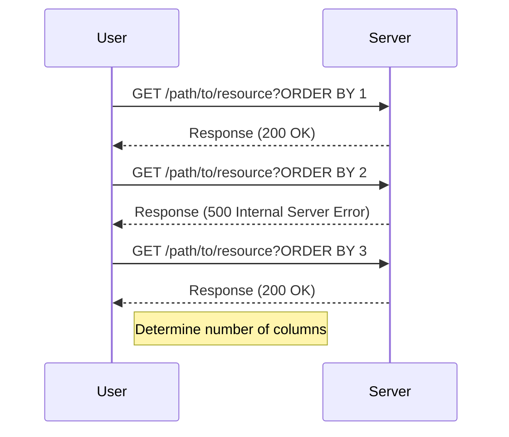

## Understanding SQL Injection and the UNION Attack

### What is SQL Injection?

SQL Injection (SQLi) is a type of security vulnerability that allows an attacker to inject malicious SQL statements into an application’s input fields. This can lead to unauthorized access to sensitive data, manipulation of data, or even complete control over the database. SQLi occurs when user input is not properly validated or sanitized before being included in a SQL query.

### Why Does SQL Injection Matter?

SQL Injection is one of the most critical vulnerabilities in web applications due to its potential impact. An attacker can exploit SQLi to bypass authentication mechanisms, retrieve sensitive information, or even execute commands on the server. This makes it a high-priority issue for security professionals and developers alike.

### How Does SQL Injection Work?

At its core, SQL Injection works by manipulating the structure of a SQL query. Consider a simple login form where the username and password are submitted to the server. A typical SQL query might look like this:

```sql
SELECT * FROM users WHERE username = 'input_username' AND password = 'input_password';
```

If the input fields are not properly sanitized, an attacker could inject a malicious SQL statement. For example, if the attacker inputs `'' OR '1'='1` as the username, the query becomes:

```sql
SELECT * FROM users WHERE username = '' OR '1'='1' AND password = 'input_password';
```

This query will always return true, effectively bypassing the authentication mechanism.

### Recent Real-World Examples

One notable example of SQL Injection is the breach of the popular website MySpace in 2006. Hackers exploited a SQLi vulnerability to gain access to user data, including email addresses and passwords. Another recent example is the SQLi attack on the Equifax credit reporting agency in 2017, which exposed sensitive personal information of millions of customers.

### Determining the Number of Columns in a Query

To perform a successful SQL Injection attack, especially using the UNION technique, it is crucial to know the number of columns returned by the original query. This is because the UNION operator requires both queries to have the same number of columns.

### The UNION Attack

The UNION attack is a specific type of SQL Injection where an attacker combines the results of two or more SELECT statements. This is done to extract additional data from the database. To successfully execute a UNION attack, the attacker must ensure that the number of columns in the injected query matches the number of columns in the original query.

### Example Scenario

Let's consider a scenario where an attacker wants to determine the number of columns returned by a query. Suppose the original query is:

```sql
SELECT column1, column2, column3 FROM table WHERE id = 'input_id';
```

The attacker needs to inject a payload that will help them determine the number of columns. One way to do this is by using the ORDER BY clause.

### Writing the Exploit Function

To automate the process of determining the number of columns, we can write a Python script. The script will iterate through a range of numbers and attempt to inject an ORDER BY clause with different column numbers.

#### Background Theory

The ORDER BY clause is used to sort the result-set in ascending or descending order. By injecting an ORDER BY clause with a specific column number, we can test whether the query is executed successfully. If the query fails, it means the specified column number does not exist.

#### Step-by-Step Mechanics

1. **Identify the Path**: First, identify the path of the request. This can be done using tools like Burp Suite.
2. **Iterate Through Column Numbers**: Iterate through a range of column numbers (e.g., 1 to 50).
3. **Inject the Payload**: Inject the ORDER BY clause with the current column number.
4. **Make the Request**: Send the request to the server and check the response.
5. **Determine Success**: If the response indicates success, the correct number of columns has been found.

#### Complete Code Example

Here is a complete Python script to determine the number of columns:

```python
import requests

def exploit(url):
    path = "/path/to/resource"
    for i in range(1, 51):
        sql_payload = f"ORDER BY {i}"
        full_url = url + path + "?" + sql_payload
        response = requests.get(full_url, verify=False, proxies={"http": "http://localhost:8080", "https": "http://localhost:8080"})
        
        if response.status_code == 200:
            print(f"Success with {i} columns")
            break
        else:
            print(f"Failed with {i} columns")

# Example usage
exploit("http://example.com")
```

### Mermaid Diagrams

To visualize the process, we can use a mermaid diagram:



### Pitfalls and Common Mistakes

1. **Incorrect Range**: Choosing an incorrect range for the number of columns can lead to unnecessary iterations.
2. **Improper Validation**: Not validating user input can leave the application vulnerable to SQL Injection.
3. **Ignoring Error Responses**: Ignoring error responses can make it difficult to determine the success of the attack.

### How to Prevent / Defend

#### Detection

1. **Logging and Monitoring**: Implement logging and monitoring to detect unusual SQL queries.
2. **Intrusion Detection Systems (IDS)**: Use IDS to detect and alert on suspicious activities.

#### Prevention

1. **Parameterized Queries**: Use parameterized queries to prevent SQL Injection.
2. **Input Validation**: Validate and sanitize all user inputs before using them in SQL queries.
3. **Least Privilege Principle**: Ensure that the application runs with the least privileges necessary.

#### Secure Coding Fixes

**Vulnerable Code**:

```python
query = f"SELECT * FROM users WHERE username = '{username}' AND password = '{password}'"
```

**Secure Code**:

```python
query = "SELECT * FROM users WHERE username = %s AND password = %s"
cursor.execute(query, (username, password))
```

### Real-World Example: CVE-2021-3129

CVE-2021-3129 is a SQL Injection vulnerability in the WordPress plugin WP Event Manager. The vulnerability arises from improper validation of user input in the search functionality. An attacker could exploit this vulnerability to inject malicious SQL statements and gain unauthorized access to the database.

### Conclusion

Understanding and preventing SQL Injection is crucial for securing web applications. By automating the process of determining the number of columns and implementing proper security measures, developers can significantly reduce the risk of SQL Injection attacks.

### Practice Labs

For hands-on practice with SQL Injection and UNION attacks, consider the following labs:

- **PortSwigger Web Security Academy**: Offers comprehensive modules on SQL Injection.
- **OWASP Juice Shop**: Provides a vulnerable web application for practicing various types of attacks.
- **DVWA (Damn Vulnerable Web Application)**: A deliberately insecure web application for testing and learning about web vulnerabilities.

By thoroughly understanding the concepts and practicing with real-world examples, you can become proficient in detecting and preventing SQL Injection attacks.

---
<!-- nav -->
[[07-Understanding SQL Injection and UNION Attacks|Understanding SQL Injection and UNION Attacks]] | [[Web Security (PortSwigger)/02-SQL Injection/04-Lab 3 SQLi UNION attack determining the number of columns returned by the query/00-Overview|Overview]] | [[Web Security (PortSwigger)/02-SQL Injection/04-Lab 3 SQLi UNION attack determining the number of columns returned by the query/09-Understanding the Lab Environment|Understanding the Lab Environment]]
