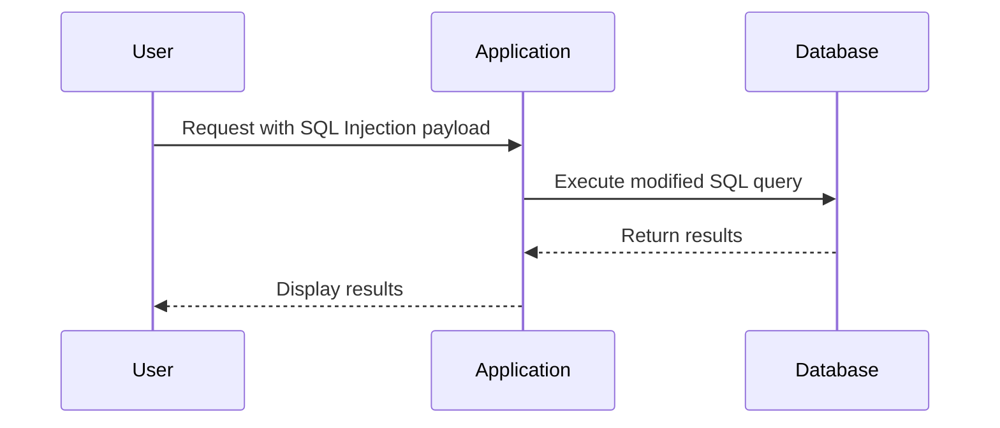

## Understanding the Lab Environment

The lab environment simulates a web application with a SQL Injection vulnerability in the product category filter. The goal is to determine the number of columns returned by the query using a SQL Injection Union attack.

### Background Theory

Before diving into the practical steps, it's essential to understand the underlying principles of SQL Injection and the `UNION` operator.

#### SQL Injection Vulnerabilities

SQL Injection vulnerabilities typically occur when user input is directly concatenated into SQL queries without proper sanitization or parameterization. This allows an attacker to inject arbitrary SQL code, potentially altering the intended behavior of the query.

#### The UNION Operator

The `UNION` operator in SQL is used to combine the result sets of two or more SELECT statements. Each SELECT statement within the `UNION` must have the same number of columns and compatible data types.

### Steps to Perform the SQL Injection Union Attack

1. **Identify the Vulnerable Parameter**: Determine which parameter in the application is vulnerable to SQL Injection. In this case, it is the product category filter.
2. **Craft the SQL Injection Payload**: Construct a payload that includes a `UNION` operator to combine the original query with a new SELECT statement.
3. **Determine the Number of Columns**: By injecting different payloads, you can determine the number of columns returned by the original query.

### Practical Example

Let's walk through the steps to perform the SQL Injection Union attack in the lab environment.

#### Step 1: Identify the Vulnerable Parameter

Assume the application has a URL like:

```
http://example.com/products?category=Electronics
```

By manipulating the `category` parameter, we can test for SQL Injection.

#### Step 2: Craft the SQL Injection Payload

We start by injecting a simple payload to see if the application is vulnerable:

```
http://example.com/products?category=Electronics' UNION SELECT NULL--
```

If the application returns an error, it indicates that the `category` parameter is vulnerable to SQL Injection.

#### Step 3: Determine the Number of Columns

To determine the number of columns, we need to inject payloads that incrementally increase the number of columns until the query succeeds.

```plaintext
http://example.com/products?category=Electronics' UNION SELECT NULL-- (1 column)
http://example.com/products?category=Electronics' UNION SELECT NULL, NULL-- (2 columns)
http://example.com/products?category=Electronics' UNION SELECT NULL, NULL, NULL-- (3 columns)
...
```

Continue this process until the query returns valid results.

### Full Example with Code

Here is a detailed example of the process:

1. **Initial Payload**:
    ```plaintext
    http://example.com/products?category=Electronics' UNION SELECT NULL--
    ```

2. **Two Columns**:
    ```plaintext
    http://example.com/products?category=Electronics' UNION SELECT NULL, NULL--
    ```

3. **Three Columns**:
    ```plaintext
    http://example.com/products?category=Electronics' UNION SELECT NULL, NULL, NULL--
    ```

4. **Four Columns**:
    ```plaintext
    http://example.com/products?category=Electronics' UNION SELECT NULL, NULL, NULL, NULL--
    ```

Once the correct number of columns is determined, you can proceed to extract data from other tables.

### Mermaid Diagram: SQL Injection Flow



### Common Pitfalls and Detection

#### Common Pitfalls

- **Incorrect Column Count**: Failing to correctly determine the number of columns can lead to errors or incorrect results.
- **Improper Sanitization**: Not properly sanitizing user input can leave the application vulnerable to SQL Injection.

#### Detection

- **Logging and Monitoring**: Implement logging and monitoring to detect unusual SQL queries.
- **Web Application Firewalls (WAF)**: Use WAFs to detect and block SQL Injection attempts.

### How to Prevent / Defend

#### Secure Coding Practices

- **Parameterized Queries**: Use parameterized queries to ensure user input is treated as data rather than executable code.
- **Input Validation**: Validate and sanitize all user input to prevent SQL Injection.

#### Configuration Hardening

- **Least Privilege Principle**: Ensure the application runs with the least privileges necessary to perform its tasks.
- **Database Security Settings**: Configure database settings to minimize exposure to SQL Injection.

#### Secure Code Example

Vulnerable Code:
```python
query = f"SELECT * FROM products WHERE category = '{category}'"
```

Secure Code:
```python
query = "SELECT * FROM products WHERE category = %s"
params = (category,)
cursor.execute(query, params)
```

### Conclusion

SQL Injection is a serious threat to web applications that rely on SQL databases. By understanding the principles behind SQL Injection and practicing secure coding techniques, developers can protect their applications from these vulnerabilities. The SQL Injection Union attack is a powerful technique that can be used to extract sensitive data from a database. However, with proper defenses in place, such attacks can be prevented.

### Practice Labs

For hands-on practice with SQL Injection, consider the following labs:

- **PortSwigger Web Security Academy**: Offers a variety of labs to practice SQL Injection and other web security vulnerabilities.
- **OWASP Juice Shop**: A deliberately insecure web application for practicing web security skills.
- **DVWA (Damn Vulnerable Web Application)**: A PHP/MySQL web application that demonstrates insecure coding practices.

These labs provide a safe environment to learn and practice web security techniques.

---
<!-- nav -->
[[08-Understanding SQL Injection and the UNION Attack|Understanding SQL Injection and the UNION Attack]] | [[Web Security (PortSwigger)/02-SQL Injection/04-Lab 3 SQLi UNION attack determining the number of columns returned by the query/00-Overview|Overview]] | [[Web Security (PortSwigger)/02-SQL Injection/04-Lab 3 SQLi UNION attack determining the number of columns returned by the query/10-Conclusion|Conclusion]]
