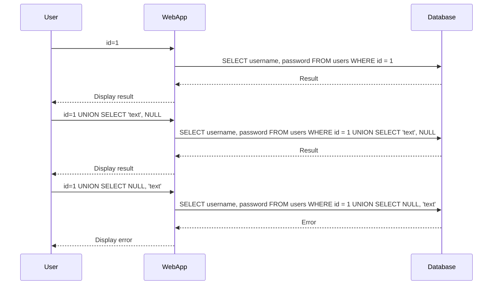

## SQL Injection Overview

SQL Injection is a common web security vulnerability that allows an attacker to interfere with the queries that an application makes to its database. The goal of SQL injection attacks is to manipulate the logic of the underlying SQL queries, thereby allowing the attacker to bypass authentication mechanisms, access unauthorized data, or even execute arbitrary commands on the database server.

### Why SQL Injection Matters

SQL Injection vulnerabilities can lead to severe consequences, including:

- **Data Leakage**: Attackers can extract sensitive information such as passwords, credit card details, and personal data.
- **Data Manipulation**: Attackers can modify or delete data within the database.
- **Unauthorized Access**: Attackers can gain administrative privileges and take control of the entire database.
- **Denial of Service**: By injecting malicious SQL code, attackers can cause the database to crash or become unresponsive.

### Real-World Examples

One notable example of SQL Injection is the breach of the popular website MySpace in 2006. An attacker exploited a SQL Injection vulnerability to steal millions of user profiles. Another recent example is the SQL Injection attack on the Equifax database in 2017, which exposed sensitive data of over 143 million customers.

### Background Theory

To understand SQL Injection, it's essential to grasp the basics of SQL queries and how they interact with databases. SQL (Structured Query Language) is used to manage and manipulate relational databases. Common SQL operations include `SELECT`, `INSERT`, `UPDATE`, and `DELETE`.

#### Example SQL Query

```sql
SELECT username, password FROM users WHERE id = 1;
```

In this query, the database returns the `username` and `password` of the user with `id = 1`. If the input to the query is not properly sanitized, an attacker can inject additional SQL code to manipulate the query.

### SQL Injection Types

There are several types of SQL Injection attacks, including:

- **Error-Based SQL Injection**: Exploits errors returned by the database to infer information about the database structure.
- **Blind SQL Injection**: Uses boolean or time-based techniques to infer information without direct feedback from the database.
- **Union-Based SQL Injection**: Combines the results of two or more SELECT statements to retrieve additional data.

### Union-Based SQL Injection

Union-Based SQL Injection is particularly useful when the attacker wants to retrieve data from different tables or columns. This technique relies on the `UNION` operator to combine the results of two or more SELECT statements.

#### Example Scenario

Consider a web application that retrieves user information based on a user ID:

```sql
SELECT username, password FROM users WHERE id = 1;
```

If the input is not properly sanitized, an attacker can inject a `UNION` statement to retrieve additional data:

```sql
SELECT username, password FROM users WHERE id = 1 UNION SELECT table_name, column_name FROM information_schema.columns WHERE table_schema = 'database_name';
```

This query combines the results of two SELECT statements, potentially revealing the structure of the database.

### Finding Columns Containing Text

When performing a Union-Based SQL Injection attack, it's crucial to identify columns that can accept text data types. This is necessary because many sensitive pieces of information, such as usernames and hashed passwords, are stored as text.

#### Identifying Text Columns

The process of identifying text columns involves iteratively testing each column to determine if it accepts text data. This is done by injecting a value of type text into each column and observing whether an error is thrown.

#### Step-by-Step Process

1. **Determine the Number of Columns**:
   First, determine the number of columns in the original query. This can be done by incrementally increasing the number of dummy values until an error is thrown.

   ```sql
   SELECT * FROM users WHERE id = 1 UNION SELECT NULL, NULL -- Throws an error if there are fewer than 2 columns
   ```

2. **Iterate Through Each Column**:
   Once the number of columns is known, test each column by injecting a text value and checking for errors.

   ```sql
   SELECT * FROM users WHERE id = 1 UNION SELECT 'text', NULL, NULL -- Test the first column
   ```

   If no error is thrown, the first column accepts text data. Repeat this process for each column.

### Complete Example

Let's walk through a complete example of identifying text columns using a Union-Based SQL Injection attack.

#### Original Query

Assume the original query is:

```sql
SELECT username, password FROM users WHERE id = 1;
```

#### Determine the Number of Columns

First, determine the number of columns by incrementally adding `NULL` values:

```sql
SELECT username, password FROM users WHERE id = 1 UNION SELECT NULL, NULL -- No error, 2 columns
```

#### Test Each Column

Now, test each column by injecting a text value:

```sql
SELECT username, password FROM users WHERE id = 1 UNION SELECT 'text', NULL -- No error, first column accepts text
```

```sql
SELECT username, password FROM users WHERE id = 1 UNION SELECT NULL, 'text' -- Error, second column does not accept text
```

### Mermaid Diagram

A mermaid diagram can help visualize the process of identifying text columns:



### Pitfalls and Common Mistakes

- **Incorrect Number of Columns**: Failing to correctly determine the number of columns can lead to incorrect injection attempts.
- **Improper Error Handling**: Not properly handling errors can make it difficult to determine which columns accept text data.
- **Insufficient Testing**: Failing to thoroughly test each column can result in missing potential vulnerabilities.

### How to Prevent / Defend

#### Secure Coding Practices

1. **Parameterized Queries**: Use parameterized queries to ensure that user inputs are treated as data rather than executable code.

   ```python
   import sqlite3

   conn = sqlite3.connect('example.db')
   cursor = conn.cursor()

   user_id = 1
   cursor.execute("SELECT username, password FROM users WHERE id = ?", (user_id,))
   rows = cursor.fetchall()
   ```

2. **Input Validation**: Validate user inputs to ensure they meet expected formats and constraints.

   ```python
   def validate_input(user_input):
       if not isinstance(user_input, int):
           raise ValueError("Invalid input")
       return user_input

   user_id = validate_input(1)
   ```

#### Detection and Monitoring

1. **Web Application Firewalls (WAF)**: Implement WAFs to detect and block SQL Injection attempts.

2. **Logging and Monitoring**: Monitor application logs for suspicious activities and unusual SQL queries.

#### Hardening Configurations

1. **Least Privilege Principle**: Ensure that database users have the minimum permissions necessary to perform their tasks.

2. **Database Configuration**: Disable unnecessary features and services to reduce the attack surface.

### Complete Code Example

Here is a complete example demonstrating both the vulnerable and secure versions of a web application:

#### Vulnerable Version

```python
import sqlite3

def get_user_info(user_id):
    conn = sqlite3.connect('example.db')
    cursor = conn.cursor()
    cursor.execute(f"SELECT username, password FROM users WHERE id = {user_id}")
    rows = cursor.fetchall()
    return rows

user_id = 1
print(get_user_info(user_id))
```

#### Secure Version

```python
import sqlite3

def get_user_info(user_id):
    conn = sqlite3.connect('example.db')
    cursor = conn.cursor()
    cursor.execute("SELECT username, password FROM users WHERE id = ?", (user_id,))
    rows = cursor.fetchall()
    return rows

user_id = 1
print(get_user_info(user_id))
```

### Practice Labs

For hands-on practice with SQL Injection, consider the following labs:

- **PortSwigger Web Security Academy**: Offers comprehensive modules on SQL Injection, including Union-Based SQL Injection.
- **OWASP Juice Shop**: A deliberately insecure web application for practicing various web security attacks, including SQL Injection.
- **DVWA (Damn Vulnerable Web Application)**: A PHP/MySQL web application that contains numerous security vulnerabilities.

By thoroughly understanding and practicing the concepts covered in this chapter, you can effectively defend against SQL Injection attacks and ensure the security of your web applications.

---
<!-- nav -->
[[Web Security (PortSwigger)/02-SQL Injection/05-Lab 4 SQL injection UNION attack finding a column containing text/01-Introduction to SQL Injection|Introduction to SQL Injection]] | [[Web Security (PortSwigger)/02-SQL Injection/05-Lab 4 SQL injection UNION attack finding a column containing text/00-Overview|Overview]] | [[03-Finding Columns Containing Text|Finding Columns Containing Text]]
