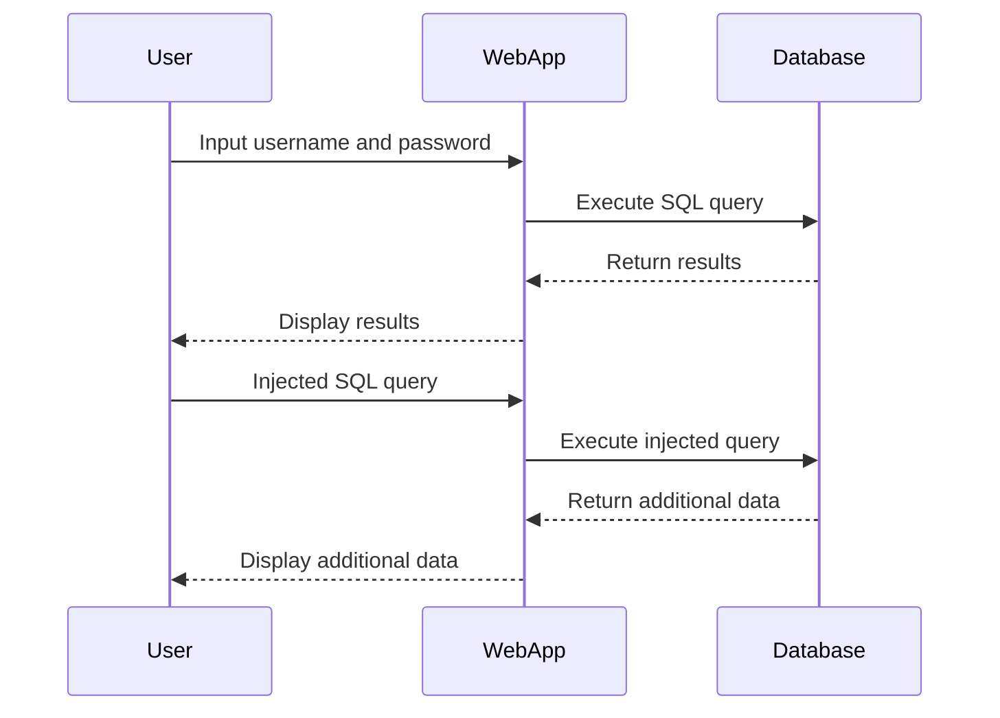

## SQL Injection: Union Attack Retrieving Data from Other Tables

### Background Theory

SQL Injection is a common web application vulnerability that occurs when an attacker manipulates input fields to execute arbitrary SQL commands against a database. This can lead to unauthorized access to sensitive data, data manipulation, or even complete control over the database.

In the context of SQL Injection, a **Union Attack** is a specific technique used to retrieve data from other tables within the same database. This attack leverages the `UNION` operator in SQL, which combines the results of two or more `SELECT` statements into a single result set.

### Understanding the Scenario

Let's break down the scenario described in the lecture:

- We have a web application that interacts with a database.
- There is a form or input field where user input is used to construct an SQL query.
- The goal is to extract usernames and passwords from the `users` table and log in as the administrator.

#### Example Scenario

Consider a simple login form where the user inputs a username and password. The backend SQL query might look like this:

```sql
SELECT * FROM users WHERE username = 'input_username' AND password = 'input_password';
```

If the input fields are vulnerable to SQL Injection, an attacker could manipulate the input to inject malicious SQL code.

### Union Query Construction

To perform a Union Attack, the attacker constructs a query using the `UNION` operator. The key points are:

1. **Matching Column Counts**: The number of columns selected in the injected query must match the number of columns in the original query.
2. **Data Type Consistency**: The data types of the columns in the injected query must be compatible with those in the original query.

#### Example Original Query

Assume the original query looks like this:

```sql
SELECT username, password FROM users WHERE username = 'admin' AND password = 'input_password';
```

The attacker wants to retrieve data from another table, such as `admins`, which also has `username` and `password` columns.

#### Injected Query

The attacker constructs the following query:

```sql
SELECT username, password FROM users WHERE username = 'admin' AND password = 'input_password' UNION SELECT username, password FROM admins;
```

This query combines the results of two `SELECT` statements:
1. The original query.
2. A new query selecting data from the `admins` table.

### Detailed Steps

1. **Identify Vulnerable Input Field**: Find an input field where user input is directly used in an SQL query.
2. **Determine Original Query Structure**: Understand the structure of the original query, including the number of columns and their data types.
3. **Construct Injected Query**: Create a new `SELECT` statement that matches the original query in terms of column count and data types.
4. **Combine Queries Using UNION**: Use the `UNION` operator to combine the original and injected queries.

#### Example Code

Here’s a detailed example of how an attacker might craft the injected query:

```sql
-- Original query
SELECT username, password FROM users WHERE username = 'admin' AND password = 'input_password';

-- Injected query
SELECT username, password FROM users WHERE username = 'admin' AND password = 'input_password' UNION SELECT username, password FROM admins;
```

### Real-World Examples

#### Recent CVEs and Breaches

- **CVE-2021-22205**: A SQL Injection vulnerability in the WordPress plugin "WP eCommerce" allowed attackers to retrieve sensitive data from the database.
- **Equifax Breach (2017)**: A SQL Injection vulnerability led to the exposure of sensitive personal information of millions of users.

These examples highlight the severity of SQL Injection vulnerabilities and the importance of proper mitigation strategies.

### Mermaid Diagrams

#### SQL Injection Attack Flow



### Pitfalls and Common Mistakes

1. **Incorrect Column Count**: If the number of columns in the injected query does not match the original query, the SQL statement will fail.
2. **Data Type Inconsistency**: If the data types of the columns in the injected query do not match those in the original query, the SQL statement may fail or return unexpected results.
3. **Lack of Proper Validation**: Failing to validate user input can make the application vulnerable to SQL Injection attacks.

### How to Prevent / Defend

#### Detection

- **Logging and Monitoring**: Implement logging and monitoring to detect unusual SQL queries or patterns indicative of SQL Injection attempts.
- **Intrusion Detection Systems (IDS)**: Use IDS to identify and alert on potential SQL Injection attacks.

#### Prevention

- **Input Validation**: Validate and sanitize all user input to ensure it conforms to expected formats and does not contain malicious SQL code.
- **Parameterized Queries**: Use parameterized queries or prepared statements to separate SQL logic from user input.

#### Secure Coding Fixes

##### Vulnerable Code

```python
# Vulnerable code
query = f"SELECT * FROM users WHERE username = '{username}' AND password = '{password}';"
cursor.execute(query)
```

##### Secure Code

```python
# Secure code using parameterized queries
query = "SELECT * FROM users WHERE username = %s AND password = %s;"
cursor.execute(query, (username, password))
```

#### Configuration Hardening

- **Least Privilege Principle**: Ensure that the database user has the minimum necessary privileges to perform its tasks.
- **Database Security Settings**: Configure database security settings to restrict access and limit the impact of potential SQL Injection attacks.

### Complete Example

#### Full HTTP Request and Response

##### Request

```http
POST /login HTTP/1.1
Host: example.com
Content-Type: application/x-www-form-urlencoded

username=admin&password=' UNION SELECT username, password FROM admins--
```

##### Response

```http
HTTP/1.1 200 OK
Content-Type: text/html

<!DOCTYPE html>
<html>
<head>
    <title>Login</title>
</head>
<body>
    <h1>Login Successful</h1>
    <p>Welcome, admin!</p>
    <p>Username: admin</p>
    <p>Password: admin_password</p>
</body>
</html>
```

### Practice Labs

For hands-on practice with SQL Injection and Union Attacks, consider the following labs:

- **PortSwigger Web Security Academy**: Offers interactive labs on SQL Injection, including Union Attacks.
- **OWASP Juice Shop**: Provides a vulnerable web application for practicing various web security techniques, including SQL Injection.
- **DVWA (Damn Vulnerable Web Application)**: A deliberately insecure web application for learning and testing web application security.

By thoroughly understanding and practicing these concepts, you can effectively defend against SQL Injection attacks and ensure the security of your web applications.

---
<!-- nav -->
[[04-SQL Injection UNION Attack|SQL Injection UNION Attack]] | [[Web Security (PortSwigger)/02-SQL Injection/06-Lab 5 SQL injection UNION attack retrieving data from other tables/00-Overview|Overview]] | [[Web Security (PortSwigger)/02-SQL Injection/06-Lab 5 SQL injection UNION attack retrieving data from other tables/06-Practice Questions & Answers|Practice Questions & Answers]]
