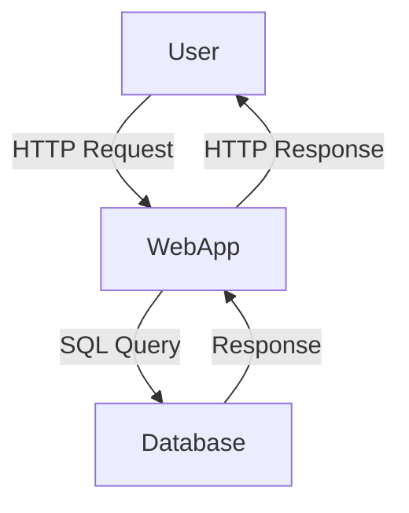
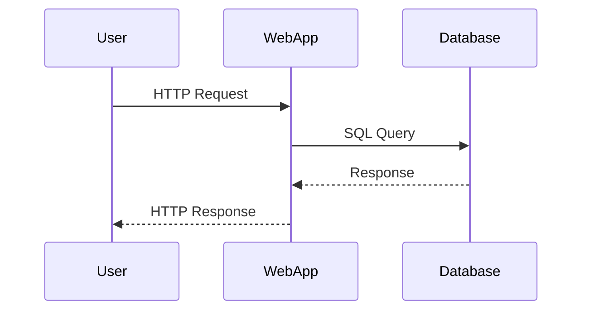

## Introduction to SQL Injection

SQL Injection (SQLi) is a common type of web application security vulnerability that allows an attacker to interfere with the queries that an application makes to its database. The attacker can inject malicious SQL statements into input fields, which can then be executed by the database. This can lead to unauthorized data retrieval, manipulation, or even complete compromise of the database.

### What is SQL Injection?

SQL Injection occurs when user input is incorrectly filtered by a web application and is then passed to an SQL query. This can happen in various parts of a web application, such as form fields, URL parameters, or cookies. The attacker can manipulate the input to alter the intended SQL query, leading to unintended behavior.

#### Why Does SQL Injection Matter?

SQL Injection is significant because it can lead to severe consequences, including:

- **Data Leakage**: Retrieving sensitive information such as passwords, credit card details, and personal data.
- **Data Manipulation**: Inserting, updating, or deleting data in the database.
- **Privilege Escalation**: Gaining higher privileges within the database, potentially leading to administrative access.
- **Denial of Service**: Causing the database to crash or become unresponsive.

#### How Does SQL Injection Work?

To understand SQL Injection, consider a simple login form where the username and password are submitted to the server. The server might construct an SQL query like this:

```sql
SELECT * FROM users WHERE username = 'username' AND password = 'password';
```

If the application does not properly sanitize the input, an attacker can inject malicious SQL. For example, if the attacker inputs `username` as `' OR '1'='1` and `password` as `' OR '1'='1`, the resulting SQL query would be:

```sql
SELECT * FROM users WHERE username = '' OR '1'='1' AND password = '' OR '1'='1';
```

This query will always return true, allowing the attacker to bypass authentication.

### Real-World Examples of SQL Injection

SQL Injection vulnerabilities have been exploited in numerous high-profile breaches. Here are a couple of recent examples:

- **CVE-2021-31166**: A SQL Injection vulnerability was found in the WordPress plugin WP Travel Engine. An attacker could exploit this vulnerability to execute arbitrary SQL commands, potentially leading to data leakage or manipulation.
- **CVE-2020-14882**: A SQL Injection vulnerability was discovered in the Joomla! CMS. This allowed attackers to inject malicious SQL commands, leading to unauthorized data access and potential privilege escalation.

### Background Theory

To fully understand SQL Injection, it's essential to delve into the underlying principles of SQL and how databases handle queries.

#### SQL Basics

Structured Query Language (SQL) is a standard language used to manage relational databases. It includes commands for creating, modifying, and querying data. Common SQL commands include:

- **SELECT**: Retrieves data from the database.
- **INSERT**: Adds new data to the database.
- **UPDATE**: Modifies existing data in the database.
- **DELETE**: Removes data from the database.

#### Database Query Execution

When a web application sends a query to the database, the database engine parses the query and executes it. If the query contains malicious input, the database engine will execute it as intended, leading to unintended behavior.

### Union-Based SQL Injection

Union-based SQL Injection is a technique where the attacker uses the `UNION` operator to combine the results of two or more SELECT statements. This can be used to retrieve additional data from the database.

#### Example of Union-Based SQL Injection

Consider a web application that constructs a query based on user input:

```sql
SELECT * FROM products WHERE category = 'input';
```

An attacker can inject a `UNION` statement to retrieve additional data. For example, if the attacker inputs `category` as `' UNION SELECT version()`, the resulting query would be:

```sql
SELECT * FROM products WHERE category = '' UNION SELECT version();
```

This query will return the version of the database along with the product data.

### Querying Database Type and Version

In this lab, we will focus on using a union-based SQL Injection attack to query the database type and version on MySQL and Microsoft databases.

#### MySQL Database

MySQL is a widely used open-source relational database management system. To query the version of a MySQL database, we can use the `version()` function.

##### Example Query

```sql
SELECT version();
```

This query returns the version of the MySQL database.

#### Microsoft SQL Server

Microsoft SQL Server is a relational database management system developed by Microsoft. To query the version of a Microsoft SQL Server database, we can use the `@@VERSION` variable.

##### Example Query

```sql
SELECT @@VERSION;
```

This query returns the version of the Microsoft SQL Server database.

### Lab Setup

The lab contains a SQL Injection vulnerability in the product category filter. The goal is to use a union-based SQL Injection attack to retrieve the database version string.

#### Accessing the Lab

To access the lab, follow these steps:

1. Visit the URL: [Portswigger Web Security Academy](https://portswigger.net/web-security)
2. Sign up for an account if you don't already have one.
3. Log in to your account.
4. Click on the "Academy" tab.
5. Scroll down and select the "Learning Path".
6. Scroll down and select "SQL Injection".
7. Scroll down again and select "Examining the Database".
8. Solve the second lab titled "SQL Injection Attack, querying the database type and version on MySQL and Microsoft".

### Exploiting the Vulnerability

To exploit the vulnerability, we need to craft a union-based SQL Injection attack.

#### Crafting the Attack

Assuming the application constructs a query like this:

```sql
SELECT * FROM products WHERE category = 'input';
```

We can inject a `UNION` statement to retrieve the database version. For example, if the attacker inputs `category` as `' UNION SELECT version()`, the resulting query would be:

```sql
SELECT * FROM products WHERE category = '' UNION SELECT version();
```

This query will return the version of the database along with the product data.

#### Full HTTP Request and Response

Here is an example of the full HTTP request and response:

**HTTP Request:**

```http
GET /products?category=%27+UNION+SELECT+version() HTTP/1.1
Host: example.com
User-Agent: Mozilla/5.0
Accept: */*
```

**HTTP Response:**

```http
HTTP/1.1 200 OK
Date: Mon, 01 Jan 2024 00:00:00 GMT
Server: Apache/2.4.41 (Ubuntu)
Content-Type: text/html; charset=UTF-8
Content-Length: 1234

<!DOCTYPE html>
<html>
<head>
    <title>Products</title>
</head>
<body>
    <h1>Products</h1>
    <table>
        <tr>
            <th>ID</th>
            <th>Name</th>
            <th>Category</th>
            <th>Version</th>
        </tr>
        <tr>
            <td>1</td>
            <td>Product 1</td>
            <td></td>
            <td>5.7.34</td>
        </tr>
    </table>
</body>
</html>
```

### Mermaid Diagrams

#### Network Topology



#### Sequence Diagram



### Pitfalls and Common Mistakes

When performing a union-based SQL Injection attack, there are several common mistakes to avoid:

- **Incorrect Syntax**: Ensure that the injected SQL syntax is correct and matches the database schema.
- **Insufficient Privileges**: The attacker may not have sufficient privileges to execute certain queries.
- **Error Handling**: The application may have error handling mechanisms that prevent the attacker from seeing the results of the injected query.

### How to Prevent / Defend Against SQL Injection

#### Detection

To detect SQL Injection vulnerabilities, you can use automated tools such as:

- **Static Application Security Testing (SAST)**: Tools like SonarQube and Fortify can analyze the codebase for SQL Injection vulnerabilities.
- **Dynamic Application Security Testing (DAST)**: Tools like Burp Suite and OWASP ZAP can test the application for SQL Injection vulnerabilities.

#### Prevention

To prevent SQL Injection attacks, follow these best practices:

- **Use Prepared Statements**: Prepared statements ensure that user input is treated as data rather than executable code.
- **Input Validation**: Validate all user input to ensure it meets expected formats and constraints.
- **Least Privilege Principle**: Run the application with the least privileges necessary to perform its tasks.
- **Parameterized Queries**: Use parameterized queries to separate the SQL logic from the user input.

#### Secure Coding Fixes

Here is an example of a vulnerable code snippet and its secure counterpart:

**Vulnerable Code:**

```php
$category = $_GET['category'];
$query = "SELECT * FROM products WHERE category = '$category'";
$result = mysqli_query($conn, $query);
```

**Secure Code:**

```php
$category = $_GET['category'];
$stmt = $conn->prepare("SELECT * FROM products WHERE category = ?");
$stmt->bind_param("s", $category);
$stmt->execute();
$result = $stmt->get_result();
```

### Hands-On Labs

To practice SQL Injection attacks and defenses, you can use the following labs:

- **PortSwigger Web Security Academy**: Offers a variety of labs to practice SQL Injection attacks and defenses.
- **OWASP Juice Shop**: A deliberately insecure web application for practicing web security techniques.
- **DVWA (Damn Vulnerable Web Application)**: A PHP/MySQL web application that is riddled with vulnerabilities for educational purposes.
- **WebGoat**: A deliberately insecure Java web application maintained by OWASP for security training.

### Conclusion

SQL Injection is a critical vulnerability that can lead to severe consequences if not properly mitigated. By understanding the principles behind SQL Injection and implementing best practices for prevention, you can significantly reduce the risk of such attacks. Always validate and sanitize user input, use prepared statements, and follow the least privilege principle to ensure the security of your applications.

---
<!-- nav -->
[[Web Security (PortSwigger)/02-SQL Injection/09-Lab 8 SQLi attack querying the database type and version on MySQL Microsoft/00-Overview|Overview]] | [[Web Security (PortSwigger)/02-SQL Injection/09-Lab 8 SQLi attack querying the database type and version on MySQL Microsoft/02-SQL Injection Overview|SQL Injection Overview]]
