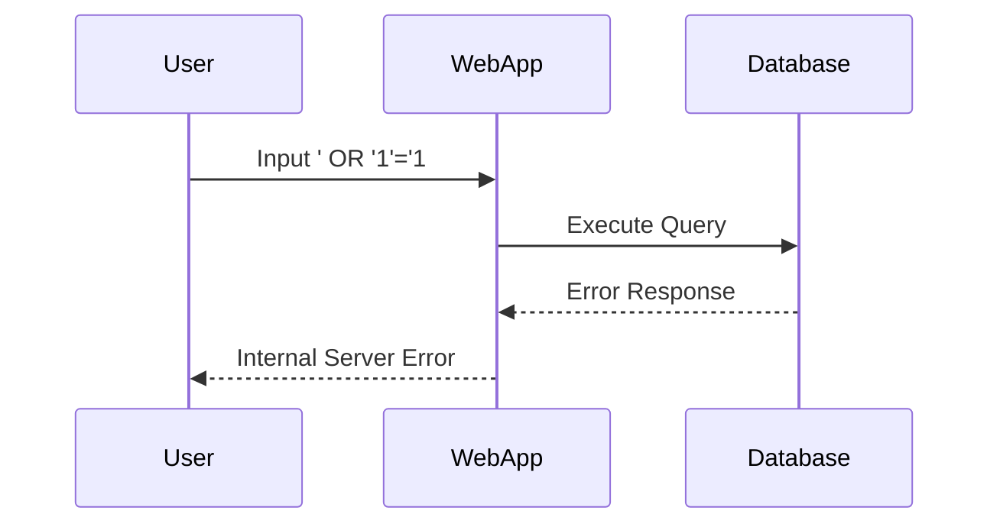

## Identifying Vulnerable Fields

To identify whether a field is vulnerable to SQL Injection, you can perform a series of tests using SQL characters. If the application responds with an error, it may indicate that the field is vulnerable.

### Example: Testing for SQL Injection

Consider a web application with a search functionality that takes user input and queries a database. To test if the search field is vulnerable to SQL Injection, you can input special SQL characters like `'` or `--`.

#### HTTP Request Example

```http
GET /search?query=' OR '1'='1 HTTP/1.1
Host: example.com
```

If the application returns an error, such as an "Internal Server Error," it suggests that the field might be vulnerable to SQL Injection.

### Mermaid Diagram: SQL Injection Attack Flow



---
<!-- nav -->
[[05-How to Prevent  Defend Against SQL Injection|How to Prevent  Defend Against SQL Injection]] | [[Web Security (PortSwigger)/02-SQL Injection/10-Lab 9 SQL injection attack listing the database contents on non Oracle databases/00-Overview|Overview]] | [[Web Security (PortSwigger)/02-SQL Injection/10-Lab 9 SQL injection attack listing the database contents on non Oracle databases/07-Practice Labs|Practice Labs]]
