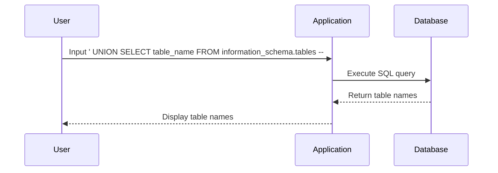

## SQL Injection Attack: Listing Database Contents on Non-Oracle Databases

### Introduction to SQL Injection

SQL Injection (SQLi) is a type of cyber attack used to exploit vulnerabilities in web applications that use SQL databases. This attack occurs when an attacker can insert malicious SQL statements into input fields, which are then executed by the database. SQLi attacks can lead to unauthorized access to sensitive data, data manipulation, and even complete control over the database.

### Understanding the Context

In the context of the lecture, we are dealing with a specific scenario where the goal is to list the contents of a database using SQL Injection. The lecture specifically mentions that we are working with a PostgreSQL database, but the principles can be applied to other non-Oracle databases as well.

### Background Theory

#### What is SQL?

Structured Query Language (SQL) is a programming language designed for managing data held in a relational database management system (RDBMS). SQL allows users to perform various operations such as creating, modifying, and querying data.

#### What is a Database Schema?

A database schema defines the structure of the database, including tables, columns, relationships, and constraints. In PostgreSQL, the `information_schema` is a system catalog that provides metadata about the database objects.

#### What is Information Schema?

The `information_schema` is a set of views that provide metadata about the database objects. One of the key views is `tables`, which contains information about all the tables in the database. By querying this view, we can obtain a list of all the tables in the database.

### Step-by-Step Mechanics

#### Step 1: Identify the Vulnerable Input Field

To perform an SQL Injection attack, we first need to identify an input field that is vulnerable to SQLi. This could be a search box, login form, or any other input field that interacts with the database.

#### Step 2: Craft the SQL Injection Payload

Once we have identified the vulnerable input field, we need to craft an SQL Injection payload. The payload will depend on the specific structure of the SQL query being executed by the application.

For example, consider the following SQL query:

```sql
SELECT * FROM users WHERE username = 'input_field';
```

If the input field is vulnerable to SQL Injection, we can inject a payload like:

```sql
' UNION SELECT table_name FROM information_schema.tables -- 
```

This payload will append a new SQL statement to the original query, effectively listing all the tables in the database.

### Complete Example

Let's walk through a complete example of how to list the database contents using SQL Injection.

#### Original SQL Query

Assume the original SQL query looks like this:

```sql
SELECT * FROM users WHERE username = 'input_field';
```

#### Injected Payload

We inject the following payload into the input field:

```sql
' UNION SELECT table_name FROM information_schema.tables --
```

#### Full SQL Query

The resulting SQL query becomes:

```sql
SELECT * FROM users WHERE username = '' UNION SELECT table_name FROM information_schema.tables -- ';
```

#### Expected Result

When the application executes this modified query, it will return a list of all the tables in the database.

### Code Example

Here is a complete example of how the SQL Injection attack would look in practice:

#### Vulnerable Code

```python
# Vulnerable code
username = input("Enter username: ")
query = f"SELECT * FROM users WHERE username = '{username}'"
cursor.execute(query)
results = cursor.fetchall()
print(results)
```

#### Injected Payload

```python
# Injected payload
username = "' UNION SELECT table_name FROM information_schema.tables --"
```

#### Full SQL Query Execution

```python
# Full SQL query execution
query = f"SELECT * FROM users WHERE username = '{username}'"
cursor.execute(query)
results = cursor.fetchall()
print(results)
```

### Mermaid Diagrams

#### SQL Injection Attack Flow



### Real-World Examples

#### Recent CVEs and Breaches

One notable example of SQL Injection leading to a breach is the 2017 Equifax data breach. The attackers exploited a vulnerability in the Apache Struts framework, which allowed them to execute arbitrary SQL commands and steal sensitive data.

### Pitfalls and Common Mistakes

#### Incorrect Payload Construction

One common mistake is constructing the payload incorrectly, which can result in syntax errors or unexpected behavior. Always ensure that the payload is correctly formatted and tested.

#### Lack of Proper Validation

Another common mistake is failing to validate user input properly. Always validate and sanitize user input to prevent SQL Injection attacks.

### How to Prevent / Defend

#### Detection

To detect SQL Injection attacks, implement logging and monitoring of database queries. Look for unusual patterns or suspicious SQL statements.

#### Prevention

To prevent SQL Injection attacks, follow these best practices:

1. **Use Prepared Statements**: Prepared statements separate the SQL logic from the user input, preventing SQL Injection.
   
   ```python
   # Secure code using prepared statements
   username = input("Enter username: ")
   query = "SELECT * FROM users WHERE username = %s"
   cursor.execute(query, (username,))
   results = cursor.fetchall()
   print(results)
   ```

2. **Input Validation**: Validate and sanitize user input to ensure it meets expected criteria.

3. **Least Privilege Principle**: Ensure that the database user has the minimum necessary privileges to perform its tasks.

4. **Web Application Firewalls (WAF)**: Use WAFs to detect and block SQL Injection attempts.

### Secure Coding Fixes

#### Vulnerable Code

```python
# Vulnerable code
username = input("Enter username: ")
query = f"SELECT * FROM users WHERE username = '{username}'"
cursor.execute(query)
results = cursor.fetchall()
print(results)
```

#### Secure Code

```python
# Secure code using prepared statements
username = input("Enter username: ")
query = "SELECT * FROM users WHERE username = %s"
cursor.execute(query, (username,))
results = cursor.fetchall()
print(results)
```

### Configuration Hardening

#### Database Configuration

Ensure that the database is configured securely:

1. **Disable Unnecessary Features**: Disable features that are not required for the application.
2. **Limit User Privileges**: Ensure that database users have the least privileges necessary to perform their tasks.
3. **Enable Logging**: Enable detailed logging to monitor database activity.

### Conclusion

SQL Injection is a serious threat to web applications that interact with databases. By understanding the mechanics of SQL Injection and implementing proper defenses, you can protect your applications from these attacks.

### Practice Labs

For hands-on experience with SQL Injection, consider the following labs:

- **PortSwigger Web Security Academy**: Offers interactive labs on SQL Injection.
- **OWASP Juice Shop**: A deliberately insecure web application for practicing web security techniques.
- **DVWA (Damn Vulnerable Web Application)**: A PHP/MySQL web application that demonstrates web application vulnerabilities.

By practicing in these environments, you can gain a deeper understanding of SQL Injection and how to defend against it.

---
<!-- nav -->
[[Web Security (PortSwigger)/02-SQL Injection/10-Lab 9 SQL injection attack listing the database contents on non Oracle databases/07-Practice Labs|Practice Labs]] | [[Web Security (PortSwigger)/02-SQL Injection/10-Lab 9 SQL injection attack listing the database contents on non Oracle databases/00-Overview|Overview]] | [[09-SQL Injection Detection|SQL Injection Detection]]
