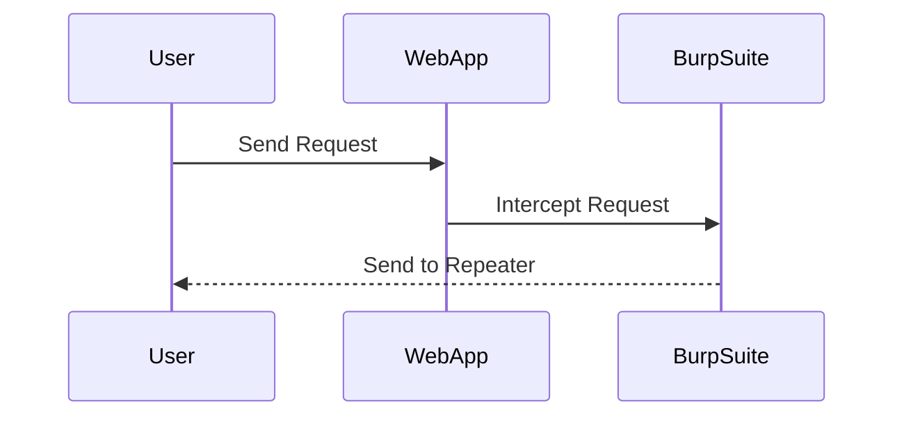

## Using Burp Suite for SQL Injection

Burp Suite is a popular tool used for web application security testing. It provides features such as interception, replay, and modification of HTTP requests, making it ideal for performing SQL Injection attacks.

### Setting Up Burp Suite

1. **Start Burp Suite**: Launch Burp Suite and set up the proxy settings.
2. **Configure Proxy**: Configure the browser to use Burp Suite as the proxy.
3. **Intercept Requests**: Intercept the HTTP requests sent by the browser.

#### Example: Setting Up Burp Suite

1. Open Burp Suite.
2. Go to the "Proxy" tab and click "Intercept."
3. Configure your browser to use the proxy settings provided by Burp Suite.

### Sending Requests to Repeater

Once the request is intercepted, you can send it to the "Repeater" tab to modify and replay the request.

#### Example: Sending Request to Repeater

---
<!-- nav -->
[[13-Union-Based SQL Injection|Union-Based SQL Injection]] | [[Web Security (PortSwigger)/02-SQL Injection/10-Lab 9 SQL injection attack listing the database contents on non Oracle databases/00-Overview|Overview]] | [[Web Security (PortSwigger)/02-SQL Injection/10-Lab 9 SQL injection attack listing the database contents on non Oracle databases/15-Conclusion|Conclusion]]
