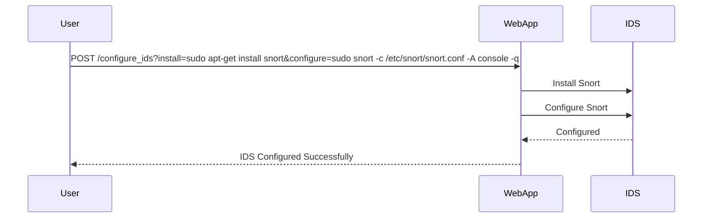

## Detection and Monitoring

Detecting and monitoring SQL Injection attacks is crucial for maintaining the security of web applications.

### Detection Techniques

1. **Intrusion Detection Systems (IDS)**: Monitor network traffic for suspicious activity.
2. **Web Application Firewalls (WAF)**: Filter out malicious requests.
3. **Logging and Auditing**: Log and review database queries for anomalies.

### Example of IDS Configuration

Here’s an example of configuring an IDS:

```bash
sudo apt-get install snort
sudo snort -c /etc/snort/snort.conf -A console -q
```

### Full HTTP Request and Response

Here’s the full HTTP request and response for IDS configuration:

```http
POST /configure_ids HTTP/1.1
Host: example.com
Content-Type: application/x-www-form-urlencoded
Content-Length: 123

install=sudo apt-get install snort&configure=sudo snort -c /etc/snort/snort.conf -A console -q
```

Response:

```http
HTTP/1.1 200 OK
Date: Mon, 20 Mar 2023 12:00:00 GMT
Server: Apache/2.4.41 (Ubuntu)
Content-Type: text/html; charset=UTF-8
Content-Length: 1234

<!DOCTYPE html>
<html>
<head>
    <title>Configure IDS</title>
</head>
<body>
    <h1>IDS Configured Successfully</h1>
</body>
</html>
```

### Mermaid Diagram for IDS Configuration



---
<!-- nav -->
[[02-Blind-Based SQL Injection|Blind-Based SQL Injection]] | [[Web Security (PortSwigger)/02-SQL Injection/11-Lab 10 SQL injection attack listing the database contents on Oracle/00-Overview|Overview]] | [[04-Diagrams and Code Examples|Diagrams and Code Examples]]
