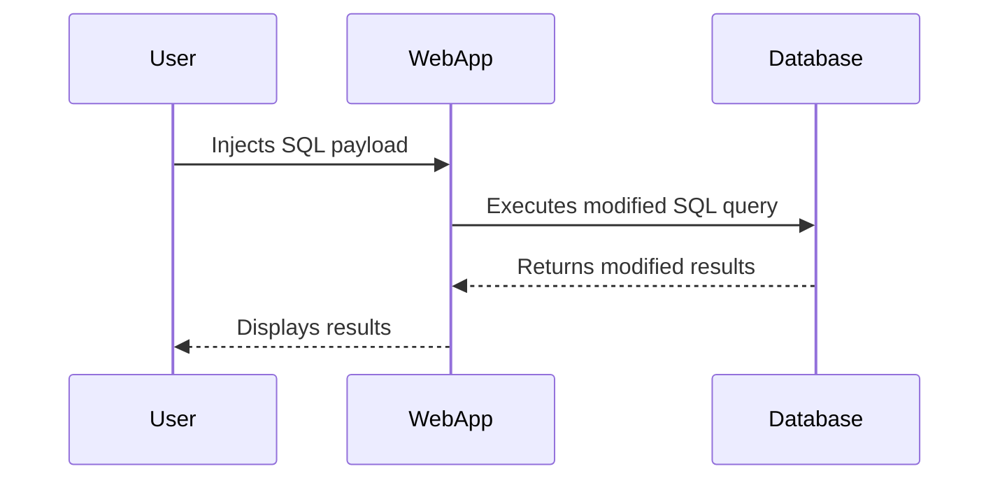

## Diagrams and Code Examples

### Mermaid Diagram: SQL Injection Attack Chain



### Full HTTP Request and Response

#### HTTP Request

```http
POST /login.php HTTP/1.1
Host: example.com
Content-Type: application/x-www-form-urlencoded
Content-Length: 31

username=admin' UNION SELECT table_name FROM all_tables--&password=password
```

#### HTTP Response

```http
HTTP/1.1 200 OK
Date: Mon, 20 Nov 2023 12:00:00 GMT
Server: Apache/2.4.41 (Ubuntu)
Content-Length: 1234
Content-Type: text/html; charset=UTF-8

<!DOCTYPE html>
<html>
<head>
    <title>Login</title>
</head>
<body>
    <h1>Login</h1>
    <form action="login.php" method="POST">
        <input type="text" name="username" placeholder="Username">
        <input type="password" name="password" placeholder="Password">
        <button type="submit">Login</button>
    </form>
    <div id="results">
        <!-- Results of the SQL query -->
    </div>
</body>
</html>
```

### Complete Code Example

#### Vulnerable Code

```php
<?php
$username = $_POST['username'];
$password = $_POST['password'];

$query = "SELECT * FROM users WHERE username = '$username' AND password = '$password'";
$result = mysqli_query($conn, $query);

if ($result && mysqli_num_rows($result) > 0) {
    echo "Login successful";
} else {
    echo "Login failed";
}
?>
```

#### Secure Code

```php
<?php
$username = $_POST['username'];
$password = $_POST['password'];

$stmt = $pdo->prepare("SELECT * FROM users WHERE username = :username AND password = :password");
$stmt->execute(['username' => $username, 'password' => $password]);
$user = $stmt->fetch();

if ($user) {
    echo "Login successful";
} else {
    echo "Login failed";
}
?>
```

### Conclusion

By understanding the principles of SQL Injection and implementing secure coding practices, we can protect our web applications from this type of attack. Regularly testing and validating our code can help us identify and mitigate potential vulnerabilities.

---
<!-- nav -->
[[03-Detection and Monitoring|Detection and Monitoring]] | [[Web Security (PortSwigger)/02-SQL Injection/11-Lab 10 SQL injection attack listing the database contents on Oracle/00-Overview|Overview]] | [[05-Exploiting SQL Injection to List Database Contents|Exploiting SQL Injection to List Database Contents]]
