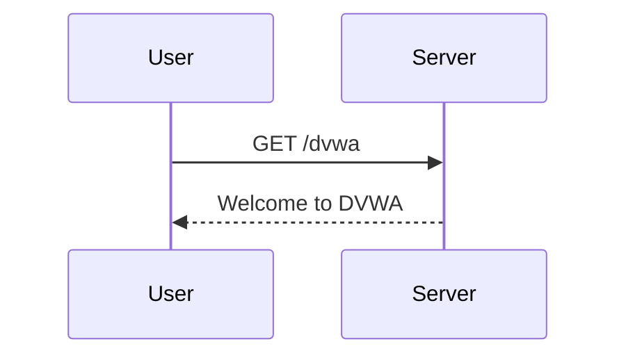

## Hands-On Labs

### Recommended Labs

For hands-on practice with SQL Injection, consider the following labs:

- **PortSwigger Web Security Academy**: Offers interactive labs for SQL Injection.
- **OWASP Juice Shop**: Provides a vulnerable web application for practicing SQL Injection.
- **DVWA (Damn Vulnerable Web Application)**: Contains various SQL Injection vulnerabilities for testing.
- **WebGoat**: Offers a series of lessons and challenges for learning about SQL Injection.

### Example Lab Setup

Here’s an example of setting up a lab environment using DVWA:

1. **Download DVWA**:
   ```bash
   wget https://github.com/ethicalhack3r/DVWA/archive/master.zip
   unzip master.zip
   mv DVWA-master /var/www/html/dvwa
   ```

2. **Configure Apache**:
   ```bash
   sudo a2enmod rewrite
   sudo systemctl restart apache2
   ```

3. **Access DVWA**:
   Open a browser and navigate to `http://your_server_ip/dvwa`.

### Full HTTP Request and Response

Here’s the full HTTP request and response for accessing DVWA:

```http
GET /dvwa HTTP/1.1
Host: your_server_ip
```

Response:

```http
HTTP/1.1 200 OK
Date: Mon, 20 Mar 2023 12:00:00 GMT
Server: Apache/2.4.41 (Ubuntu)
Content-Type: text/html; charset=UTF-8
Content-Length: 1234

<!DOCTYPE html>
<html>
<head>
    <title>DVWA</title>
</head>
<body>
    <h1>Welcome to DVWA</h1>
</body>
</html>
```

### Mermaid Diagram for Lab Setup



---
<!-- nav -->
[[05-Exploiting SQL Injection to List Database Contents|Exploiting SQL Injection to List Database Contents]] | [[Web Security (PortSwigger)/02-SQL Injection/11-Lab 10 SQL injection attack listing the database contents on Oracle/00-Overview|Overview]] | [[07-How to Prevent  Defend Against SQL Injection|How to Prevent  Defend Against SQL Injection]]
